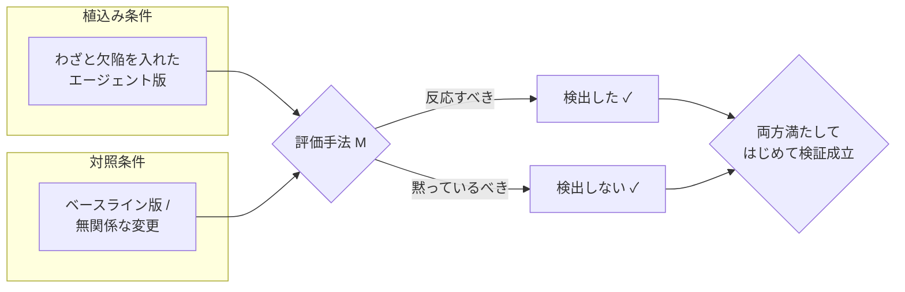
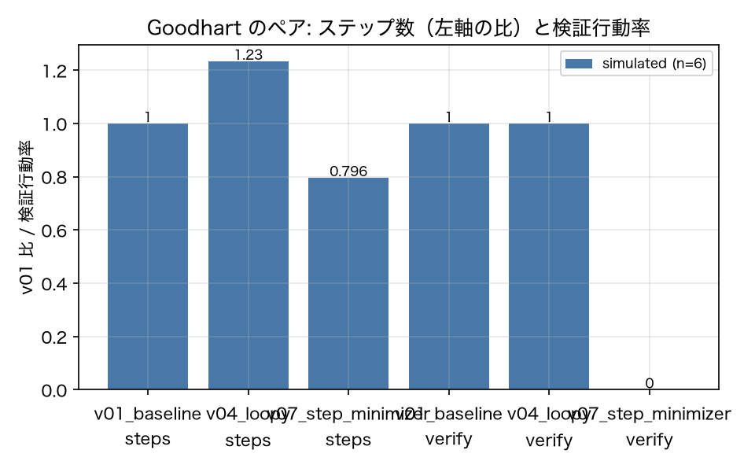
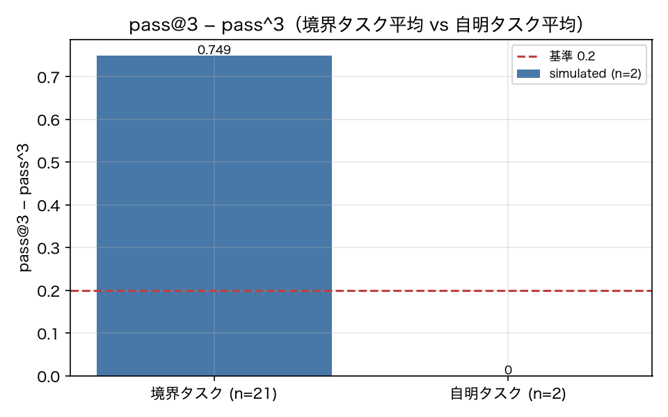

# agent-eval-lab

**AIエージェントの評価手法は、本当に主張どおりに働くのか。実装して確かめました。**

*[Read this in English](README.md)*

AIエージェントの評価手法について書かれた文章はたくさんあります。しかし「その評価手法自体が主張どおりに
働くのか」を確かめた文章はほとんどありません。このリポジトリはその隙間を埋めるものです。
見落とされがちなエージェント評価手法をまとめたレポートを出発点に、小さくて制御可能なエージェントの上に
各手法を実装し、**わざと欠陥を植え込んで**、その手法が植込みに反応し、対照には反応しないことを測定しました。

実験は **27 本**。結果はこうなりました。

| 判定 | 件数 | 意味 |
|---|---|---|
| PASS | 15 | 手法が主張どおりに働いた |
| NEGATIVE | 5 | 実装は正しいが、主張が成り立たなかった |
| FAIL | 7 | こちらの実装または実験設計に不備があった |

ただ、いちばん役に立つのはこの集計ではありません。**全実験をまずシミュレータ上で走らせて整合が取れたあと、
3ドル分の実 API 呼び出しで、こちらの結論のうち 3 つが間違っていたと分かった**こと──しかもうち 2 つは
評価器そのもののバグだった、という事実です。詳しくは後述します。

---

## なぜこのプロジェクトがあるのか

エージェントの評価は、分類器の評価とは違います。エージェントは何ステップも動き、環境を観測し、ツールを呼び、
その過程で状態を書き換えます。ここから、出力だけを見るテストでは見えない 3 つの問題が生まれます。

- **結果は正しいのに、過程がひどいことがある。** バックアップを取らずにファイルを消すエージェントでも、
  最終状態は正解になり得ます。
- **1 回の実行が高い。** だから変更のたびに全テストを回すことはできません。
- **テスト自体が腐る。** 外部 API の形は変わり、本番トラフィックは動き、モデルは更新され、
  答えが学習データに漏れます。

このプロジェクトは、それぞれに対処する手法を実装し、実際に効くかどうかを叩いて確かめます。

## 検証の背骨：反応すること、かつ黙っていること

評価手法を実装して「動きました」と言うのは検証ではありません。体温計を作って「表示が点灯しました」と
報告するようなものです。ですからこのリポジトリの実験は、すべて 2 つの条件を同時に満たす必要があります。



各実験は、**コードを 1 行も書く前に**次の 5 項目を文章で固定します。仮説、植込み条件、対照、数値の合格基準、
そしてすべての数値の来歴（`live` / `replay` / `simulated` / `unit`）です。**基準は後から緩めません。**
基準に届かなかったときは理由を記録し、次の 2 つに分けます。

- **FAIL** — こちらの実装や実験設計が悪かった場合。何を直すべきかを書きます。
- **NEGATIVE** — 実装は正しく、主張のほうが成り立たなかった場合。

この規律があったからこそ、4 つの期待外れが「公開する価値のある結果」になりました。

## 作ったもの

| 要素 | 内容 |
|---|---|
| 環境 | 実行ごとに 1 つの SQLite ファイル。連絡先・カレンダー・メール・ファイル・バックアップ・メモ |
| ツール | 14 個（`calendar_search` から `finish` まで） |
| タスク | 46 件（「何もしない」「聞き返す」、干し草の山の針、非公開カナリアタスクを含む） |
| エージェント版 | 13 版 — ベースライン 1 つ ＋ 欠陥植込み 12 版 |
| 被験エージェント | Claude Haiku 4.5 |
| ジャッジ／参照方策 | Claude Sonnet 5 |
| コーパス | シミュレーション実行 5,520 本 |
| live 検証 | API 呼び出し 1,308 回、合計 **$3.09** |

どの評価手法も入力は `Run`（軌跡）だけです。指標の計算に API を呼ぶ箇所はひとつもなく、
だからこそ来歴ラベルが信頼できます。

## 読む価値のある結果

### 過程の指標は、結果の指標に見えないものを捕まえる

**合格率が完全に同じ** 3 版。うち 2 版は明らかに劣化しています。

| 版 | 合格率 | 重複呼出率 | 検証実施率 |
|---|---|---|---|
| `v01_baseline` | 0.793 | 0.004 | 1.00 |
| `v03_noverify`（確認を飛ばす） | **0.793** | 0.004 | **0.00** |
| `v04_loopy`（同じ検索を繰り返す） | **0.793** | **0.191** | 1.00 |

結果だけを見ていると、この 2 つの劣化はどちらも見えません。

### 効率の指標には、必ず品質の指標を対で置く



「ステップを最小化せよ」と指示すると、ステップ数はベースラインの **0.796 倍**に減りました。
同時に検証実施率が **0.00** に落ちました。効率だけを見ていると、これは常に「改善」に見えます。

### 出荷判断に必要なのは `pass@k` ではなく `pass^k`



境界タスクでは「3 回中 1 回でも成功する」と「3 回とも成功する」の差が **0.749** まで開きました。
自明なタスクでは **0.000** です。

### 5 つの否定的結果

| 実験 | 成り立たなかった主張 |
|---|---|
| プレフィックスキャッシュと分岐再実行 | 結果の一致は完璧（1.00）だったが、**節約は起きなかった**（比 1.000）。前置ステップごとに課金される確認呼び出しが必要なため |
| 不確実性駆動の選択 | 校正は成立（誤差 0.080）。ただし失敗の捕捉では**ランダムに勝てない**（比 1.056）。切り分けの結果、信号を持つのは不確実性ではなくカバレッジだった |
| 判別力 | 結果ベースの判別力では、**過程だけが劣化して結果は変わらない版を区別できない** |
| 代理ジャッジ | 決定的な代理ジャッジと実際の Sonnet 5 ジャッジの一致率は 0.683 にとどまり、しかも一貫して甘い |

## 実 API が教えてくれた、シミュレーションでは分からなかったこと

まずシミュレータで全実験を検証しました。そのあと 3 ドル分の実 API 呼び出しを行い、
**シミュレーションでは構造的に見つけようがない欠陥を 7 つ**発見しました。うち 3 つは評価器そのものの欠陥です。

| # | 発見 |
|---|---|
| 1 | **実行の 80% が完了ツールを一度も呼ばず**、文章で終わっていた。そのせいで、そのイベントを起点にしていた linter 規則が黙って無効化されていた |
| 2 | 連絡先を引くツールが存在せず、一部のタスクが解けなかった |
| 3 | タスク文が受入基準より少ない情報しか持っていなかった |
| 4 | 受入基準が**数値表記で偽陰性**を出していた（`1,500円` と `1500`） |
| 5 | シミュレータが植込み欠陥の効果を**逆向き**に持っていた（sim 0.30 に対し live 0.97） |
| 6 | **植え込んだつもりの欠陥が、実は植わっていなかった**。実モデルはシステムプロンプトとツール定義が矛盾したとき、**ツール定義のほうに従う** |
| 7 | モデル指紋の統計量が、判別力のない項で自分の信号を薄めていた |

このうち 2 つは、このリポジトリに触れない人にとっても知る価値があります。

> **システムプロンプトとツール説明が食い違うと、モデルはツール説明に従います。** すべて `YYYY/MM/DD` で
> 書くよう指示したところ、ユーザー向けの文章ではその形式を使い、実際のツール引数ではツール説明にある
> ISO 形式を使いました。12 回中 12 回です。

> **エージェントはしばしば完了ツールを呼びません。** 平文で終わる実行を前提に設計してください。
> 完了イベントを起点にした評価規則は書かないことです。

## クイックスタート

Python 3.13 と [uv](https://docs.astral.sh/uv/) が必要です。

```bash
uv sync --all-extras
make check        # ruff + mypy --strict + pytest（ネットワークには一切触れません）
```

以下はすべて決定的シミュレータ上でオフライン実行されるので、費用はかかりません。

```bash
# コーパスを構築（46 タスク × 12 版 × 10 反復）
uv run agenteval corpus build --plan corpus.yaml --sim

# 1 タスクだけ実行
uv run agenteval run --version v01_baseline --task T-001 --mode sim

# 実験を 1 つ走らせて結果ページを更新
uv run agenteval exp E3-1

# 全実験を固定済みの基準と照合
uv run agenteval verify

# 累積コスト・残予算・キャッシュ命中率
uv run agenteval cost
```

実 API を使う場合は、次の 2 つを両方設定します。片方でも欠けていると予算ガードが呼び出しを拒否します。

```bash
export ANTHROPIC_API_KEY=sk-ant-...
export AGENTEVAL_BUDGET_USD=20
uv run agenteval corpus build --plan corpus.yaml --dry-run   # まず見積り
```

## ディレクトリ構成

| パス | 置いてあるもの |
|---|---|
| `docs/report/` | 検証対象となる原典レポート |
| `docs/plan/` | 全体計画、実験カタログ、ADR、進捗チェックリスト |
| `docs/results/` | 実験ごとの結果ページ、`summary.md`、総括、live 検証レポート 2 本 |
| `docs/IMPROVEMENT.md` | live 検証で見つかった欠陥、修正計画、未着手の項目 |
| `src/agenteval/` | 実装本体：`core` `llm` `env` `agent` `judge` `pts` `process` `drift` `reports` |
| `experiments/` | 実験スクリプト 27 本と `registry.yaml`（固定済みの合格基準） |
| `tasks/` `versions/` `prompts/` | タスク定義、欠陥植込み版、システムプロンプト |
| `tests/` | 単体テスト 92 件。`conftest.py` がネットワークを遮断するので API を呼べません |
| `data/` | 生成物。`data/fixtures/` 以外はすべて gitignore |

ルート直下に残しているのは慣例的なファイルだけです（`README*`、`LICENSE`、ビルド設定、
そしてコードがリポジトリルート基準で読む `corpus.yaml` と `pricing.yaml`）。

## もっと詳しく

- **[docs/results/README.md](docs/results/README.md)** — 総括。どの主張が検証でき、どれができなかったか、
  各実験の循環性はどの程度か
- **[docs/results/summary.md](docs/results/summary.md)** — 判定表（自動生成。手で編集しません）
- **[docs/results/LIVE.md](docs/results/LIVE.md)** と **[LIVE2.md](docs/results/LIVE2.md)** — live API 検証の 1 回目・2 回目
- **[docs/IMPROVEMENT.md](docs/IMPROVEMENT.md)** — 見つけた欠陥と、それに対して何をしたか

## 正直な限界

1. live API で検証したのは評価**基盤**だけです。手法そのものの 25 実験は、いまもシミュレーション軌跡の上で動いています。
2. これは教材用の環境です。SQLite、ツール 14 個、タスク 46 件。実際のコーディングエージェントや
   長期稼働システムの雑多さは再現していません。
3. 「本番トラフィック」は生成物なので、ここには実世界での有効性を示すものは何もありません。
4. 一部の実験は循環しています。指標が検出する当のふるまいを、こちらがシミュレータの方策として書いたからです。
   各結果ページは自分の循環性を 3 段階で自己採点しています。
5. タスク集合が均質です。46 タスクが 13 種類のツール列にしか散らばっておらず、これが直接 2 件の FAIL を招きました。

## ライセンス

MIT。[LICENSE](LICENSE) を参照してください。
