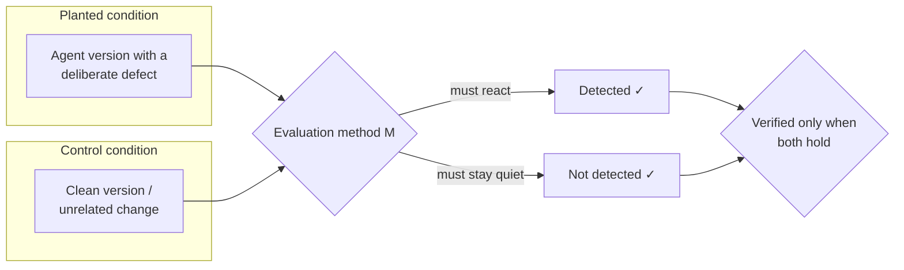

# agent-eval-lab

**Do AI agent evaluation methods actually work? We implemented them and found out.**

*[日本語版 README はこちら](README.ja.md)*

There is plenty of writing about how to evaluate AI agents. There is much less writing about
whether those evaluation methods actually do what they claim. This repository closes that gap:
we took the methods proposed in a report on overlooked agent-evaluation techniques, implemented
them against a small controllable agent, deliberately planted defects, and measured whether each
method reacted to the planted defect and stayed quiet on the control.

We ran **30 experiments**. Here is how they landed.

| Verdict | Count | Meaning |
|---|---|---|
| PASS | 15 | The method worked as claimed |
| NEGATIVE | 6 | Correctly implemented, but the claim did not hold |
| FAIL | 9 | Our implementation or experiment design was at fault |

The most useful part is not the tally. It is that **we ran the whole suite against a simulated
agent first, everything looked consistent, and then $3 of real Claude API calls showed that three
of our conclusions were wrong** — including two bugs in the evaluator itself. More on that below.

---

## Why this exists

Evaluating an agent is not like evaluating a classifier. An agent takes many steps, observes an
environment, calls tools, and mutates state along the way. That creates three problems that
output-only testing cannot see:

- **The result can be right while the process is terrible.** An agent that deletes a file without
  taking a backup still produces the correct final state.
- **Each run is expensive**, so you cannot re-run every test on every change.
- **The tests themselves rot.** External APIs change shape, production traffic drifts, models get
  updated, and answers leak into training data.

This project implements and stress-tests the methods that address each of those.

## The core idea: a method must react *and* stay quiet

Implementing an evaluation method and saying "it runs" is not verification. It is like building a
thermometer and reporting that the display lights up. So every experiment here has to clear two
bars at once.



Each experiment fixes five things **in writing before any code is written**: the hypothesis, the
planted condition, the control, a numeric pass criterion, and the provenance of every number
(`live` / `replay` / `simulated` / `unit`). Criteria are never loosened afterwards. When a method
misses its bar, we record *why*, split into:

- **FAIL** — our implementation or experiment design was wrong. We say what to fix.
- **NEGATIVE** — the implementation was right and the claim simply did not hold.

That discipline is what turned four disappointments into results worth publishing.

## What we built

| Piece | Details |
|---|---|
| Environment | One SQLite file per run: contacts, calendar, mail, files, backups, notes |
| Tools | 14 tools, from `calendar_search` to `finish` |
| Tasks | 46 (including "do nothing", "ask a clarifying question", needle-in-a-haystack, and private canary tasks) |
| Agent versions | 13 — one baseline plus 12 with planted defects |
| Agent under test | Claude Haiku 4.5 |
| Judge / reference policy | Claude Sonnet 5 |
| Corpus | 5,520 simulated runs |
| Live verification | 1,308 API calls, **$3.09** total |

Every evaluation method takes only a `Run` (a trajectory) as input. Nothing calls the API to
compute a metric, which is what makes the provenance labels trustworthy.

## Results worth your time

### Process metrics catch what outcome metrics cannot

Three agent versions with **identical pass rates**, two of which are clearly degraded:

| Version | Pass rate | Duplicate-call rate | Verification rate |
|---|---|---|---|
| `v01_baseline` | 0.793 | 0.004 | 1.00 |
| `v03_noverify` (skips checks) | **0.793** | 0.004 | **0.00** |
| `v04_loopy` (repeats searches) | **0.793** | **0.191** | 1.00 |

If you only look at outcomes, both regressions are invisible.

### Pair every efficiency metric with a quality metric


Telling the agent to "minimise steps" cut steps to **0.796×** baseline — and dropped the
verification rate to **0.00**. Efficiency alone always looks like an improvement.

### Ship decisions need `pass^k`, not `pass@k`


On boundary tasks the gap between "succeeds at least once in 3 tries" and "succeeds all 3 times"
reached **0.749**. On trivial tasks it was **0.000**.

### PTS only works once you record change history

Predictive Test Selection is a real, industrially-proven mechanism — but it needs the right inputs.
Our first attempt lost to a one-line dependency-graph heuristic. The reason was structural: we had
never recorded change history, so **recency features could not even be written** (lag is undefined
without an ordering over changes).

After adding an append-only change/test ledger and deriving lag and change-size features from it:

| | Before the ledger | After |
|---|---|---|
| Regression recall at a 30% budget | 0.535 | **0.819** |
| Escape-defect rate vs random | 0.868× | **0.319×** |

An ablation over feature groups shows **recency alone is the strongest learned signal** (AUC 0.878,
above the dependency graph's 0.776) — while piling on every history group overfits 122 positives and
drops it to 0.747. Full write-up: [docs/PTS.en.md](docs/PTS.en.md).

### Six negative results

| Experiment | Claim that did not hold |
|---|---|
| Prefix cache & branch re-execution | Outcomes matched perfectly (1.00), but there were **no savings** (ratio 1.000): every prefix step still needs a billed confirmation call |
| Uncertainty-driven selection | Calibration held (error 0.080), but the selection is **no better than random** at catching failures (ratio 1.056). An ablation shows the signal lives in coverage, not uncertainty |
| Discriminative power | Outcome-only discriminative power **cannot** separate versions that degrade the process but not the result |
| Surrogate judge | A deterministic stand-in judge agreed with the real Sonnet 5 judge only 0.683 of the time, and was consistently too lenient |

## What the real API taught us that simulation could not

We validated the whole suite against a simulator first. Then we spent $3 on real API calls and
found **seven defects that simulation structurally could not reveal** — three of them in the
evaluator itself.

| # | Finding |
|---|---|
| 1 | **80% of real runs never called the completion tool**, finishing with prose instead — which silently disabled a linter rule that keyed off that event |
| 2 | No tool existed to look up a contact, making some tasks unsolvable |
| 3 | Task prompts carried less information than their acceptance criteria |
| 4 | Acceptance criteria produced **false negatives on number formatting** (`1,500円` vs `1500`) |
| 5 | The simulator had a planted defect's effect **backwards** (sim 0.30 vs live 0.97) |
| 6 | **A planted defect was never actually planted**: the real model resolves a conflict between the system prompt and a tool definition **in favour of the tool definition** |
| 7 | The model-fingerprint statistic diluted its own signal with terms that carry no discriminating power |

Two of these are worth knowing even if you never touch this repo:

> **When your system prompt and your tool description disagree, the model follows the tool
> description.** We told the agent to use `YYYY/MM/DD` everywhere. It used that format in its prose
> to the user, and the tool-documented ISO format in the actual arguments — 12 out of 12 times.

> **Agents often do not call your completion tool.** Plan for a run that ends with plain text, and
> never write an evaluation rule that keys off a completion event.

## Quick start

Requires Python 3.13 and [uv](https://docs.astral.sh/uv/).

```bash
uv sync --all-extras
make check        # ruff + mypy --strict + pytest (never touches the network)
```

Everything below runs offline against the deterministic simulator, so it costs nothing:

```bash
# Build the corpus (46 tasks x 12 versions x 10 repeats)
uv run agenteval corpus build --plan corpus.yaml --sim

# Run a single task
uv run agenteval run --version v01_baseline --task T-001 --mode sim

# Run one experiment and refresh its result page
uv run agenteval exp E3-1

# Check every experiment against its fixed criteria
uv run agenteval verify

# See cumulative cost, remaining budget and cache hit rate
uv run agenteval cost
```

To use the real API, set both variables. The budget guard refuses to call out without them:

```bash
export ANTHROPIC_API_KEY=sk-ant-...
export AGENTEVAL_BUDGET_USD=20
uv run agenteval corpus build --plan corpus.yaml --dry-run   # estimate first
```

## Repository layout

| Path | What lives there |
|---|---|
| `docs/report/` | The source report being verified |
| `docs/plan/` | Plan, experiment catalogue, ADRs, progress checklist |
| `docs/results/` | One page per experiment, plus `summary.md`, the overall write-up, and the two live-verification reports |
| `docs/IMPROVEMENT.md` | Defects found in live verification, the fix plan, and what is still open |
| `src/agenteval/` | Implementation: `core` `llm` `env` `agent` `judge` `pts` `process` `drift` `reports` |
| `experiments/` | 27 experiment scripts and `registry.yaml` (the fixed pass criteria) |
| `tasks/` `versions/` `prompts/` | Task definitions, agent versions with planted defects, system prompts |
| `tests/` | 92 unit tests. `conftest.py` blocks the network so they can never call the API |
| `data/` | Generated artefacts. Everything except `data/fixtures/` is git-ignored |

Only conventional root files stay at the top level: `README*`, `LICENSE`, build config, and the two
YAML files (`corpus.yaml`, `pricing.yaml`) that the code reads relative to the repository root.

## Where to read more

- **[docs/results/README.md](docs/results/README.md)** — the overall write-up: which claims were
  verified, which were not, and how circular each experiment is
- **[docs/results/summary.md](docs/results/summary.md)** — the verdict table (generated, never edited by hand)
- **[docs/results/LIVE.md](docs/results/LIVE.md)** and **[LIVE2.md](docs/results/LIVE2.md)** — the live-API verification rounds
- **[docs/IMPROVEMENT.md](docs/IMPROVEMENT.md)** — every defect we found and what we did about it

## Honest limitations

1. Only the evaluation *harness* was validated against the live API. The 25 method experiments
   still run on simulated trajectories.
2. This is a teaching environment: SQLite, 14 tools, 46 tasks. It does not reproduce the messiness
   of a real coding agent or long-running deployment.
3. "Production traffic" is generated, so nothing here demonstrates real-world effectiveness.
4. Some experiments are partly circular — we wrote the simulator policy that the metric then
   detects. Each result page grades its own circularity on a three-point scale.
5. The task set is homogeneous: 46 tasks collapse into only 13 distinct tool sequences, which
   directly caused two FAIL verdicts.

## License

MIT. See [LICENSE](LICENSE).
