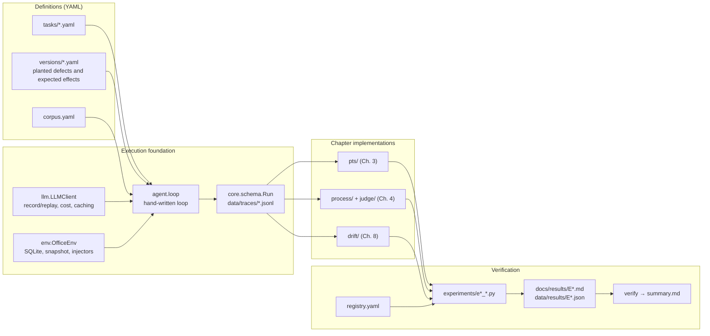
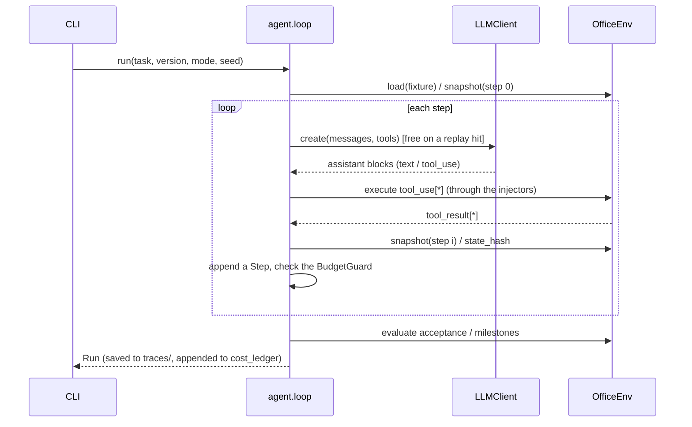
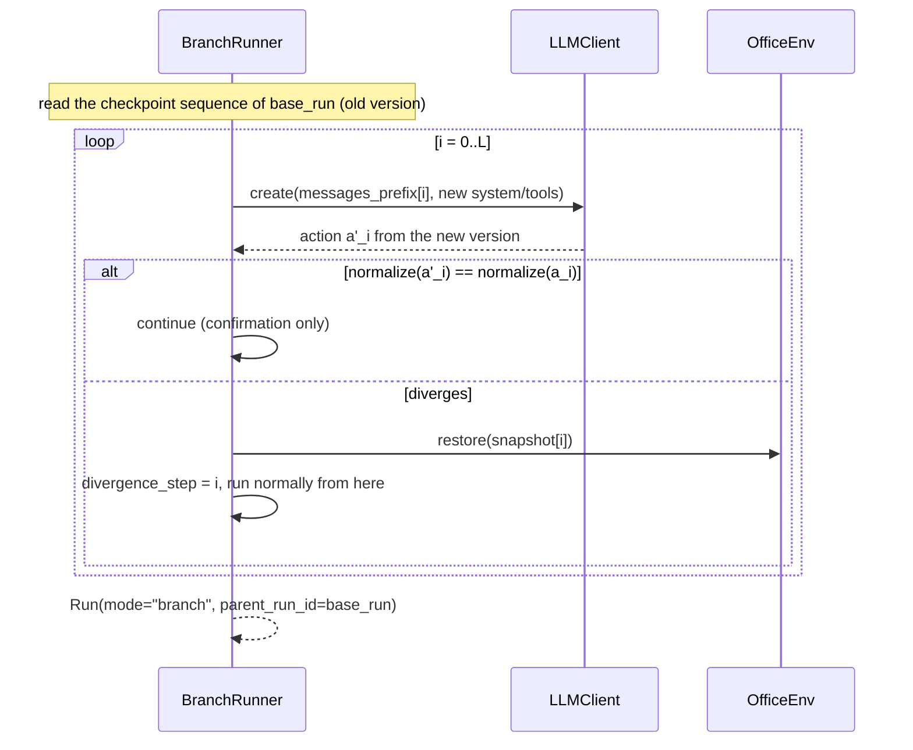

# Architecture

*日本語版: [01-architecture.md](01-architecture.md)*

## The big picture



Every chapter implementation takes only a `Run` (a trajectory) as input. Anything that needs live calls — branch re-execution, ablation, step judging, reference-policy sampling — goes through `LLMClient`; everything else is computed deterministically from the `Run`. That boundary is what justifies the provenance labels (live / replay / simulated).

## Data model (pydantic, `core/schema.py`)

```python
class ToolCall(BaseModel):
    id: str; name: str; args: dict; args_norm: dict

class ToolResult(BaseModel):
    id: str; content: str; is_error: bool; bytes: int; injected: dict | None

class Usage(BaseModel):
    input_tokens: int; output_tokens: int
    cache_creation_input_tokens: int = 0; cache_read_input_tokens: int = 0

class Step(BaseModel):
    i: int; state_hash_before: str; state_hash_after: str
    assistant_text: str; tool_calls: list[ToolCall]; tool_results: list[ToolResult]
    usage: Usage; latency_ms: int; context_tokens: int; snapshot_ref: str

class Outcome(BaseModel):
    passed: bool; acceptance_results: dict[str, bool]
    milestone_score: float; linter_violations: list[Violation]

class Run(BaseModel):
    run_id: str; task_id: str; version_id: str; version_hash: str
    mode: Literal["live", "replay", "branch"]; seed: int
    injections: list[dict]; steps: list[Step]
    final_text: str; claims: list[str]; outcome: Outcome | None
    cost: Cost; wall_time_s: float
    parent_run_id: str | None = None; divergence_step: int | None = None
```

## A normal run



## Branch re-execution (3.6)



The validity of branch re-execution is checked by comparing `outcome.passed` against a normal run of the same (task, version) pair — that is E3-5.

## Ablation (4.3)

Replace the tool result of step i with `[result omitted by ablation]`, restore `snapshot[i]`, and execute step i+1 onwards live. This reuses the same foundation as branch re-execution (checkpoints + restore), sharing `resume_from(run, i, messages_override)` from `prefix_cache.py`.

## CLI (typer, `agenteval`)

| Command | Description |
|---|---|
| `run --version V --task T [--mode] [--seed] [--inject ...]` | One run |
| `corpus build --plan corpus.yaml [--dry-run\|--live]` | Build the version × task × repeat corpus |
| `exp <id> [--live] [--seed]` | Run an experiment and refresh its result page and JSON |
| `verify` | Reconcile the registry with the result JSON into `summary.md` |
| `cost` | Aggregate the ledger: spend, remaining budget, cache hit rate |
| `data prune --older-than 30d` | Clean up generated artefacts (with a confirmation prompt) |
| `prod2test review` | Interactive human approval of drafted tests |
| `lifecycle tick` | Advance test states from metrics |

## Directory layout

```
agent-eval-lab/
├── CLAUDE.md  .claude/rules/*.md
├── pyproject.toml  Makefile  pricing.yaml  corpus.yaml
├── src/agenteval/
│   ├── core/      schema.py normalize.py events.py ids.py
│   ├── llm/       client.py cassette.py cost.py models.py
│   ├── env/       office.py tools.py checks.py fixtures.py injectors.py external.py
│   ├── agent/     loop.py context.py prompts.py
│   ├── judge/     verdict.py rubric.py
│   ├── pts/       change.py coverage.py impact.py selector.py pyramid.py prefix_cache.py sprt.py kpi.py
│   ├── process/   metrics.py ablation.py linter.py rules/ milestones.py step_judge.py plan.py niah.py consistency.py budget.py
│   ├── drift/     prodstream.py fidelity.py distribution.py discriminative.py dualtrack.py attribution.py fingerprint.py prod2test.py lifecycle.py contamination.py
│   ├── reports/   plotting.py pages.py verify.py
│   └── cli.py
├── tasks/  versions/  prompts/
├── experiments/   registry.yaml  e3_*.py e4_*.py e8_*.py
├── tests/         conftest.py (forces AGENTEVAL_LLM_MODE=replay) core/ env/ pts/ process/ drift/
├── data/          fixtures/ (committed) cassettes/ traces/ snapshots/ results/ cost_ledger.jsonl
└── docs/          report/ plan/ results/
```
