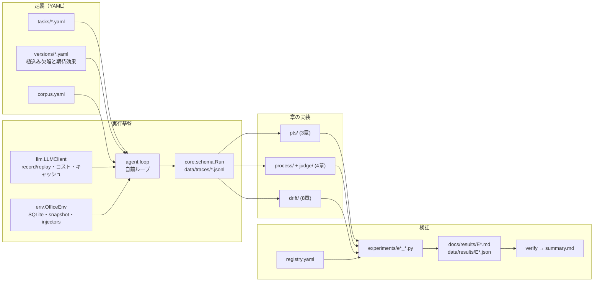
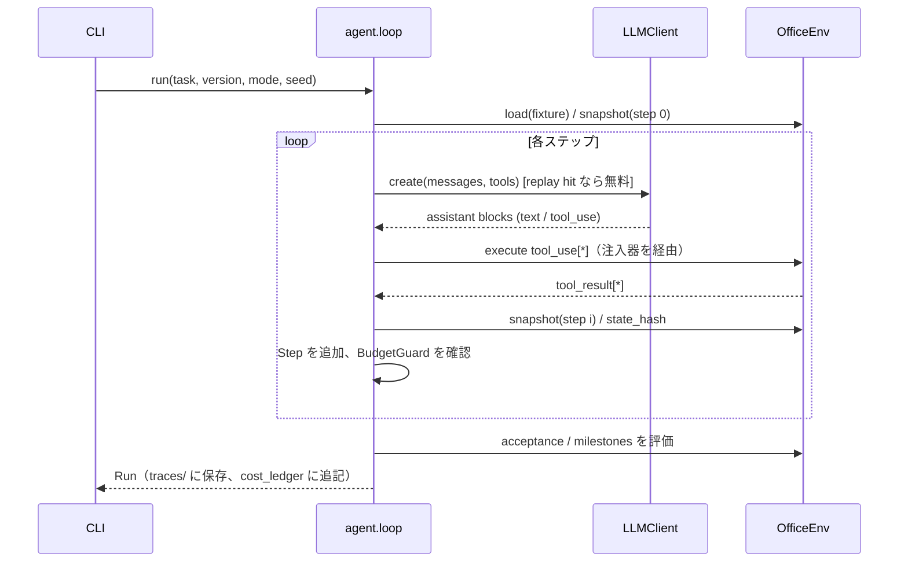
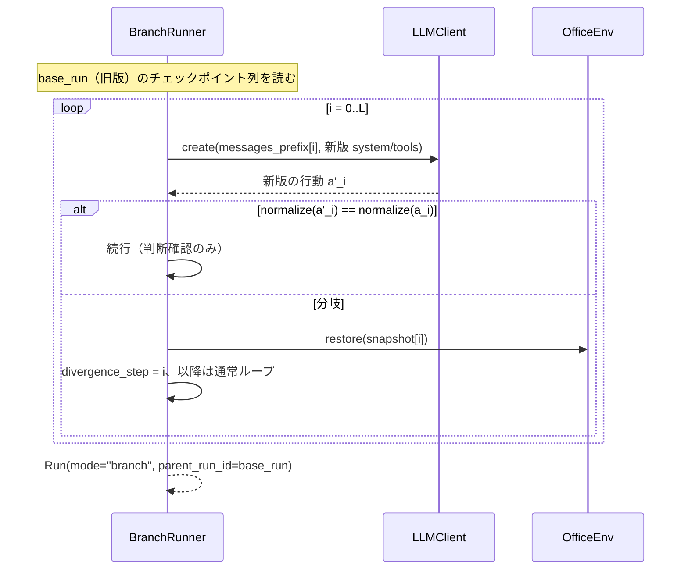

# アーキテクチャ

## 全体像



すべての章の実装は `Run`（軌跡）だけを入力にする。live を必要とする処理（分岐再実行、アブレーション、ステップ判定、参照方策サンプリング）は `LLMClient` を通り、それ以外は `Run` から決定的に計算する。この境界が「来歴ラベル（live / replay / simulated）」の根拠になる。

## データモデル（pydantic、`core/schema.py`）

```python
class ToolCall(BaseModel):
    id: str; name: str; args: dict; args_norm: dict

class ToolResult(BaseModel):
    id: str; content: str; is_error: bool; bytes: int; injected: dict | None

class Usage(BaseModel):
    input_tokens: int; output_tokens: int
    cache_creation_input_tokens: int = 0; cache_read_input_tokens: int = 0

class Step(BaseModel):
    i: int; state_hash_before: str; state_hash_after: str
    assistant_text: str; tool_calls: list[ToolCall]; tool_results: list[ToolResult]
    usage: Usage; latency_ms: int; context_tokens: int; snapshot_ref: str

class Outcome(BaseModel):
    passed: bool; acceptance_results: dict[str, bool]
    milestone_score: float; linter_violations: list[Violation]

class Run(BaseModel):
    run_id: str; task_id: str; version_id: str; version_hash: str
    mode: Literal["live", "replay", "branch"]; seed: int
    injections: list[dict]; steps: list[Step]
    final_text: str; claims: list[str]; outcome: Outcome | None
    cost: Cost; wall_time_s: float
    parent_run_id: str | None = None; divergence_step: int | None = None
```

## 通常実行の流れ



## 分岐再実行（3.6）



分岐再実行の妥当性は、同じ (task, version) の通常実行と `outcome.passed` を比較して確かめる（E3-5）。

## アブレーション（4.3）
ステップ i のツール結果を `[result omitted by ablation]` に置換した会話で、`snapshot[i]` を restore してから i+1 以降を live 実行する。分岐再実行と同じ基盤（チェックポイント ＋ restore）を使うので、`prefix_cache.py` の `resume_from(run, i, messages_override)` を共有する。

## CLI（typer、`agenteval`）
| コマンド | 説明 |
|---|---|
| `run --version V --task T [--mode] [--seed] [--inject ...]` | 1 run |
| `corpus build --plan corpus.yaml [--dry-run|--live]` | 版 × タスク × 反復のコーパス生成 |
| `exp <id> [--live] [--seed]` | 実験を実行し結果ページと JSON を更新 |
| `verify` | registry と結果 JSON を照合して `summary.md` |
| `cost` | 台帳の集計、残予算、cache hit 率 |
| `data prune --older-than 30d` | 生成物の掃除（確認プロンプト付き） |
| `prod2test review` | 起草済みテストを人が承認する対話 |
| `lifecycle tick` | メトリクスからテスト状態を遷移させる |

## ディレクトリ
```
agent-eval-lab/
├── CLAUDE.md  .claude/rules/*.md
├── pyproject.toml  Makefile  pricing.yaml  corpus.yaml
├── src/agenteval/
│   ├── core/      schema.py normalize.py events.py ids.py
│   ├── llm/       client.py cassette.py cost.py models.py
│   ├── env/       office.py tools.py checks.py fixtures.py injectors.py external.py
│   ├── agent/     loop.py context.py prompts.py
│   ├── judge/     verdict.py rubric.py
│   ├── pts/       change.py coverage.py impact.py selector.py pyramid.py prefix_cache.py sprt.py kpi.py
│   ├── process/   metrics.py ablation.py linter.py rules/ milestones.py step_judge.py plan.py niah.py consistency.py budget.py
│   ├── drift/     prodstream.py fidelity.py distribution.py discriminative.py dualtrack.py attribution.py fingerprint.py prod2test.py lifecycle.py contamination.py
│   ├── reports/   plotting.py pages.py verify.py
│   └── cli.py
├── tasks/  versions/  prompts/
├── experiments/   registry.yaml  e3_*.py e4_*.py e8_*.py
├── tests/         conftest.py（AGENTEVAL_LLM_MODE=replay を強制） core/ env/ pts/ process/ drift/
├── data/          fixtures/（コミット） cassettes/ traces/ snapshots/ results/ cost_ledger.jsonl
└── docs/          report/ plan/ results/
```
