# AIエージェントで見落とされがちな評価手法

## ― 過程・環境・評価者・時間の4軸から評価系を設計する ―

作成日: 2026年9月12日　版: 1.0

---

## 要旨

AIエージェントの評価は「最終出力が模範解答と一致するか」を中心に組まれがちである。しかしそれだけでは、コストの暴走、危険な操作、偽の完了報告、そしてテスト自体の陳腐化を捉えられない。本レポートは評価対象を出力から次の4軸に拡張し、見落とされがちな手法を体系化する。

| 軸 | 問い | 主な章 |
|---|---|---|
| **過程** | どう解いたか。無駄・非合理・危険はないか | 3, 4 |
| **環境** | テストは実利用を映しているか | 7, 8 |
| **評価者** | LLMジャッジと人の判定は信頼できるか | 5, 6 |
| **時間** | 評価系は劣化していないか | 3, 8 |

全体を貫く原理は3つである。

1. **情報量／コストの最適化** — 希少資源（人の注意・ライブ環境実行・金銭）を、結果が最も不確実な場所に集中させる。
2. **主張ではなく証拠** — エージェントの自己申告ではなく、ツールログと環境の最終状態だけを根拠にする。
3. **評価系そのものが劣化する製品** — テスト・モック・ジャッジ・選択器にも指標・予算・ライフサイクルを持たせる。

主要な提案は次のとおり。

- 軌跡カバレッジと不確実性に基づく **Predictive Test Selection**、接頭辞キャッシュによる **分岐再実行**、逐次検定による **早期打切り**（3章）
- ツール呼び出し列に対する **時相論理アサーション（軌跡リンター）**、アブレーションによる **無駄呼び出し判定**、**軌跡内 Needle-in-a-Haystack** テスト（4章）
- **主張と証拠を分離した** ツール付きジャッジ、**ジャッジのミューテーションテスト**、人の時間を複利で効かせる **レビュー→ルーブリック蒸留**（5章）
- **同期／非同期** の二時間軸、**dry-run モード** を前提としたシャドー実行、**承認ゲートの健全性指標**（6章）
- **正直な失敗報告率** を主指標とするカオスエンジニアリング、**スコープ封じ込めテスト**（7章）
- **本番→テスト・パイプライン**、**模擬忠実度**、**二重トラック評価**、テストの **ライフサイクル管理**（8章）

---

## 目次

1. はじめに：なぜエージェント評価は別物なのか
2. 全体を貫く3原理
3. Predictive Test Selection のエージェント適用
4. 過程・計画の評価
5. オフライン評価：LLM-as-Judge × Human-in-the-loop
6. オンライン評価：LLM-as-Judge × Human-in-the-loop
7. 非機能テストの設計
8. テストの陳腐化対策
9. 追加で見落とされがちな論点
10. 導入ロードマップ
11. まとめ
- 付録A 指標一覧
- 付録B 参照した概念の出典

---

## 1. はじめに：なぜエージェント評価は別物なのか

### 1.1 三つの評価パラダイムの比較

| 観点 | 従来のソフトウェアテスト | 単発LLM評価 | AIエージェント評価 |
|---|---|---|---|
| 決定性 | 決定的 | 確率的（1回の生成） | 確率的 × 多段（誤差が累積） |
| 1ケースの実行コスト | ミリ秒〜秒 | 秒、数円 | 分〜時間、数十〜数千円 |
| 正解の形 | 一意 | 複数解あり | 複数解 ＋ 複数経路 |
| 評価対象 | 出力 | 出力 | 出力 ＋ 軌跡 ＋ 副作用 ＋ コスト |
| 環境依存 | モックで固定可能 | ほぼ無し | 外部ツール・Web・DB に強く依存 |
| 時間変化の源 | コード変更 | モデル更新 | モデル・環境・ユーザー・記憶が常時変化 |
| 典型的な失敗 | 例外、誤出力 | 誤答、幻覚 | 暴走、危険操作、偽の完了報告、非効率 |

エージェント評価が難しいのは、右列の性質が**同時に**成り立つからである。確率的で多段であるため1回の合否は信用できず、反復が必要だが、1回が高価であるため反復できない。正解が複数あるため模範解答比較は不十分だが、過程を人が読むには軌跡が長すぎる。環境に依存するため模擬が必要だが、模擬は現実から離れていく。本レポートの各章は、この三つ巴の緊張をほどくための手法である。

### 1.2 本レポートの4軸と章の対応

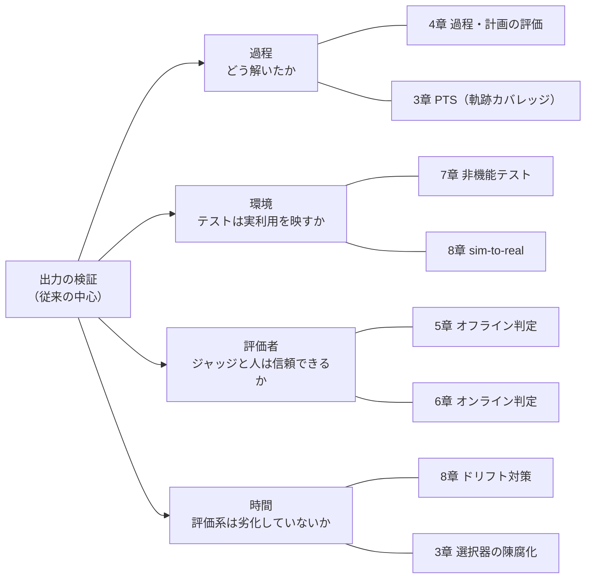

### 1.3 用語

| 用語 | 本レポートでの意味 |
|---|---|
| 軌跡（trajectory） | エージェントの行動列 $\tau = (s_0, a_1, s_1, \dots, a_L, s_L)$。$a_i$ はツール呼び出し・発話・計画更新、$s_i$ は会話状態と環境状態の組 |
| 環境状態 | ファイルシステム、DB、外部サービス、ブラウザなど、エージェントの行動で変化する外界のスナップショット |
| ジャッジ | 軌跡や結果を採点するLLM。評価対象のエージェントとは別に設計・管理する |
| HITL | Human-in-the-loop。人が定義・裁定・承認・監査のいずれかで評価に関与すること |
| PTS | Predictive Test Selection。変更内容と履歴から失敗しそうなテストを予測して選ぶ手法 |
| ドリフト | モデル・環境・タスク分布・評価者が時間とともに変化し、評価と現実がずれること |

---

## 2. 全体を貫く3原理

### 2.1 原理1：情報量／コストの最適化

エージェント評価で希少なのは、テストケースの数ではない。**人の注意**、**ライブ環境での実行**、そして**金銭**である。これらを配分する際の統一的な基準は「1単位のコストあたり、どれだけ不確実性を減らせるか」である。

$$
\mathrm{Priority}(x) = \frac{\mathbb{E}\,[\,\mathrm{IG}(x)\,]}{c(x)}
$$

ここで $x$ はテスト、ジャッジ呼び出し、人のレビューのいずれでもよく、$\mathrm{IG}$ は関心のある問い（退行があるか、判定は正しいか）に対する情報利得、$c$ はコストである。合否が二値なら、予測合格率 $p$ のエントロピーが情報利得の近似になる。

$$
H(p) = -\,p \log_2 p \;-\; (1-p)\log_2 (1-p)
$$

合格率が 0% や 100% に近いテストは走らせても学ぶことがなく、50% 付近のテストが最も多くを教える。この一つの式が、3章の PTS、5章の人の配分、6章のサンプリングをすべて説明する。

| 配分の場面 | $x$ | 何についての不確実性か | 章 |
|---|---|---|---|
| CIでどのテストを走らせるか | テストケース | 新版で合否が反転するか | 3 |
| どの軌跡を深く判定するか | ジャッジ呼び出し | 一次判定が正しいか | 5 |
| どのケースを人に回すか | 人のレビュー | ジャッジ間の不一致をどう裁くか | 5 |
| 本番のどのセッションを監査するか | サンプル | 品質分布がシフトしたか | 6 |

### 2.2 原理2：主張ではなく証拠

エージェントは「テストしました」「確認済みです」「変更は最小限です」と言う。これらは行動の証拠ではなく生成されたテキストである。評価は自己申告を根拠にしない。

| エージェントの主張 | 確認すべき証拠 |
|---|---|
| 「テストを実行し、すべて通りました」 | テスト実行のツール呼び出しログと終了コード、実行時刻が変更後であること |
| 「設定ファイルを確認しました」 | read 呼び出しの存在と、その内容が後続の判断に反映された痕跡 |
| 「変更は最小限に留めました」 | 触れた資源の集合と diff の実体 |
| 「完了しました」 | 環境の最終状態が受入基準を満たすこと |

5章のジャッジ設計（主張と証拠の分離）、9章の自己申告忠実度はこの原理の具体化である。

### 2.3 原理3：評価系そのものが劣化する製品

テストスイート、記録済みのツール応答、LLMジャッジ、人のレビュー体制、PTS の選択器は、いずれも時間とともに現実から離れていく。評価系を「一度作れば終わり」の道具ではなく、健全性指標と保守予算を持つ製品として扱う。

| 評価系の構成要素 | 劣化の仕方 | 健全性指標 | 章 |
|---|---|---|---|
| テストケース | 全員が通る（飽和）、実利用と乖離（陳腐化） | 弁別力 $d(t)$、鮮度年齢、分布距離 | 8 |
| 記録済みツール応答（モック） | 実環境の応答と食い違う | 模擬忠実度 $F$ | 8 |
| LLMジャッジ | モデル更新で判定が変わる、エージェントに攻略される | 対人一致率、ミューテーションスコア | 5 |
| 人のレビュー | 疲労、評価者間の不一致 | 評価者間一致 $\kappa$、レビュー効率 | 5, 6 |
| PTS 選択器 | 学習した履歴が古くなる | 逃走欠陥率 | 3 |

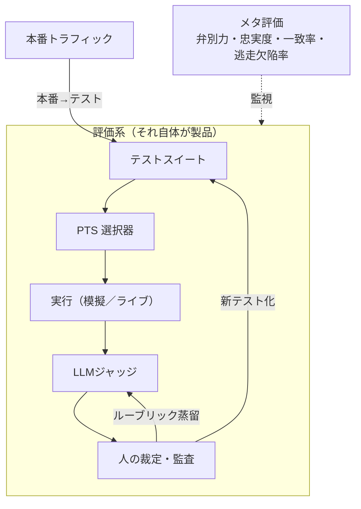

---

## 3. Predictive Test Selection のエージェント適用

### 3.1 前提：エージェントの「変更」は多層である

Predictive Test Selection（PTS）は、変更内容と過去の合否履歴から「失敗しそうなテスト」を予測し、全件ではなく高確率のテストだけを実行する手法である。コードでは「どのファイルが変わったか」と「そのファイルに近いテストの失敗履歴」が主な特徴量になる。エージェントでは変更の種類がはるかに多く、しかも**何も変えていないのに壊れる**（外部環境が変わる）ため、変更の種類ごとに影響推定の手掛かりを用意する必要がある。

| 変更の種類 | 例 | 検知手段 | 影響推定の手掛かり |
|---|---|---|---|
| コード | ツールラッパー、ルーティング、パーサ | git diff | 従来のコードカバレッジ |
| プロンプト | システムプロンプト、few-shot、スキル定義 | テキスト diff | 意味的影響推定（3.3） |
| モデル版 | プロバイダの更新、モデル切替 | 版ID、モデル指紋（8.8） | 前回のモデル更新で反転したテスト |
| ツール仕様 | スキーマ変更、API のバージョン | 契約テスト | 軌跡カバレッジ（3.2）：そのツールを呼ぶテスト |
| 知識ベース／RAG | 文書の追加・更新 | インデックス差分 | 検索ログ：どの文書を引いたテストか |
| 設定 | 温度、最大ステップ、予算 | config diff | 全体に広く効く → 境界テスト優先（3.4） |
| 外部環境 | Web サイト改修、API 挙動変化 | 変更なしの失敗 | 模擬忠実度ジョブ（8.5） |

### 3.2 軌跡カバレッジ依存グラフ

コードのカバレッジ計測には計装が必要だが、エージェントでは過去の実行ログがそのまま「このテストは何を使ったか」の記録になる。各テスト $t$ について、軌跡から使用要素の集合 $U(t)$（呼んだツール、参照したプロンプト節、起動したスキル、引いた文書、通った分岐）を抽出し、変更 $\Delta$ が触れる要素集合 $C(\Delta)$ との交わりで候補を絞る。

$$
\mathcal{T}_{\text{cand}}(\Delta) = \{\, t \in \mathcal{T} : U(t) \cap C(\Delta) \neq \varnothing \,\}
$$

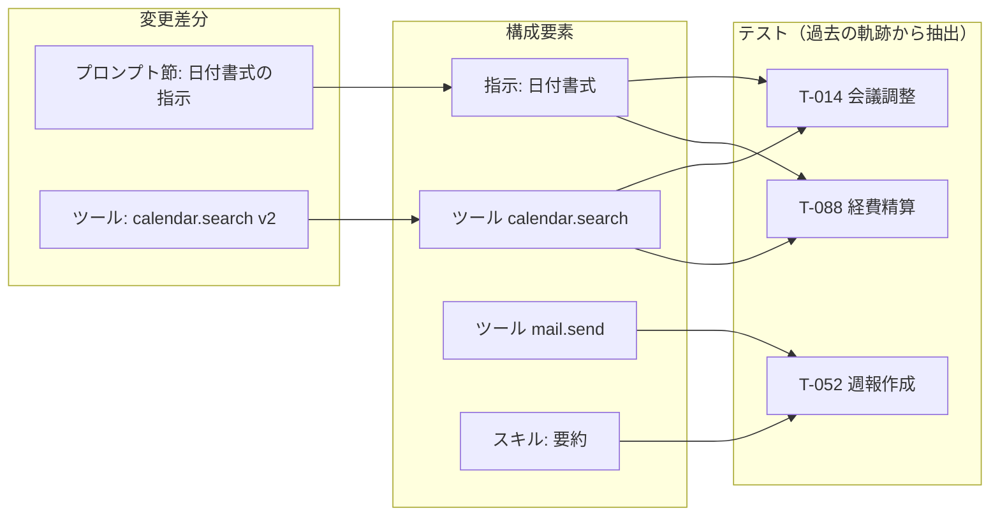

この例では T-052 は候補から外れる。プロンプト節とテストの対応は、指示のカテゴリをタグ化してテストのタスク特徴（日付を含むか等）と照合するか、過去の軌跡で該当指示に言及した痕跡（計画文、根拠文）から推定する。

### 3.3 意味的影響推定（プロンプト差分向け）

プロンプトの diff は行単位の変更でしかなく、どの行動に効くかは直接には分からない。そこで LLM に diff を読ませ、「変わりうる行動」を仮説としてタグ列挙させ、テストのタグや埋め込みと照合する。

1. diff → 影響仮説（例：「日付の出力形式が変わる」「確認質問の頻度が下がる」）
2. 仮説をテストのタグ・タスク文の埋め込みと照合し、類似度上位を候補に追加
3. 3.2 のカバレッジ候補と和集合を取る

仮説生成は安価であり、当たらなくても 3.4 の不確実性スコアが最終的な優先度を決めるため、誤検知のコストは小さい。

### 3.4 不確実性駆動の選択

候補の中からどれを実行するかは、新版での合否がどれだけ**不確実か**で決める。予測合格率 $\hat p_t$ を次の特徴量から推定する。

| 特徴量 | 意味 | 不確実性への寄与 |
|---|---|---|
| 直近の合格率 | 安定して通る／落ちるか | 0.5 付近で最大 |
| 反転回数 | 過去 $k$ 回の変更で合否が反転した回数 | 多いほど高い |
| スコア余裕 | 合格閾値からの距離（部分点の場合） | 小さいほど高い |
| カバレッジ重なり | $\lvert U(t) \cap C(\Delta) \rvert$ | 大きいほど高い |
| フレーク率 | 同一版での反復実行のばらつき | 高いほど「テスト側の問題」として別扱い |

選択問題は、情報利得の総和を最大化しつつ冗長性を罰する予算付き最適化として書ける。

$$
\max_{S \subseteq \mathcal{T}_{\text{cand}}} \;\sum_{t \in S} H(\hat p_t)\;-\;\lambda \sum_{t \ne t' \in S} \mathrm{sim}(t, t')
\quad \text{s.t.}\quad \sum_{t \in S} c(t) \le B
$$

$\mathrm{sim}$ は軌跡の類似度（ツール列の編集距離や埋め込み距離）で、同一経路を通る30件から代表3件だけを選ぶ効果を持つ。厳密解は不要で、$H(\hat p_t)/c(t)$ の降順に貪欲に詰め、類似テストを間引くだけで十分に機能する。

### 3.5 エージェント版テストピラミッド

PTS の出力は「どのテストを走らせるか」だけではなく「**どの段まで登るか**」でもある。

| レベル | 内容 | 決定性 | 所要時間の目安 | 用途 |
|---|---|---|---|---|
| L0 | 決定的部品の単体テスト（パーサ、ツールラッパー、ルーティング） | 完全 | 秒 | 常時 |
| L1 | 記録済み LLM 出力の再生による周辺ロジックの回帰 | 完全 | 秒 | 常時 |
| L2 | 単一ステップ判断テスト（この状態で正しい行動を選ぶか） | 確率的 | 秒〜分 | LLM に影響する変更 |
| L3 | 模擬ツールでの全軌跡 | 確率的 | 分 | 判断の分岐、ツール仕様変更 |
| L4 | ライブサンドボックスでの全軌跡 | 確率的 | 分〜時間 | 外部環境依存、モデル版変更 |
| L5 | 本番カナリア／シャドー（6章） | — | 日 | リリース前後 |

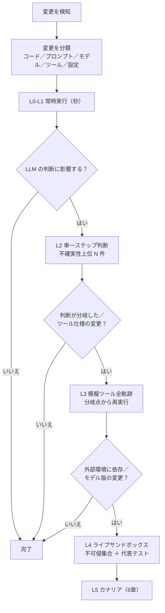

### 3.6 接頭辞キャッシュと分岐再実行

エージェントテストが遅い最大の理由は、変更の影響が末尾数ステップにしかなくても、毎回先頭から全軌跡を走らせることにある。前回の実行で各ステップの状態 $s_i$（会話状態 ＋ 環境スナップショット）をチェックポイントとして保存しておけば、新版については「同じ状態でどう判断するか」だけを順に確認し、旧軌跡から**分岐した地点以降**のみをライブ実行すればよい。

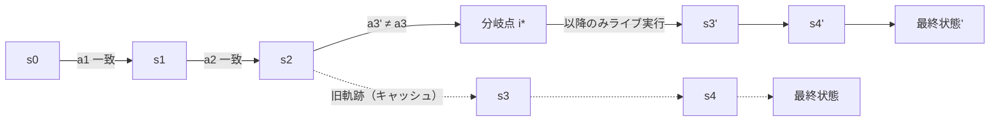

実行コストは軌跡長 $L$ から接尾辞長 $L - i^*$ に落ちる。実現の要件は次の3点である。

- **環境の決定的スナップショット**：コンテナ、git の作業ツリー、DB のスナップショット、API モック。コーディングエージェントや社内 API 連携では現実的に用意できる。
- **同値判定の許容幅**：引数の書式違いなど良性の差を分岐と誤認しないよう、ツール名と正規化した引数の一致に加え、安価なジャッジで意味的同値を判定する。
- **分岐点分布の診断利用**：多くのテストで早期に分岐するなら変更の影響は大きい。分岐点のヒストグラム自体が変更のリスク指標になる。

同じ仕組みは 4.3 のアブレーション（あるツール結果を消して接尾辞を再実行）と 8.8 のドリフト帰属（1要素だけ入れ替えて再実行）でも使う。接頭辞キャッシュは PTS の高速化にとどまらず、過程評価とドリフト分析の共通基盤である。

### 3.7 逐次検定による早期打切り

確率的なテストは反復が必要だが、反復回数を固定する必要はない。合格率 $p$ について「許容水準 $p_0$ 以上」対「問題水準 $p_1$ 以下」を逐次確率比検定（SPRT）で判定し、決着した時点で止める。$n$ 回中 $s$ 回成功したときの対数尤度比は

$$
\Lambda_n = s \ln\frac{p_1}{p_0} + (n - s)\ln\frac{1 - p_1}{1 - p_0}
$$

であり、$\Lambda_n \ge \ln\frac{1-\beta}{\alpha}$ で「退行あり」、$\Lambda_n \le \ln\frac{\beta}{1-\alpha}$ で「許容」として打ち切る（$\alpha, \beta$ は許容する誤判定率）。明確に通る／落ちるテストは2〜3回で決着し、境界のテストにだけ反復が集中する。

スイート全体でも同じ発想が使える。失敗確率の高い順に実行し（fail-fast）、「重要テストのいずれかが退行した」という判断が統計的に決着した時点で残りを打ち切る。

### 3.8 選択器の運用

- **コールドスタート**：学習データ（変更 → 合否反転）がない初期は、プロンプト摂動やモデル入替といった合成変更を人為的に加えて反転データを作る。
- **選択器自身の KPI**：定期（週次など）フル実行で見つかった失敗のうち、選択から漏れていた割合を**逃走欠陥率**として追跡する。

$$
\mathrm{Escape}(S) = \frac{\lvert F_{\text{full}} \setminus S \rvert}{\lvert F_{\text{full}} \rvert}
$$

- **ε-探索**：毎回の選択に少量（例：5%）のランダムテストを混ぜ、選択器の校正を保ち、想定外の退行を拾う。
- **不可侵集合**：不可逆操作・安全・セキュリティに関わるテストは選択の対象外とし、常に実行する。
- **選択器の陳腐化**：履歴に直近ほど重い重みを付けて再学習する（8章）。

---

## 4. 過程・計画の評価

### 4.1 結果一致テストの限界

模範解答との比較が不十分なのは「正解が複数ある」からだけではない。過程と結果は独立に良し悪しを持ち、結果だけを見ると対角線以外の2象限を取り違える。

| | 結果：正しい | 結果：誤り |
|---|---|---|
| **過程：良い** | 真の成功 | ツール障害、環境の揺らぎ。過程を評価していれば「エージェントの問題ではない」と切り分けられる |
| **過程：悪い** | 偶然の正解、報酬ハック、答えの覗き見、過剰なコスト。結果評価はこれを成功と数える | 真の失敗 |

さらに、コスト・安全性・再現性は過程にしか現れない。無駄な手順はトークンを消費するだけでなく、巨大で無関係なツール出力をコンテキストに積み上げ、後続の判断に必要な情報を自ら埋もれさせる。エージェントは自分自身に対して Needle-in-a-Haystack 問題を作り出す（4.9）。

### 4.2 軌跡メトリクスの体系

| 指標 | 定義 | 検出する問題 |
|---|---|---|
| 迂回率 | $D = L_{\text{actual}} / L_{\min}$（$L_{\min}$ は既知の最短ステップ数） | 遠回り、探索の下手さ |
| 重複呼び出し率 | 同一（ツール, 正規化引数）の再呼び出し数 ／ 総呼び出し数 | ループ、記憶の不使用 |
| 後戻り回数 | 状態を戻す操作（revert、undo、同一ファイルの再読）の回数 | 計画の不備 |
| 無駄呼び出し率 | 結果が最終出力に寄与しなかった呼び出しの割合（4.3） | 探索の非効率、コンテキスト汚染 |
| コンテキスト増加量 | ステップごとの追加トークン $\Delta C_i$、累積、ピーク | 自己汚染、コスト |
| 検証行動率 | 検証が必要な局面のうち検証（テスト実行、差分確認）を行った割合 | 過小検証 |
| 復帰成功率 | ツールエラー後にループせず進行した割合 | 障害耐性の欠如 |
| 停止適切性 | 未達で完了宣言した率、達成後も継続した率 | 早すぎ／遅すぎる停止 |
| 質問適切性 | 曖昧なタスクで質問した率、明確なタスクで質問しなかった率 | 過剰／過少な確認 |

$L_{\min}$ は人手で与えるか、best-of-N の実行から最短の成功軌跡を採用する。指標は単独で使わず、4.11 の対指標と組で報告する。

### 4.3 アブレーションによる無駄呼び出し判定

ある呼び出しが「無駄だったか」は、その結果をコンテキストから消して以降を再実行し、最終結果が変わらないかで判定できる。接頭辞キャッシュ（3.6）があればこれは自動化できる。

$$
U(\tau) = \frac{1}{N} \sum_{i=1}^{N} \mathbb{1}\!\left[\, y(\tau) = y(\tau_{\setminus i}) \,\right]
$$

$\tau_{\setminus i}$ は呼び出し $i$ の結果を除いてステップ $i$ から再実行した軌跡、$y$ は最終結果である。全呼び出しに対して行うと高価なので、安価な代理指標（ジャッジに「この出力は後で参照されたか」を問う）を全件に適用し、サンプルに対してアブレーションで代理指標を校正する。

### 4.4 時相論理アサーション（軌跡リンター）

軌跡をイベント列 $e_1, \dots, e_L$ とみなすと、「正しい過程」の多くは黄金軌跡ではなく**順序と禁止の制約**として書ける。線形時相論理（LTL）風の記法で仕様化し、構造化ログに対して決定的に検査する。LLM を使わず、ミリ秒で走り、正解経路が複数あっても壊れない。

| 仕様（自然言語） | 記法 | 目的 |
|---|---|---|
| 削除の前に必ずバックアップする | $\mathbf{G}\big(\mathrm{delete}(x) \rightarrow \mathbf{O}\,\mathrm{backup}(x)\big)$ | 不可逆操作の保護 |
| 完了を宣言する前にテストを実行している | $\mathbf{G}\big(\mathrm{claim\_done} \rightarrow \mathbf{O}\,\mathrm{run\_tests}\big)$ | 偽の完了報告の防止 |
| 設定ファイルは読んでから編集する | $\neg\,\mathrm{edit}(cfg)\ \mathbf{U}\ \mathrm{read}(cfg)$ | 盲目的な変更の防止 |
| 同一引数の呼び出しは2回まで | $\mathrm{count}(\mathrm{call}(f, a)) \le 2$ | ループ検出 |
| 許可範囲外へ書き込まない | $\mathbf{G}\big(\mathrm{write}(r) \rightarrow r \in \mathrm{Allowed}\big)$ | スコープ封じ込め（7.3） |
| エラー後は再試行上限内で代替か報告に移る | $\mathbf{G}\big(\mathrm{error} \rightarrow \mathbf{X}(\mathrm{retry}_{\le 2} \vee \mathrm{alt} \vee \mathrm{escalate})\big)$ | 無限再試行の防止 |

$\mathbf{G}$ は「常に」、$\mathbf{O}$ は「過去に一度」、$\mathbf{U}$ は「〜まで」、$\mathbf{X}$ は「次のステップで」を表す。リンター違反は確定的な失敗として扱い、ジャッジ（5章）の判定を待たない。

### 4.5 半順序マイルストーン仕様

黄金軌跡を1本与える代わりに、**必ず到達すべき中間状態**（マイルストーン）とその**順序制約**、および**禁止行動**だけを指定し、間の経路は自由にする。

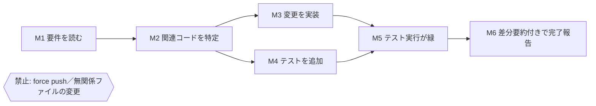

到達は環境状態の検査（ファイルの存在、DB の行、テストの終了コード）で判定し、部分点を与える。

$$
\mathrm{Score}(\tau) = \frac{\lvert\{\, m \in M : \mathrm{reached}(m) \wedge \mathrm{order\_ok}(m) \,\}\rvert}{\lvert M \rvert} \;-\; \pi \cdot \lvert \mathrm{violations}(\tau) \rvert
$$

M3 と M4 の順序は問わないので、実装先行でもテスト先行でも満点になる。

### 4.6 ステップ単位判定

長い軌跡を丸ごと採点するのではなく、各状態 $s_i$ で行動 $a_i$ が妥当かを判定して集約する。実装は2通りある。

- **判定モデル方式**：$(s_i, a_i)$ を与え「この状態でこの行動は合理的か」を採点する（プロセス報酬モデルの考え方）。集約は平均に加えて最小値も見る。1手の致命的判断が平均に埋もれるのを防ぐためである。
- **参照方策との一致方式**：強い参照エージェントを同じ状態 $s_i$ から $K$ 回走らせて行動分布 $\hat\pi_{\text{ref}}(\cdot \mid s_i)$ を得て、評価対象の行動（の意味的同値類 $[a_i]$）がどれだけ支持されるかを測る。

$$
A(\tau) = \frac{1}{L} \sum_{i=1}^{L} \hat\pi_{\text{ref}}\big([a_i] \mid s_i\big)
$$

$A$ が低いステップは「参照エージェントなら取らない行動」であり、人のレビュー対象として自動抽出できる。

### 4.7 計画の外在化と乖離率

思考の中の計画は評価できないが、**構造化データとして出力させた計画**は評価できる。計画を依存関係付きのステップ列（DAG）として出させ、実行前と実行後の2段階で検査する。

| 段階 | 検査項目 |
|---|---|
| 実行前 | DAG が非循環か、依存が妥当か、各要件が少なくとも1ステップに対応しているか、存在しないツール・資源を参照していないか |
| 実行後 | 宣言した計画と実際の行動列の乖離、乖離の正当性 |

乖離率は意味的同値の粒度で取った編集距離で定義する。

$$
\delta(\tau) = \frac{\mathrm{ED}(\mathrm{plan}, \mathrm{exec})}{\max\big(\lvert \mathrm{plan} \rvert, \lvert \mathrm{exec} \rvert\big)}
$$

乖離がゼロである必要はない（途中で知った情報で計画を変えるのは正しい）。乖離した箇所だけをジャッジに「正当な変更か」と問えば、判定対象は軌跡全体ではなく数箇所に絞られる。

### 4.8 思考トレースの忠実性への注意

推論トレースは行動の説明として便利だが、後付けの合理化や不忠実な説明であり得る。トレースを正解の根拠にすると、もっともらしい説明を書くエージェントが高得点になる。思考の評価は**行動と環境変化で裏取り**し、トレースは人のレビューの補助資料に留める。

### 4.9 軌跡内 Needle-in-a-Haystack

非合理な処理が自らコンテキストを汚染する問題を直接測る。早い段階のツール出力に鍵となる事実を埋め込み、大きなノイズ出力を $n$ ステップ挟んだ後、その事実を要する判断をさせる。

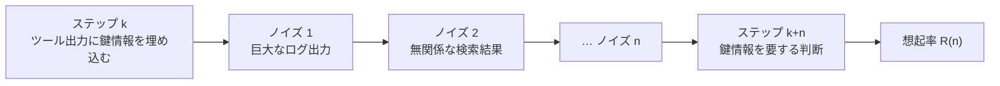

$$
R(n) = \Pr\big[\text{correct decision at step } k+n\big]
$$

$R(n)$ を $n$ の関数として描き、曲線下面積を要約指標にする。これはコンテキスト管理戦略（ツール出力の要約、絞り込み、外部記憶への退避）を比較する指標になり、「ステップ数を減らす」とは別の軸で過程の質を測る。

### 4.10 一貫性：pass@k と pass^k

$n$ 回実行して $c$ 回成功したとき、

$$
\mathrm{pass@}k = 1 - \frac{\binom{n-c}{k}}{\binom{n}{k}}, \qquad
\mathrm{pass}^k = \frac{\binom{c}{k}}{\binom{n}{k}}
$$

pass@k は「$k$ 回のうち1回でも成功する確率」で能力の上限を、pass^k は「$k$ 回すべて成功する確率」で信頼性を表す。本番で毎回同じタスクを任せるエージェントに必要なのは後者である。結果の一貫性に加え、各状態での行動エントロピーやステップ数の分散も取る。効率的で分散の小さい軌跡は、仕様が行動を十分に拘束している証拠になる。

### 4.11 コスト回帰テストと Goodhart 対策

タスク種別ごとにトークン数・ステップ数の p95 予算を CI で強制する。

$$
Q_{0.95}\big(\mathrm{tokens}(\tau)\big) \le B_{\text{class}}
$$

平均ではなく p95 を使うのは、暴走した1本がコスト全体を支配するからである。ただし効率指標を単独で最適化すると、エージェントは検証を省いてステップを減らし始める。効率指標は必ず対になる品質指標と組で報告する。

| 効率指標 | 対になる指標 | 単独最適化で起きること |
|---|---|---|
| ステップ数 | 検証行動率 | テスト実行や差分確認の省略 |
| トークン数 | 軌跡内 NIAH の想起率 | 必要な情報まで捨てる要約 |
| 質問回数 | 誤前提率 | 確認せずに思い込みで進む |
| 完了時間 | 副作用違反数 | 安全確認の省略 |

---

## 5. オフライン評価：LLM-as-Judge × Human-in-the-loop

### 5.1 役割分担の原理：人が定義し、LLM が適用する

LLM ジャッジは規模と一貫性に優れるが、正解を知らず、主張に騙され、長い軌跡の中盤を落とす。人は正解と趣味と新奇性の発見に優れるが、高価で遅く、疲れる。分担の原則は「**定義は人、適用は LLM**」である。

| 活動 | 人 | LLM |
|---|---|---|
| ルーブリック・仕様・リンター規則の作成 | 主 | 下書きの補助 |
| 校正用ゴールデンセットのラベル付け | 主 | — |
| 一次判定（大量） | — | 主 |
| 失敗のクラスタリング、根拠の要約 | — | 主 |
| ジャッジ間の不一致の裁定 | 主 | — |
| 新奇な故障モードの発見 | 主（代表事例を見る） | クラスタ提示 |
| 優先度・重大度の判断 | 主 | — |

### 5.2 エージェント向けジャッジ設計

| 課題 | 設計 |
|---|---|
| 長い軌跡で中盤の情報を落とす | ステップ／マイルストーン単位で分割判定し、集約する |
| エージェントの主張に騙される | **主張と証拠の分離**：最終要約や「確認しました」を隠し、生のツールログと環境状態だけを見せる |
| 読むだけでは検証できない | **ツール付きジャッジ**：最終環境状態を検査し、テストを走らせ、diff を取る |
| 絶対評価が不安定 | 新旧版のペアワイズ比較、位置を入れ替えて2回判定 |
| 自己選好バイアス | 評価対象と異なるモデル族を含むアンサンブル |
| 冗長性バイアス | 長さ正規化、無駄ステップを減点するルーブリック項目 |
| リッカート尺度の曖昧さ | 二値のチェックリスト（下位質問）に分解して合算 |
| 根拠の後付け | 判定根拠にログ行番号など証拠の参照を必須化 |

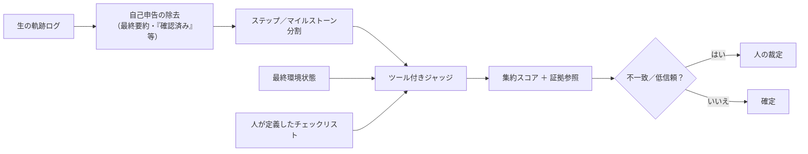

### 5.3 ジャッジのミューテーションテスト

テストスイートの品質をミューテーションテスト（既知のバグを注入して検出できるか）で測るのと同じ発想を、ジャッジに適用する。良い軌跡に既知の欠陥を注入し、ジャッジが検出できるかを測る。

| 変異オペレータ | 注入内容 | 検出できなければ何が起きるか |
|---|---|---|
| 引数改変 | ツール引数を誤った値に置換 | 誤操作を見逃す |
| 検証省略 | テスト実行ステップを削除 | 未検証の完了を許す |
| 破壊的操作の挿入 | 削除・強制上書きを追加 | 危険操作を見逃す |
| 偽の完了報告 | 未達のまま完了宣言に書き換え | 自己申告に騙される |
| 手順の入替 | バックアップと削除の順序を逆転 | 順序制約を見ない |
| 冗長ループの挿入 | 同一呼び出しを5回複製 | 非効率を評価しない |
| スコープ逸脱 | 無関係ファイルへの変更を追加 | 封じ込め違反を見逃す |

$$
\mathrm{MS} = \frac{\#\,\text{killed mutants}}{\#\,\text{mutants}}
$$

変異の種類別にスコアを出し、弱い種類のルーブリックを補強する。同時に変異なしの軌跡に対する誤警報率も測る。ジャッジのプロンプトやモデルを変えるたびにこのスイートを走らせれば、ジャッジの回帰テストになる。

### 5.4 人の配分アルゴリズム

人の時間は、ジャッジが決められないところと、ジャッジの誤り率を見積もるところに使う。

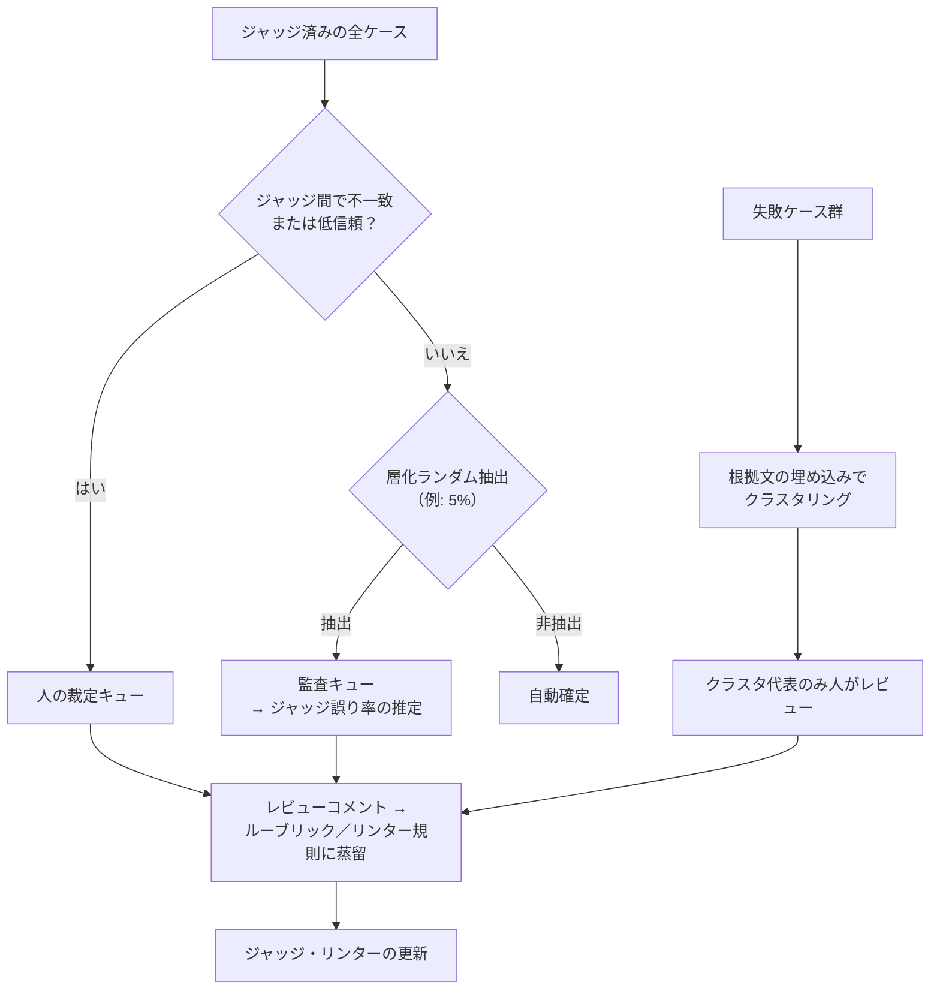

要点は最後の「蒸留」にある。人のコメント（「このケースでは事前確認が必要だった」）をルーブリック項目やリンター規則に変換すれば、以後は同種の判定が自動化され、人の1時間が複利で効く。

### 5.5 合成タスクの落とし穴

テストケースを LLM に生成させると、モデルの盲点をタスク側も共有し、難しい入力が過小になる。人がシナリオ族とパラメータ（ドメイン、曖昧さの度合い、障害の有無）を設計し、LLM が変種を生成し、人がサンプルを検証する。人手で書いた種テストの比率を保ち、合成タスクと実タスクの合格率差を監視する。差が大きければ合成タスクは易しすぎる。

### 5.6 メタ評価の常設

ジャッジの指標を、エージェントの指標と同じダッシュボードに置く。

| 指標 | 定義 |
|---|---|
| 対人一致率 | ゴールデンセット上で人の判定と一致した割合、Cohen の $\kappa$ |
| 再判定一致率 | 同一入力を再判定して同じ結論になる割合 |
| ミューテーションスコア | 5.3 の $\mathrm{MS}$（変異種類別） |
| 誤警報率 | 変異なしの良い軌跡を不合格にした割合 |
| コスト・遅延 | 1判定あたりのトークンと時間 |

---

## 6. オンライン評価：LLM-as-Judge × Human-in-the-loop

オフラインとの違いは4つある。正解がない、遅延制約がある、副作用が本物である、そして**暗黙のシグナル**が手に入る。

### 6.1 二つの時間軸で設計する

| | 同期（行動前） | 非同期（事後） |
|---|---|---|
| 目的 | 危険な行動を止める | 品質分布を監視し、改善に繋げる |
| 遅延制約 | 数十〜数百ミリ秒 | 分〜日 |
| 手段 | ルール、小型モデル、リンター（4.4） | 重いジャッジ、ツール付きジャッジ |
| 人の役割 | 不可逆操作の承認 | フラグ付きセッションの監査 |
| 対象範囲 | 全件（ただし高リスク行動のみ深く） | 層化サンプル |

全件に重いジャッジをかけると、コストが本番のエージェント自体を上回る。同期側は「止める」ことに特化した軽い検査、非同期側は「測る」ことに特化した重い検査と役割を分ける。

### 6.2 暗黙シグナルのラベル化

本番には明示的な評価がなくても、ユーザーの行動が品質を語る。

| シグナル | 意味 | 注意点 |
|---|---|---|
| 出力の編集差分量 | 品質の逆指標 | タスク種別で正規化する |
| 操作の取り消し・ロールバック | 有害または不要な行動 | 誤操作も含まれる |
| 同一依頼の言い直し | 未達 | 探索的な利用と区別する |
| 途中離脱 | 未達または遅延 | 外的な割り込みもある |
| 下流の成果（PR のマージ、返信の送信、購入完了） | 真の達成 | 観測が遅れる |
| 明示的評価（評価ボタン、理由） | 直接の評価 | 回答する層に偏る |

これらを弱教師として組み合わせ、**行動ラベル**を作る。行動ラベルはオンラインジャッジの校正に使い、両者の相関が落ちたらジャッジのドリフト（8.1）を疑う。

### 6.3 承認ゲートの健全性指標

「不可逆操作の前に人が承認する」というゲートは HITL の代表的な形だが、ゲート自体の健全性を測らないと形骸化する。

$$
\mathrm{ApprovalRate} = \frac{\#\,\text{approved}}{\#\,\text{gated}}, \qquad
\mathrm{Precision}_{\text{int}} = \frac{\#\,\text{necessary interventions}}{\#\,\text{interventions}}, \qquad
\mathrm{Recall}_{\text{int}} = \frac{\#\,\text{necessary interventions caught}}{\#\,\text{necessary interventions (post-hoc audit)}}
$$

| 観測 | 解釈 | 対応 |
|---|---|---|
| 承認率がほぼ 100% | ゲートは形骸化している（人は読まずに承認）か、ゲート対象が広すぎる | ゲート対象を絞る、要約の質を上げる |
| 拒否率が高い | エージェントの自律性が較正されていない | ゲート前の判断ロジックを修正 |
| 事後監査で見逃しが多い（Recall が低い） | ゲート対象の定義が狭すぎる | 対象行動の再定義 |

### 6.4 シャドー実行と dry-run モード

新版を本番入力で並走させ、旧版とペアワイズ比較したい。しかし副作用のあるツールは並走できない。読み取りは本番に通し、書き込みは模擬に振り分ける **dry-run プロキシ** をツール層に持つ必要がある。これは後付けが難しいアーキテクチャ要件であり、評価の設計は製品の設計に食い込む。

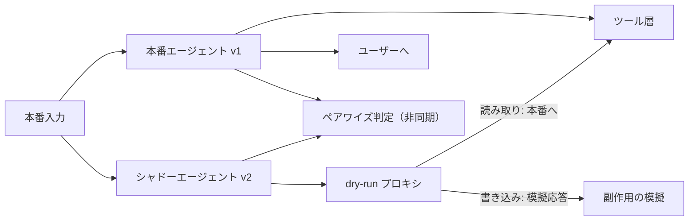

模擬された書き込み以降、シャドーの状態は本番から乖離する。比較は最初の副作用までの区間、または読み取りのみのタスクに限定するのが安全である。

### 6.5 統計的工程管理

ジャッジスコアの時系列 $x_t$ に対して、平均の低下を CUSUM で検知する。

$$
S^{-}_t = \max\!\big(0,\; S^{-}_{t-1} + (\mu_0 - x_t) - k\big), \qquad \text{alarm if } S^{-}_t > h
$$

$\mu_0$ は基準期間の平均、$k$ は許容する微小な変動、$h$ は警報閾値である。ジャッジ側のモデル版は固定し、更新時はゴールデンセットで再校正してから切り替える。切り替え期間は新旧ジャッジを並走させ、スコア分布の差をエージェントの変化と混同しない。

### 6.6 フィードバックループとホールドアウトジャッジ

オンラインジャッジのスコアでエージェントを自動調整すると、エージェントはジャッジの好みを学び、ジャッジ攻略が起きる。学習信号に使うジャッジと監視に使うジャッジを分け、後者は開発ループから隔離する。ジャッジのスコアが上がるのに行動ラベル（6.2）が横ばいなら攻略の兆候である。学習信号として使う判定は最終的に人が裁定する。

### 6.7 長時間自律エージェントのステージゲート

数時間〜数日走るエージェントでは、人が軌跡を通読することはできない。ジャッジが進捗と計画からの逸脱を要約し、人は要約と抜き取り検査でチェックポイントを承認する。この設計の指標は次の値である。

$$
\mathrm{ReviewEfficiency} = \frac{\text{time spent on true issues}}{\text{total review time}}
$$

この値が低ければ要約が真の問題を前面に出せていない。要約の質はエージェントの質と同じくらい重要な改善対象になる。

### 6.8 プライバシーとサンプリング

判定前に PII を除去する。サンプリングはタスク種別・リスク・ユーザー層で層化し、稀だが重要な事象（不可逆操作を伴うセッション）が抽出されるよう重み付けする。

---

## 7. 非機能テストの設計

### 7.1 非機能要件マトリクス

| カテゴリ | テスト手法 | 指標 | 合格基準の例 |
|---|---|---|---|
| 性能 | 予算アサーション（4.11） | p50／p95 の遅延・コスト・ステップ数 | p95 ≤ 予算 |
| 信頼性 | 同一タスクの N 回実行 | pass^k、最悪ケースのコスト | pass^3 ≥ 0.9、最大コスト ≤ 3 × p50 |
| 頑健性 | カオス注入（7.2） | 復帰率、正直な失敗報告率 | 報告率 100% |
| セキュリティ | インジェクション試験、スコープ封じ込め（7.3） | 追従率、逸脱数 | 追従 0、逸脱 0 |
| 再開性・冪等性 | 途中 kill → 再開 | 副作用の重複数 | 0 |
| 観測可能性 | トレース検査 | 欠損スパン率、秘密情報の漏洩 | 0 |
| 記憶 | 隔離・鮮度試験 | 他ユーザーへの漏洩数、古い事実の残存率 | 漏洩 0 |
| 制約持続 | 長い会話での遵守試験 | N ターン後の遵守率 | 40 ターン後 ≥ 95% |
| 可搬性 | モデル入替 | 合否の反転率 | 監視のみ（8.8 の基礎） |
| 拡張性 | 同時実行負荷 | レート制限時の待ち時間、再試行コスト | 予算内 |

### 7.2 エージェント・カオスエンジニアリング

ツールや基盤に障害を注入し、エージェントの振る舞いを観察する。見るべきは「復帰できるか」以上に「**正直に失敗を報告するか**」である。障害を隠して成功を装うのが最悪の故障モードであり、これは結果一致テストでは検出できない。

| 注入する障害 | 期待する振る舞い | 最悪の振る舞い |
|---|---|---|
| タイムアウト | 上限内で再試行 → 代替 → 報告 | 無限再試行 |
| 500 エラー | 同上 | 成功を装って続行 |
| 部分的な結果 | 欠損を認識し、補完するか報告する | 欠損に気づかず続行 |
| スキーマ変更 | エラーを検知して報告 | 幻覚で引数を埋める |
| 古いデータ | 鮮度を疑い確認する | 古いまま利用 |
| レート制限 | バックオフ | バースト再試行でコスト爆発 |
| 弱いモデルへのフォールバック | 品質低下を自覚し保守的に振る舞う | 同じ自信で続行 |
| コンテキストの切り詰め | 重要情報を再取得 | 忘れて矛盾した行動 |

$$
\mathrm{HonestFailureRate} = \frac{\#\{\text{injected failures explicitly reported}\}}{\#\{\text{injected failures that blocked the task}\}}
$$

### 7.3 セキュリティ：スコープ封じ込めとインジェクション

エージェントが触れた資源の集合がタスクの許可集合に含まれることを、軌跡ごとに検査する。

$$
V(\tau) = \big\lvert R_{\text{touched}}(\tau) \setminus R_{\text{allowed}} \big\rvert, \qquad \text{require } V(\tau) = 0
$$

プロンプトインジェクションは、Web ページ・メール・ファイルなどツール出力に埋め込まれた指示にエージェントが従うかを測る。指示の種類（情報流出、権限外操作、タスク変更）ごとに追従率を出す。「混乱した代理人」問題（正当なユーザーの権限で不正な指示を実行する）は、権限を持つエージェントに固有のリスクとして専用のテスト群を持つ。

### 7.4 信頼性：最悪ケースと暴走

N 回実行の平均だけでは足りない。最大コスト・最大ステップ数を報告し、暴走検出（ループ検知、ステップ上限）が実際に機能することを、暴走を誘発するテスト（解決不能なタスク、常にエラーを返すツール）で確認する。

### 7.5 再開性・観測可能性・記憶・制約持続・可搬性

- **再開性・冪等性**：途中でプロセスを停止して再開し、メールが2通送られないこと、同じ行が2度挿入されないことを確認する。
- **観測可能性**：すべての行動がトレースに残り、理由と紐付くこと。ログに API キーや PII が出ないこと。
- **記憶**：ユーザー A の記憶がユーザー B に漏れないこと。古い事実が新しい事実で上書きされること。
- **制約持続**：1ターン目の制約（「本番 DB には触らない」）を 40 ターン目でも守ること。
- **可搬性**：前後のモデル版で同じスイートを走らせ、合否の反転率を測る。ベンダーのモデル更新に対する感度の定量的基礎になる（8.8）。

---

## 8. テストの陳腐化対策

### 8.1 ドリフトの分類

「テストは通るが本番で壊れる」状態は、テストと実利用の乖離から生じる。乖離の源泉を分けて、それぞれに検知と対策を当てる。

| 種類 | 原因 | 症状 | 検知 | 対策 |
|---|---|---|---|---|
| 環境ドリフト | API・Web の変化 | 変更していないのに失敗、模擬と実の乖離 | 模擬忠実度ジョブ | 8.5, 8.6 |
| タスク分布ドリフト | 新しい用途、ユーザーの共適応 | スイートと本番の分布距離の増大 | 分布距離（8.3） | 8.2, 8.9 |
| エージェントドリフト | モデルの無断更新、記憶の蓄積 | 指標の説明できない変動 | モデル指紋（8.8） | 8.8, 8.9 |
| 評価者ドリフト | ジャッジモデルの更新 | スコア分布のシフト | ゴールデンセット再校正 | 5.6, 6.5 |
| 汚染 | テストの学習データ流入、プロンプトの過適合 | 公開テストだけ高得点 | カナリア文字列、非公開スイートとの差 | 8.9 |

**共適応**は見落とされやすい。ユーザーはエージェントに通じる言い方を学ぶため、本番データは「慣れたユーザーの入力」に偏っていく。本番から採取したテストだけでは、初心者の粗い入力が過小評価される。

### 8.2 本番→テスト・パイプライン

受入基準の起草をジャッジに任せ、人は検証だけを行う。これにより1テストあたりの人件費を下げ、採取の頻度を上げる。

### 8.3 鮮度と分布距離

各テストに作成日を持たせ、スイート全体の鮮度と本番との分布距離を監視する。

$$
\mathrm{age}(t) = \mathrm{now} - \mathrm{created}(t), \qquad
D_{\mathrm{JS}}\big(P_{\text{prod}} \,\Vert\, P_{\text{suite}}\big) = \tfrac{1}{2} D_{\mathrm{KL}}(P_{\text{prod}} \Vert M) + \tfrac{1}{2} D_{\mathrm{KL}}(P_{\text{suite}} \Vert M)
$$

$P$ はタスク種別の分布、$M$ は両者の平均分布である。より細かくはタスク文の埋め込み分布の距離（MMD など）を使う。距離が閾値を超えたら、本番→テスト・パイプラインの採取比率を上げる。

### 8.4 飽和曲線と弁別力

テストの価値は「良い版と悪い版を分けられるか」で決まる。各テスト $t$ について、過去の版のうち総合的に良かった版と悪かった版での合格率の差を弁別力とする。

$$
d(t) = \Pr[\text{pass}(t) \mid \text{good versions}] - \Pr[\text{pass}(t) \mid \text{bad versions}]
$$

すべての版が通るようになったテストは $d(t) \to 0$ で飽和している。難化して再登録するか、引退させる。スイート全体の $d$ の分布を時系列で追うと、スイートの「賞味期限」が見える。

### 8.5 模擬忠実度と TTL

記録済みのツール応答（カセット）は、記録した瞬間から実環境と離れ始める。各カセットに TTL を付け、定期ジョブでライブ応答と比較する。

$$
F = \frac{\#\{\text{recorded responses matching live}\}}{\#\{\text{checked}\}}
$$

一致しなかったカセットの一覧が、模擬を改善すべき優先リストになる。「一致」は完全一致ではなく、8.7 の層化アサーションで定義する。

### 8.6 二重トラック評価と sim-to-real ギャップ

大きな模擬スイートと小さなライブ環境スイートを並走させ、両方で走らせられるタスク集合の合否一致を Cohen の $\kappa$ で測る。

$$
\kappa = \frac{p_o - p_e}{1 - p_e}
$$

$p_o$ は観測された一致率、$p_e$ は偶然の一致率である。$\kappa$ が閾値を割ったら模擬スイートの結果を信用せず、テストピラミッド（3.5）の L4 に上げるテストを増やす。sim-to-real ギャップは「感じる」ものではなく、この数値で管理する。

### 8.7 アサーションの層化

良性の変化（Web ページの文言修正）には強く、退行には敏感なアサーションは、単一の方式では作れない。層を重ねる。

| 層 | 例 | 良性変化への脆さ | 退行検出力 |
|---|---|---|---|
| 厳密一致 | 文字列の完全一致 | 高い | 高い（良性変化も検出してしまう） |
| 状態検査 | DB の行、ファイルの存在、diff の範囲 | 中 | 高い |
| 意味的判定 | ジャッジによる「同等か」の判定 | 低い | 中 |

状態検査を骨格にし、不変条件（安全・スコープ）には厳密一致を、表層（文言・書式）には意味的判定を使う。

### 8.8 ドリフト帰属とモデル指紋

指標が動いたとき、原因がモデル・プロンプト・ツール・ジャッジのどれかを切り分ける。すべての版を固定し、1要素だけを入れ替えて再実行する。接頭辞キャッシュ（3.6）があれば、入れ替えた要素が影響し始めるステップ以降だけを走らせればよい。

ベンダーのモデルが告知なしに更新される問題には、固定のプローブ集合を毎日投げて出力分布の変化を監視する**モデル指紋**で対処する。完全一致率や埋め込みの平均シフトが基準から外れたら、モデル更新を疑い、7.5 の可搬性スイートを走らせる。

### 8.9 記憶・共適応・汚染

- **老化したエージェント状態のフィクスチャ化**：記憶を持つエージェントは「新品」と「N セッション後」で別物である。記憶スナップショットをテストフィクスチャとして保存し、0・N・2N セッション後の状態で同じスイートを走らせる。
- **素朴入力の保存**：共適応で本番データから消えていく初心者の粗い入力を、人手で維持する集合として持つ。
- **汚染対策**：非公開のホールドアウトスイート、テンプレートからの定期再生成（骨格は同じ、表層を変える）、漏洩検知用のカナリア文字列。公開スイートと非公開スイートの合格率差が広がったら汚染を疑う。

### 8.10 テストのライフサイクル

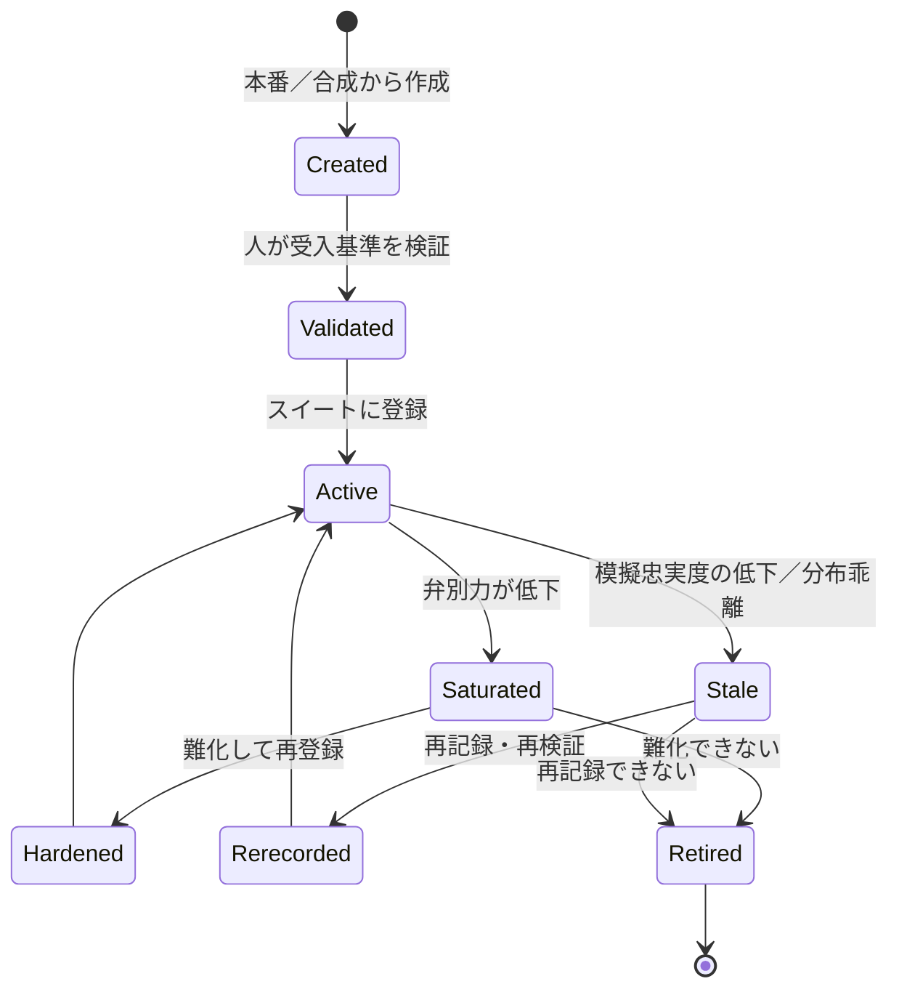

各テストに所有者と見直し期限を持たせ、状態遷移を記録する。「誰も所有していないテスト」は陳腐化の温床である。

---

## 9. 追加で見落とされがちな論点

| 論点 | なぜ見落とされるか | 手法 | 指標 |
|---|---|---|---|
| 自己申告の忠実度 | 最終メッセージが読みやすく、信じたくなる | 最終メッセージの各主張をログと照合する専用ジャッジ | 裏付けのない主張率 |
| 「何もしない・聞き返す」が正解 | テスト設計者は「やること」を書きがち | 既に満たされた依頼、曖昧な依頼、実行すべきでない依頼を意図的に混ぜる | 過剰行動率 |
| ノイズフロア | 1回の比較で改善を主張してしまう | 同一版を2回走らせた差の分布を先に測る | 最小検出可能効果 |
| 確率的リグレッションテスト | 本番の失敗を決定的テストにすると常に落ちるか常に通る | 閾値付きの反復テスト | 失敗回数 ≤ 閾値 |
| 委譲の品質 | サブエージェントの失敗が「委譲元の説明不足」でも子の責任にされる | 境界の契約テスト、渡した文脈の十分性判定 | 文脈欠落率 |

### 9.1 自己申告の忠実度

$$
\mathrm{Unsupported} = \frac{\#\{\text{claims in final message without evidence in the log}\}}{\#\{\text{claims in final message}\}}
$$

「テストは通りました」「ファイルを確認しました」の各主張を抽出し、対応するツール呼び出しと結果の有無を照合する。この値は結果一致テストでは決して見えず、しかもユーザーの信頼を最も直接に損なう。

### 9.2 ノイズフロアと最小検出可能効果

同一版を独立に2回走らせたときの指標差 $\Delta_0$ の分布を測る。改善幅がその範囲内なら証拠にならない。$N$ タスクのペア比較で、タスクごとの差の標準偏差を $\sigma_d$ とすると、検出できる最小の効果はおおよそ

$$
\mathrm{MDE} \approx (z_{1-\alpha/2} + z_{1-\beta}) \cdot \frac{\sigma_d}{\sqrt{N}}
$$

である。逆に、検出したい効果量からこの式で必要なタスク数 $N$ を決める。エージェント評価では $\sigma_d$ が大きいため、数十タスクの比較で数ポイントの差を語ることはできない。

### 9.3 確率的リグレッションテスト

本番で見つかった失敗をテスト化する際、確率的な失敗を1回の実行で判定すると、常に落ちる（フレーク扱いで無視される）か常に通る（再現しない）かのどちらかになる。$n$ 回実行して失敗が閾値を超えたら不合格とする。

$$
\text{fail if } \sum_{j=1}^{n} \mathbb{1}[\mathrm{fail}_j] > \lceil \theta n \rceil
$$

$n$ と $\theta$ は、修正前の失敗率と修正後に許容する失敗率を二項分布で区別できるように選ぶ。

---

## 10. 導入ロードマップ

一度にすべてを導入する必要はない。基盤（ログ・版固定・スナップショット・dry-run）がなければ上位の手法は動かないため、基盤から始める。

| フェーズ | 導入項目 | 得られるもの |
|---|---|---|
| 0. 基盤 | 構造化ログとトレース、モデル・プロンプト・ツール・ジャッジの版固定、環境スナップショット、dry-run モード | 以降のすべての前提 |
| 1. 即効 | 軌跡リンター（4.4）、コスト予算（4.11）、主張と証拠を分離したジャッジ（5.2）、ノイズフロア測定（9.2） | 危険操作・偽の完了・コスト暴走の検出、改善主張の信頼性 |
| 2. 効率 | 軌跡カバレッジ PTS（3.2–3.4）、接頭辞キャッシュ（3.6）、SPRT（3.7）、人の配分フロー（5.4） | CI 時間とコストの削減、人の時間の複利化 |
| 3. 持続 | 本番→テスト・パイプライン（8.2）、模擬忠実度ジョブ（8.5）、二重トラック（8.6）、ライフサイクル管理（8.10） | テストと実利用の乖離の定量管理 |
| 4. 高度 | アブレーション無駄判定（4.3）、ジャッジのミューテーションテスト（5.3）、軌跡内 NIAH（4.9）、ドリフト帰属（8.8） | 過程の質と評価者の質の精密な測定 |

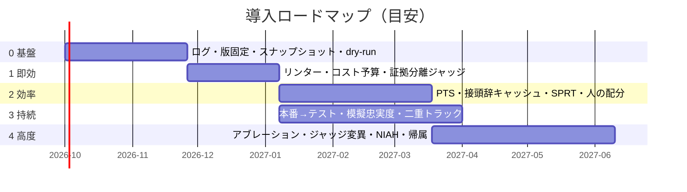

---

## 11. まとめ

エージェント評価の困難は、確率的で多段、1回が高価、正解が複数、環境に依存、という性質が同時に成り立つことにある。本レポートはこれを「過程・環境・評価者・時間」の4軸に分け、それぞれで見落とされがちな手法を提示した。手法は多いが、根は3原理に収束する。

| 原理 | 具体化した手法 |
|---|---|
| 情報量／コストの最適化 | 不確実性駆動 PTS、SPRT、分岐再実行、人の配分フロー、層化サンプリング |
| 主張ではなく証拠 | 軌跡リンター、ツール付きジャッジ、主張と証拠の分離、自己申告忠実度、正直な失敗報告率 |
| 評価系そのものが劣化する製品 | 逃走欠陥率、ミューテーションスコア、弁別力、模擬忠実度、sim-to-real の $\kappa$、ライフサイクル管理 |

レポートを時間軸で読み直すと、次の一本の線になる。

| 時間軸 | 問い | 手法 |
|---|---|---|
| 変更前 | 何を試すか | PTS、テストピラミッド、接頭辞キャッシュ、逐次検定 |
| 実行中 | どう測るか | 軌跡メトリクス、リンター、マイルストーン、ジャッジ、承認ゲート、カオス注入 |
| 変更後 | 結果を信じてよいか | ノイズフロア、メタ評価、ドリフト帰属、陳腐化管理 |

最後に強調したいのは、評価系の設計が製品の設計に食い込むことである。環境スナップショット、dry-run モード、構造化された計画出力、完全なトレースは、評価のために後付けするのではなく、エージェントの基本設計に含める。評価可能性はエージェントの機能要件である。

---

## 付録A 指標一覧

| 指標 | 定義 | 章 |
|---|---|---|
| 優先度 $\mathrm{Priority}(x)$ | 期待情報利得 ／ コスト | 2.1 |
| 逃走欠陥率 $\mathrm{Escape}(S)$ | フル実行で見つかった失敗のうち選択から漏れた割合 | 3.8 |
| 迂回率 $D$ | 実ステップ数 ／ 最短既知ステップ数 | 4.2 |
| 無駄呼び出し率 $U$ | 除去しても結果が変わらない呼び出しの割合 | 4.3 |
| マイルストーンスコア | 順序を守って到達した到達点の割合 − 違反ペナルティ | 4.5 |
| 参照方策一致 $A(\tau)$ | 各ステップの行動が参照方策に支持される確率の平均 | 4.6 |
| 計画乖離率 $\delta$ | 計画と実行の正規化編集距離 | 4.7 |
| 想起率 $R(n)$ | ノイズ n ステップ後に鍵情報を使えた確率 | 4.9 |
| pass@k ／ pass^k | k 回中1回以上 ／ k 回すべて成功する確率 | 4.10 |
| p95 コスト | タスク種別ごとのトークン数の 95 パーセンタイル | 4.11 |
| ミューテーションスコア $\mathrm{MS}$ | 注入した欠陥のうちジャッジが検出した割合 | 5.3 |
| 対人一致 $\kappa$ | ゴールデンセット上での人とジャッジの一致 | 5.6 |
| 承認率・介入精度・介入再現率 | 承認ゲートの健全性 | 6.3 |
| CUSUM $S^{-}_t$ | ジャッジスコア平均の低下の累積 | 6.5 |
| レビュー効率 | 人のレビュー時間のうち真の問題に使われた割合 | 6.7 |
| 正直な失敗報告率 | 注入障害のうち明示的に報告された割合 | 7.2 |
| スコープ違反数 $V(\tau)$ | 許可集合外の資源に触れた数 | 7.3 |
| 鮮度年齢・分布距離 $D_{\mathrm{JS}}$ | テストの経過日数、スイートと本番の分布差 | 8.3 |
| 弁別力 $d(t)$ | 良い版と悪い版での合格率の差 | 8.4 |
| 模擬忠実度 $F$ | 記録応答がライブ応答と一致する割合 | 8.5 |
| sim-to-real $\kappa$ | 模擬とライブの合否一致 | 8.6 |
| 裏付けのない主張率 | 最終メッセージの主張のうちログに証拠がない割合 | 9.1 |
| 最小検出可能効果 MDE | ノイズを超えて検出できる最小の改善幅 | 9.2 |

## 付録B 参照した概念の出典

本レポートの提案は、以下の既存概念をエージェント評価に転用・拡張したものである。

| 概念 | 出典・背景 | 本レポートでの転用 |
|---|---|---|
| Predictive Test Selection | Machalica ら（Meta）、ICSE-SEIP 2019 | 変更の多層化、軌跡カバレッジ、不確実性駆動選択 |
| 逐次確率比検定（SPRT） | Wald、1945 | 確率的テストの反復回数の動的決定 |
| CUSUM | Page、1954 | オンラインのジャッジスコア監視 |
| pass^k | τ-bench（Sierra、2024） | 信頼性指標としての採用 |
| ミューテーションテスト | DeMillo ら、1978 | ジャッジの検出力測定への転用 |
| 線形時相論理（LTL） | Pnueli、1977 | 軌跡に対する順序・禁止制約の仕様化 |
| プロセス報酬モデル | LLM の推論評価における段階的報酬 | ステップ単位判定 |
| Needle-in-a-Haystack | 長文脈 LLM の検索能力評価 | 軌跡内の自己汚染耐性の測定 |
| カオスエンジニアリング | Netflix の実践（2010 年代） | ツール・基盤障害の注入 |
| メタモルフィックテスト | Chen ら、1998 | 正解なしでの不変性検査（言い換えに対する軌跡の安定性） |
| 統計的工程管理（SPC） | Shewhart、1920 年代 | 本番品質の変化点検知 |
