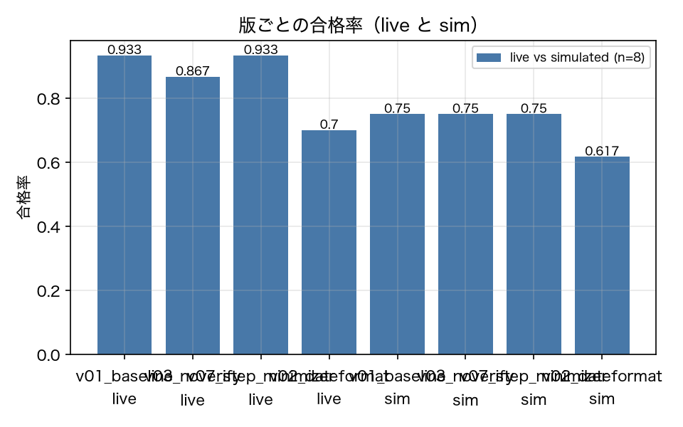

# E0-1 シミュレート・エージェントと live の一致度（sim の妥当性）

## 5項目
- 仮説: sim（ADR-008）で作った軌跡は、live で同じ (task, version, repeat) を走らせた軌跡と、評価手法が見る量の水準で一致する
- 植込み条件: 同じ 10 タスク × 3 版 × 3 反復を live と sim の両方で実行し、評価手法が使う量を突き合わせる
- 対照: 同じ (task, version, repeat) どうしを対応づけて比較する（版をまたいだ比較はしない）
- 合格基準: outcome_agreement >= 0.7、pass_rate_gap <= 0.15、tool_sequence_similarity >= 0.6、version_ordering_preserved == 1、n_separable_version_pairs >= 1、ordering_ok_on_separable_pairs == 1
- 来歴: live

## 方法
同じ (task, version, repeat) の組を live と sim の両方で実行し、評価手法が入力に使う量を
突き合わせた。live は `AGENTEVAL_LLM_MODE=record`（Haiku 4.5、プロンプトキャッシュ有効）、
sim は既存コーパスの同じ組。対応づけは (task, version, repeat) の完全一致で行い、版をまたいだ比較はしない。
比較する量:
  - `outcome.passed` の一致率（同じ組で合否が一致した割合）
  - 版ごとの合格率の差（sim が live の水準をどれだけずらすか）
  - ツール名列の類似度（正規化編集距離の補数。`pts/selector.py` と同じ定義）
  - 版の順序が保たれるか（合格率の大小関係が live と sim で同じか）
この実験だけは来歴が `live`（live と sim の**比較**なので、両方の数値が出てくる。
表では列で分けており、混ぜた統計量は作っていない）。

## 結果
| 指標 | 値（来歴） | 基準 | 判定 |
|---|---|---|---|
| live_ci_half_width | 0.0631 [live] | — | — |
| live_dup_rate | 0.0076 [live] | — | — |
| live_pass_rate_v01 | 0.9333 [live] | — | — |
| live_steps | 3.117 [live] | — | — |
| live_stop_appropriate | 0.6833 [live] | — | — |
| live_usd | 1.679 [live] | — | — |
| live_verification_rate | 0.4302 [live] | — | — |
| n_pairs | 240 [live] | — | — |
| n_separable_version_pairs | 2 [live] | >= 1 | ○ |
| ordering_ok_on_separable_pairs | 1 [live] | == 1 | ○ |
| outcome_agreement | 0.8167 [live] | >= 0.7 | ○ |
| pass_rate_gap | 0.1833 [live] | <= 0.15 | × |
| sim_dup_rate | 0 [simulated] | — | — |
| sim_pass_rate_v01 | 0.75 [simulated] | — | — |
| sim_steps | 3.417 [simulated] | — | — |
| sim_stop_appropriate | 1 [simulated] | — | — |
| sim_verification_rate | 0.5 [simulated] | — | — |
| tool_sequence_similarity | 0.6681 [live] | >= 0.6 | ○ |
| version_ordering_preserved | 0 [live] | == 1 | × |

## 判定
FAIL

未達の基準: pass_rate_gap, version_ordering_preserved。

## 気づき・限界
- live の版ごとの合格率: {'v01_baseline': 0.933, 'v03_noverify': 0.867, 'v07_step_minimizer': 0.933, 'v02_dateformat': 0.7}
- sim の版ごとの合格率: {'v01_baseline': 0.75, 'v03_noverify': 0.75, 'v07_step_minimizer': 0.75, 'v02_dateformat': 0.617}
- 合格率の順序 live=['v01_baseline', 'v07_step_minimizer', 'v03_noverify', 'v02_dateformat'] / sim=['v01_baseline', 'v03_noverify', 'v07_step_minimizer', 'v02_dateformat']
- sim は (task, seed, repeat) に対して決定的なので、live の 1 回の実行と比べている。live 側の揺れ（同じ条件でも応答が変わる）は反復 3 回ぶんしか見ていない。

---
生成: `uv run agenteval exp e0_1` / 実行時刻 2026-09-13T08:18:12+00:00 / コスト 1.6793 USD
