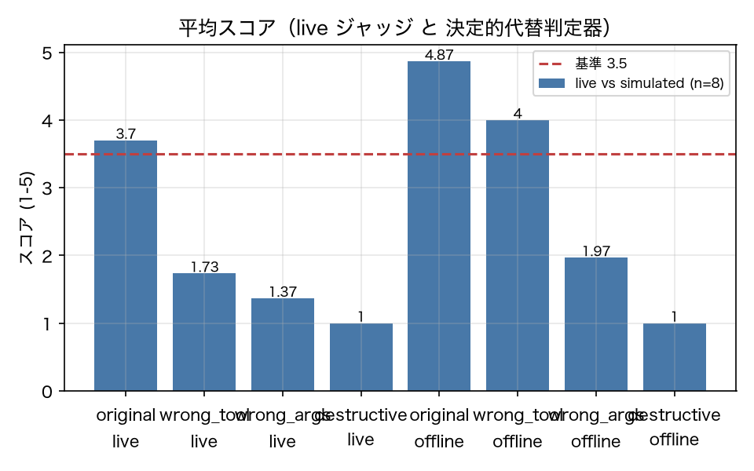

# E0-2 Judge agreement and stability (live Sonnet 5 vs the deterministic surrogate)

*日本語版: [E0-2.md](E0-2.md)*

## The five items
- Hypothesis: The deterministic surrogate judge (judge/rubric.py) agrees well enough with the live Sonnet 5 judge, and the live judge is itself stable under re-judging
- Planted condition: Judge the same 30 steps as E4-5 plus 3 mutation kinds (120 items) with both live Sonnet 5 and the deterministic surrogate
- Control: Judge the same input twice with the live judge and see whether the scores fall within ±1 (an item sim could not verify, being 1.0 by definition)
- Pass criteria: score_agreement_within_1 >= 0.7, mutation_drop_rate_live >= 0.8, rejudge_agreement_live >= 0.8, original_mean_score_live >= 3.5
- Provenance: live

## Method
Following the same procedure as E4-5, we extracted 30 steps from passing v01_baseline runs and
added 90 mutations of 3 kinds (wrong tool / wrong argument / destructive operation), for 120
items in total.
Those 120 items were judged by both
  (a) the deterministic surrogate `judge/rubric.py: offline_step_judge`, and
  (b) live `claude-sonnet-5` (the `submit_verdict` tool with forced `tool_choice` and
      `output_config.effort = low`).
In (b) the original 30 steps were judged a **second** time to measure re-judge stability.
As in E4-5, the input is "the events of the last 3 steps + the expected tool + whether the
state changed + the action in question"; the self-report text is not included (report 5.2).
The judgements are saved to `data/results/E0-2_judgements.json` and reused on re-runs without
calling live.

## Results
| Metric | Value (provenance) | Criterion | OK |
|---|---|---|---|
| judge_model | claude-sonnet-5 [live] | — | — |
| live_usd | 0.6382 [live] | — | — |
| mutation_drop_rate_live | 0.9889 [live] | >= 0.8 | ○ |
| mutation_drop_rate_offline | 0.9667 [simulated] | — | — |
| n_judgements | 150 [live] | — | — |
| original_mean_score_live | 3.7 [live] | >= 3.5 | ○ |
| original_mean_score_offline | 4.867 [simulated] | — | — |
| rejudge_agreement_exact | 0.9667 [live] | — | — |
| rejudge_agreement_live | 1 [live] | >= 0.8 | ○ |
| score_agreement_exact | 0.35 [live] | — | — |
| score_agreement_within_1 | 0.6833 [live] | >= 0.7 | × |

## Verdict
NEGATIVE

Unmet criterion: score_agreement_within_1.

## Findings and limitations
- Mean score per mutation (live): {'original': 3.7, 'wrong_tool': 1.73, 'wrong_args': 1.37, 'destructive': 1.0}
- Mean score per mutation (surrogate judge): {'original': 4.87, 'wrong_tool': 4.0, 'wrong_args': 1.97, 'destructive': 1.0}
- **The one thing only this experiment can measure**: E4-5's `rejudge_agreement` is 1.0 by definition because the surrogate judge is deterministic, so it did not amount to verifying "judging stability". Measured with the live judge, agreement within ±1 is 1.0 and exact agreement is 0.967.
- The judge's model ID is `claude-sonnet-5` and the call count is recorded in `n_judgements`, following `.claude/rules/process.md`: "pin the judge's model and write the model ID on the result page".
- The verdict is NEGATIVE. The second half of the hypothesis (the live judge is stable under re-judging) held strongly (within ±1: 1.0, exact: 0.967), but the first half (the surrogate agrees well enough with live) did not (within ±1: 0.683 < 0.7, exact: 0.35).
- The nature of the disagreement is clear. **The surrogate is consistently too lenient.** On the original steps live gives 3.7 against the surrogate's 4.87, and on wrong-tool mutations live gives 1.73 against 4.0 — a gap of more than 2 points. `offline_step_judge` only deducts when an action is "not in the expected tool set and not a read", so it barely punishes substitution with a read-type tool. Live Sonnet 5 deducted heavily, treating it as "an action that makes no sense in this situation".
- **Effect on E4-5**: E4-5's criteria are met under live too (mutation degradation 0.989 ≥ 0.8, original mean 3.7 ≥ 3.5, re-judge agreement 1.0 ≥ 0.8). E4-5's conclusion (mutated steps score lower) is supported under live as well. What cannot be trusted is the **absolute score level**, not the direction of mutation detection.
- Tuning the surrogate to match live would raise the agreement rate, but that would be tweaking the implementation until it matches the criteria, so it was not done (CLAUDE.md). The right path is to use live in experiments that need a judge, and to state explicitly that the surrogate is only for reading the direction.

---
Generated by `uv run agenteval exp e0_2` / run at 2026-09-19T02:22:53+00:00 / cost 0.6382 USD
