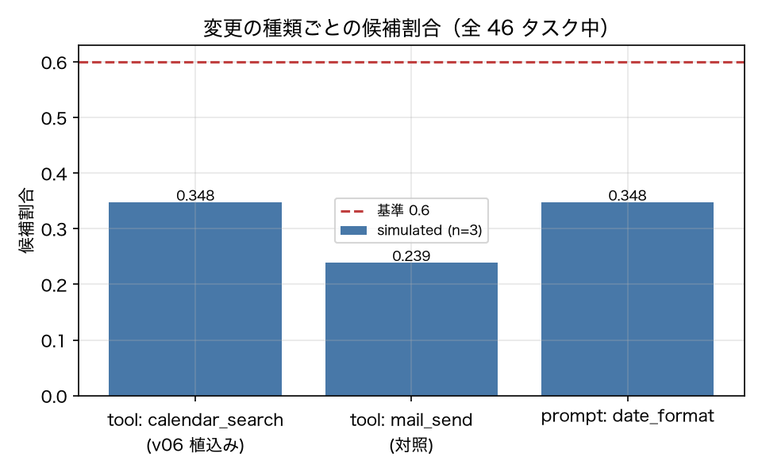

# E3-1 軌跡カバレッジ依存グラフによる候補絞り込み

## 5項目
- 仮説: ツール変更で実際に反転したテストはすべて候補集合 T_cand(Δ) に含まれ、候補は全件より十分小さい
- 植込み条件: v06_toolschema_v2（calendar_search の引数変更）。反転は v01 → v06 で測る
- 対照: 合成変更 Change(kind=tool, components={mail_send})。mail_send を呼ばないテストは候補に入らない
- 合格基準: recall_of_flipped >= 1.0、candidate_ratio <= 0.6、control_false_candidates == 0
- 来歴: simulated

## 方法
v01_baseline の全 run から `U(t)`（呼んだツール・参照した prompt section・触れた資源）を抽出し、
`Change` の触る要素 `C(Δ)` と交差するタスクを候補集合 `T_cand(Δ)` とした（原典 3.2）。
植込みは v01 → v06_toolschema_v2（`calendar_search` の引数名変更、`kind=tool`）。
反転は v01 と v06 の合格率が 0.5 をまたいだタスクとし、v01 の反復で合否が割れたタスク（フレーク帯）は
反転と数えない。対照は合成変更 `Change(kind=tool, components={mail_send})` で、候補に選ばれたタスクが
別の版（v03）の軌跡でも本当に `mail_send` を呼んでいるかを照合した（選択基準と実測の突き合わせ）。

## 結果
| 指標 | 値（来歴） | 基準 | 判定 |
|---|---|---|---|
| candidate_ratio | 0.3478 [simulated] | <= 0.6 | ○ |
| control_candidate_ratio | 0.2391 [simulated] | — | — |
| control_false_candidates | 0 [simulated] | == 0 | ○ |
| mean_flake_band | 0.1812 [simulated] | — | — |
| n_candidates | 16 [simulated] | — | — |
| n_flipped | 11 [simulated] | — | — |
| n_flipped_legacy_band | 6 [simulated] | — | — |
| n_tasks | 46 [simulated] | — | — |
| recall_of_flipped | 1 [simulated] | >= 1.0 | ○ |

## 判定
PASS

全基準を満たした。

## 気づき・限界
- 反転タスク: ['T-001', 'T-006', 'T-007', 'T-008', 'T-009', 'T-010', 'T-011', 'T-012', 'T-013', 'T-014', 'T-401']
- フレーク帯（v01 の反復から出した二項の 95% 半幅）の平均: 0.1812
- 対照（mail_send）の候補: ['T-002', 'T-004', 'T-015', 'T-016', 'T-017', 'T-018', 'T-019', 'T-020', 'T-021', 'T-029', 'T-402']
- 候補集合はプロンプト section の「参照」をツール対応表で近似している（coverage.py の SECTION_TOOLS）。実際に LLM がその section を読んだかは観測できないので、これは近似であり原典 3.2 そのものではない。
- 来歴は simulated（ADR-008 のシミュレート・エージェントで作ったコーパス）。live での再確認は未実施。

---
生成: `uv run agenteval exp e3_1` / 実行時刻 2026-09-19T01:57:47+00:00 / コスト 0.0 USD
