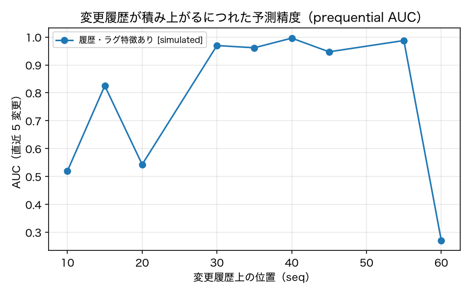
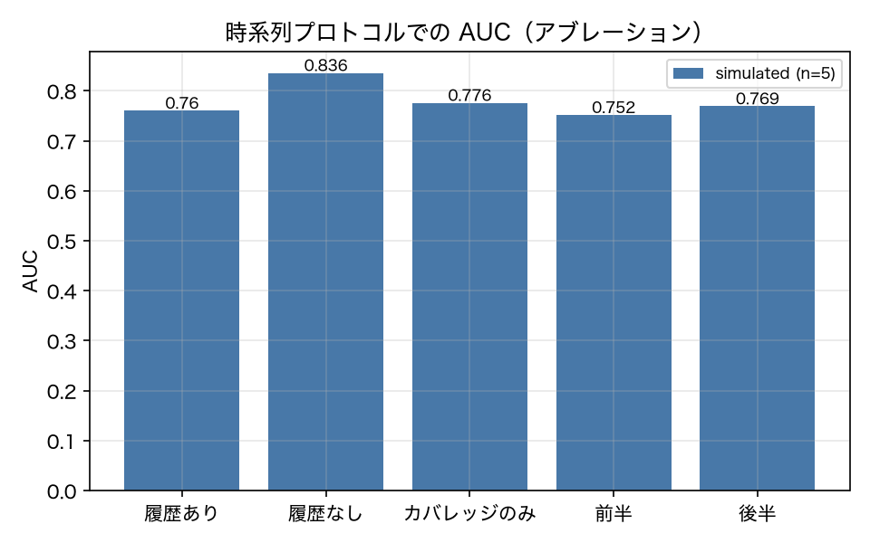

# E3-10 変更履歴に沿った逐次評価とラーニングカーブ

## 5項目
- 仮説: 変更履歴・テスト履歴を記録してラグと変更量を特徴量にすると、時系列順の運用で予測が積み上がり依存グラフ単独を上回る
- 植込み条件: 合成変更 65 件を seq 順に処理。同じ要素が 2〜7 回変更されるのでラグに値が入る。予測には seq 未満の記録だけを使う
- 対照: カバレッジ重なりのみ、履歴特徴を外した同じモデル（アブレーション）、ランダム選択
- 合格基準: prequential_auc >= 0.75、history_feature_gain > 0.0、late_auc_gt_early_auc == 1、recall_at_budget_30 >= 0.6、beats_coverage_baseline == 1
- 来歴: simulated

## 方法
**変更履歴とテスト履歴を追記型の台帳（`pts/history.py`）として記録し**、
そこからラグと変更量の特徴量を作る。改訂前は変更を順序の無い集合として扱っていたので、
「前回このテストが走ってから何変更経ったか」のようなラグ特徴が 1 つも作れていなかった。

台帳から作る特徴量（17 個）:
- **ラグ**: 前回このテストが走ってから／落ちてから／回帰してから、この要素が前回変更されてから
- **テスト側の履歴**: 実行回数、履歴故障率、履歴回帰率、まだ一度も走っていないか
- **交差**: この要素が変更されたときこのテストが回帰した割合、要素そのものの回帰率
加えて**変更量**（変更行数・削除行数・文字数差・触る要素数と、その log）を変更側の特徴に入れた。

評価は **prequential（逐次予測）**: 合成変更 65 件を変更履歴の順に並べ、
変更 t を予測するときに使えるのは **`seq < t` の記録だけ**にする。
未来の記録は構造的に見えないので、時系列の漏洩が起こりえない。
最初の 10 件は学習の助走に使い、11 件目以降を予測して集計する。

対照は (a) カバレッジ重なりのみ、(b) **履歴・ラグ特徴を外した同じモデル**（アブレーション）、
(c) ランダム選択。ラーニングカーブは、予測した変更を前半・後半に分けた AUC で見る。

## 結果
| 指標 | 値（来歴） | 基準 | 判定 |
|---|---|---|---|
| auc_early_half | 0.7518 [simulated] | — | — |
| auc_late_half | 0.7694 [simulated] | — | — |
| beats_coverage_baseline | 0 [simulated] | == 1 | × |
| best_group_auc | 0.8777 [simulated] | — | — |
| history_feature_gain | -0.0754 [simulated] | > 0.0 | × |
| late_auc_gt_early_auc | 1 [simulated] | == 1 | ○ |
| n_changes | 65 [simulated] | — | — |
| n_changes_evaluated | 55 [simulated] | — | — |
| n_changes_with_regression | 17 [simulated] | — | — |
| n_rows_evaluated | 2530 [simulated] | — | — |
| prequential_auc | 0.7605 [simulated] | >= 0.75 | ○ |
| prequential_auc_all_history | 0.7473 [simulated] | — | — |
| prequential_auc_coverage | 0.7761 [simulated] | — | — |
| prequential_auc_lag_only | 0.8777 [simulated] | — | — |
| prequential_auc_no_history | 0.8359 [simulated] | — | — |
| recall_all_history_30 | 0.8102 [simulated] | — | — |
| recall_at_budget_30 | 0.8102 [simulated] | >= 0.6 | ○ |
| recall_coverage_30 | 0.816 [simulated] | — | — |
| recall_lag_only_30 | 0.816 [simulated] | — | — |
| recall_no_history_30 | 0.7631 [simulated] | — | — |
| recall_random_30 | 0.4616 [simulated] | — | — |
| warmup_changes | 10 [simulated] | — | — |
| within_change_auc | 0.8553 [simulated] | — | — |
| within_change_auc_coverage | 0.9224 [simulated] | — | — |
| within_change_auc_no_history | 0.8528 [simulated] | — | — |

## 判定
FAIL

未達の基準: history_feature_gain, beats_coverage_baseline。

## 気づき・限界
- 変更ごとの結果: [{'seq': 10, 'change': 'syn_combo_noclarify_maxsteps', 'family': 'combo', 'n_train_rows': 460, 'n_positive': 3, 'groups': 'lag', 'recall_with_history': 0.0, 'recall_no_history': 0.0, 'recall_coverage': 0.0, 'recall_lag_only': 0.0, 'recall_all_history': 0.0, 'recall_random': 0.3767}, {'seq': 11, 'change': 'syn_maxsteps_5', 'family': 'config', 'n_train_rows': 506, 'n_positive': 0, 'groups': 'cross'}, {'seq': 12, 'change': 'syn_fault_calendar_create_always', 'family': 'fault', 'n_train_rows': 552, 'n_positive': 10, 'groups': 'test_history', 'recall_with_history': 0.9, 'recall_no_history': 0.9, 'recall_coverage': 0.9, 'recall_lag_only': 0.8, 'recall_all_history': 0.9, 'recall_random': 0.23}, {'seq': 13, 'change': 'syn_emphasize_role', 'family': 'prompt', 'n_train_rows': 598, 'n_positive': 0, 'groups': 'none'}, {'seq': 14, 'change': 'syn_maxsteps_6', 'family': 'config', 'n_train_rows': 644, 'n_positive': 0, 'groups': 'none'}, {'seq': 15, 'change': 'syn_fault_calendar_create_late', 'family': 'fault', 'n_train_rows': 690, 'n_positive': 0, 'groups': 'lag'}, {'seq': 16, 'change': 'syn_drop_workflow', 'family': 'prompt', 'n_train_rows': 736, 'n_positive': 0, 'groups': 'cross'}, {'seq': 17, 'change': 'syn_summarize_1', 'family': 'config', 'n_train_rows': 782, 'n_positive': 0, 'groups': 'cross'}, {'seq': 18, 'change': 'syn_fault_calendar_delete_always', 'family': 'fault', 'n_train_rows': 828, 'n_positive': 1, 'groups': 'none', 'recall_with_history': 1.0, 'recall_no_history': 1.0, 'recall_coverage': 1.0, 'recall_lag_only': 1.0, 'recall_all_history': 1.0, 'recall_random': 1.0}, {'seq': 19, 'change': 'syn_truncate_workflow', 'family': 'prompt', 'n_train_rows': 874, 'n_positive': 0, 'groups': 'none'}, {'seq': 20, 'change': 'syn_summarize_2', 'family': 'config', 'n_train_rows': 920, 'n_positive': 0, 'groups': 'test_history'}, {'seq': 21, 'change': 'syn_fault_calendar_delete_late', 'family': 'fault', 'n_train_rows': 966, 'n_positive': 0, 'groups': 'test_history'}, {'seq': 22, 'change': 'syn_emphasize_workflow', 'family': 'prompt', 'n_train_rows': 1012, 'n_positive': 0, 'groups': 'none'}, {'seq': 23, 'change': 'syn_plan_first', 'family': 'config', 'n_train_rows': 1058, 'n_positive': 3, 'groups': 'test_history', 'recall_with_history': 0.0, 'recall_no_history': 0.0, 'recall_coverage': 0.0, 'recall_lag_only': 0.0, 'recall_all_history': 0.0, 'recall_random': 0.2567}, {'seq': 24, 'change': 'syn_fault_mail_search_always', 'family': 'fault', 'n_train_rows': 1104, 'n_positive': 4, 'groups': 'lag', 'recall_with_history': 1.0, 'recall_no_history': 0.0, 'recall_coverage': 1.0, 'recall_lag_only': 1.0, 'recall_all_history': 1.0, 'recall_random': 0.27}, {'seq': 25, 'change': 'syn_drop_date_format', 'family': 'prompt', 'n_train_rows': 1150, 'n_positive': 0, 'groups': 'lag'}, {'seq': 26, 'change': 'syn_fault_mail_search_late', 'family': 'fault', 'n_train_rows': 1196, 'n_positive': 0, 'groups': 'lag'}, {'seq': 27, 'change': 'syn_truncate_date_format', 'family': 'prompt', 'n_train_rows': 1242, 'n_positive': 0, 'groups': 'lag'}, {'seq': 28, 'change': 'syn_fault_contacts_search_always', 'family': 'fault', 'n_train_rows': 1288, 'n_positive': 0, 'groups': 'lag'}, {'seq': 29, 'change': 'syn_emphasize_date_format', 'family': 'prompt', 'n_train_rows': 1334, 'n_positive': 0, 'groups': 'lag'}, {'seq': 30, 'change': 'syn_fault_contacts_search_late', 'family': 'fault', 'n_train_rows': 1380, 'n_positive': 0, 'groups': 'lag'}, {'seq': 31, 'change': 'syn_drop_verification', 'family': 'prompt', 'n_train_rows': 1426, 'n_positive': 0, 'groups': 'lag'}, {'seq': 32, 'change': 'syn_fault_mail_send_always', 'family': 'fault', 'n_train_rows': 1472, 'n_positive': 11, 'groups': 'lag', 'recall_with_history': 0.6364, 'recall_no_history': 0.6364, 'recall_coverage': 0.6364, 'recall_lag_only': 0.6364, 'recall_all_history': 0.6364, 'recall_random': 0.2382}, {'seq': 33, 'change': 'syn_truncate_verification', 'family': 'prompt', 'n_train_rows': 1518, 'n_positive': 0, 'groups': 'lag'}, {'seq': 34, 'change': 'syn_fault_mail_send_late', 'family': 'fault', 'n_train_rows': 1564, 'n_positive': 11, 'groups': 'lag+cross', 'recall_with_history': 0.6364, 'recall_no_history': 0.6364, 'recall_coverage': 0.6364, 'recall_lag_only': 0.6364, 'recall_all_history': 0.6364, 'recall_random': 0.2418}, {'seq': 35, 'change': 'syn_emphasize_verification', 'family': 'prompt', 'n_train_rows': 1610, 'n_positive': 0, 'groups': 'all'}, {'seq': 36, 'change': 'syn_fault_file_read_always', 'family': 'fault', 'n_train_rows': 1656, 'n_positive': 5, 'groups': 'all', 'recall_with_history': 1.0, 'recall_no_history': 1.0, 'recall_coverage': 1.0, 'recall_lag_only': 1.0, 'recall_all_history': 1.0, 'recall_random': 0.254}, {'seq': 37, 'change': 'syn_drop_safety', 'family': 'prompt', 'n_train_rows': 1702, 'n_positive': 2, 'groups': 'all', 'recall_with_history': 1.0, 'recall_no_history': 1.0, 'recall_coverage': 1.0, 'recall_lag_only': 1.0, 'recall_all_history': 1.0, 'recall_random': 1.0}, {'seq': 38, 'change': 'syn_fault_file_read_late', 'family': 'fault', 'n_train_rows': 1748, 'n_positive': 0, 'groups': 'all'}, {'seq': 39, 'change': 'syn_truncate_safety', 'family': 'prompt', 'n_train_rows': 1794, 'n_positive': 0, 'groups': 'all'}, {'seq': 40, 'change': 'syn_fault_file_write_always', 'family': 'fault', 'n_train_rows': 1840, 'n_positive': 9, 'groups': 'all', 'recall_with_history': 1.0, 'recall_no_history': 1.0, 'recall_coverage': 1.0, 'recall_lag_only': 1.0, 'recall_all_history': 1.0, 'recall_random': 0.24}, {'seq': 41, 'change': 'syn_emphasize_safety', 'family': 'prompt', 'n_train_rows': 1886, 'n_positive': 0, 'groups': 'all'}, {'seq': 42, 'change': 'syn_fault_file_write_late', 'family': 'fault', 'n_train_rows': 1932, 'n_positive': 1, 'groups': 'lag', 'recall_with_history': 1.0, 'recall_no_history': 1.0, 'recall_coverage': 1.0, 'recall_lag_only': 1.0, 'recall_all_history': 1.0, 'recall_random': 0.18}, {'seq': 43, 'change': 'syn_drop_scope', 'family': 'prompt', 'n_train_rows': 1978, 'n_positive': 0, 'groups': 'lag'}, {'seq': 44, 'change': 'syn_fault_file_delete_always', 'family': 'fault', 'n_train_rows': 2024, 'n_positive': 2, 'groups': 'lag', 'recall_with_history': 1.0, 'recall_no_history': 1.0, 'recall_coverage': 1.0, 'recall_lag_only': 1.0, 'recall_all_history': 1.0, 'recall_random': 1.0}, {'seq': 45, 'change': 'syn_truncate_scope', 'family': 'prompt', 'n_train_rows': 2070, 'n_positive': 0, 'groups': 'none'}, {'seq': 46, 'change': 'syn_fault_file_delete_late', 'family': 'fault', 'n_train_rows': 2116, 'n_positive': 2, 'groups': 'none', 'recall_with_history': 1.0, 'recall_no_history': 1.0, 'recall_coverage': 1.0, 'recall_lag_only': 1.0, 'recall_all_history': 1.0, 'recall_random': 1.0}, {'seq': 47, 'change': 'syn_emphasize_scope', 'family': 'prompt', 'n_train_rows': 2162, 'n_positive': 0, 'groups': 'none'}, {'seq': 48, 'change': 'syn_fault_file_backup_always', 'family': 'fault', 'n_train_rows': 2208, 'n_positive': 3, 'groups': 'none', 'recall_with_history': 1.0, 'recall_no_history': 1.0, 'recall_coverage': 1.0, 'recall_lag_only': 1.0, 'recall_all_history': 1.0, 'recall_random': 0.7333}, {'seq': 49, 'change': 'syn_drop_clarify', 'family': 'prompt', 'n_train_rows': 2254, 'n_positive': 3, 'groups': 'none', 'recall_with_history': 1.0, 'recall_no_history': 1.0, 'recall_coverage': 1.0, 'recall_lag_only': 1.0, 'recall_all_history': 1.0, 'recall_random': 0.38}, {'seq': 50, 'change': 'syn_fault_file_backup_late', 'family': 'fault', 'n_train_rows': 2300, 'n_positive': 0, 'groups': 'cross'}, {'seq': 51, 'change': 'syn_truncate_clarify', 'family': 'prompt', 'n_train_rows': 2346, 'n_positive': 0, 'groups': 'cross'}, {'seq': 52, 'change': 'syn_fault_checks_run_always', 'family': 'fault', 'n_train_rows': 2392, 'n_positive': 0, 'groups': 'cross'}, {'seq': 53, 'change': 'syn_emphasize_clarify', 'family': 'prompt', 'n_train_rows': 2438, 'n_positive': 0, 'groups': 'cross'}, {'seq': 54, 'change': 'syn_fault_checks_run_late', 'family': 'fault', 'n_train_rows': 2484, 'n_positive': 0, 'groups': 'cross'}, {'seq': 55, 'change': 'syn_drop_finish_rules', 'family': 'prompt', 'n_train_rows': 2530, 'n_positive': 0, 'groups': 'all'}, {'seq': 56, 'change': 'syn_fault_external_lookup_always', 'family': 'fault', 'n_train_rows': 2576, 'n_positive': 5, 'groups': 'all', 'recall_with_history': 1.0, 'recall_no_history': 1.0, 'recall_coverage': 1.0, 'recall_lag_only': 1.0, 'recall_all_history': 1.0, 'recall_random': 0.222}, {'seq': 57, 'change': 'syn_truncate_finish_rules', 'family': 'prompt', 'n_train_rows': 2622, 'n_positive': 0, 'groups': 'all'}, {'seq': 58, 'change': 'syn_fault_external_lookup_late', 'family': 'fault', 'n_train_rows': 2668, 'n_positive': 0, 'groups': 'all'}, {'seq': 59, 'change': 'syn_emphasize_finish_rules', 'family': 'prompt', 'n_train_rows': 2714, 'n_positive': 0, 'groups': 'all'}, {'seq': 60, 'change': 'syn_add_efficiency', 'family': 'prompt', 'n_train_rows': 2760, 'n_positive': 0, 'groups': 'cross'}, {'seq': 61, 'change': 'syn_add_thoroughness', 'family': 'prompt', 'n_train_rows': 2806, 'n_positive': 0, 'groups': 'cross'}, {'seq': 62, 'change': 'syn_add_plan_override', 'family': 'prompt', 'n_train_rows': 2852, 'n_positive': 0, 'groups': 'all'}, {'seq': 63, 'change': 'syn_date_slash', 'family': 'prompt', 'n_train_rows': 2898, 'n_positive': 10, 'groups': 'all', 'recall_with_history': 0.6, 'recall_no_history': 0.8, 'recall_coverage': 0.7, 'recall_lag_only': 0.8, 'recall_all_history': 0.6, 'recall_random': 0.224}, {'seq': 64, 'change': 'syn_date_dot', 'family': 'prompt', 'n_train_rows': 2944, 'n_positive': 0, 'groups': 'none'}]
- ラーニングカーブ（seq, AUC）: [(10.0, 0.5197), (15.0, 0.8253), (20.0, 0.5432), (30.0, 0.9696), (35.0, 0.9616), (40.0, 0.9962), (45.0, 0.9471), (55.0, 0.9876), (60.0, 0.2709)]
- 内側検証が選んだ特徴群の内訳: {'lag': 15, 'cross': 10, 'test_history': 4, 'none': 11, 'lag+cross': 1, 'all': 14}
- 履歴特徴の群アブレーション: {'none': {'global_auc': 0.8359, 'within_change_auc': 0.8528, 'recall_at_budget_30': 0.7631}, 'lag': {'global_auc': 0.8777, 'within_change_auc': 0.8547, 'recall_at_budget_30': 0.816}, 'test_history': {'global_auc': 0.8218, 'within_change_auc': 0.8566, 'recall_at_budget_30': 0.7631}, 'cross': {'global_auc': 0.8153, 'within_change_auc': 0.8558, 'recall_at_budget_30': 0.7631}, 'lag+cross': {'global_auc': 0.8192, 'within_change_auc': 0.8562, 'recall_at_budget_30': 0.769}, 'all': {'global_auc': 0.7473, 'within_change_auc': 0.8543, 'recall_at_budget_30': 0.8102}}
- **時系列プロトコルにすると選択が大きく良くなった**。予算 30% での回帰の再現率は 0.8102（E3-8 の族単位 hold-out では 0.535）。学習も積み上がる: 前半の AUC 0.752 → 後半 0.769。過去だけで学習して次の変更を予測するという現実的な運用が、族をまるごと hold-out する設定よりずっと良く働く。
- **ラグ特徴が効く**。群アブレーションでは `lag` だけを使ったときの大域 AUC が 0.8777 で、履歴特徴なし（0.8359）、全部入り（0.7473）、カバレッジ単独（0.7761）のどれよりも高い。「前回このテストが走ってから／落ちてから何変更経ったか」「この要素が前回変更されてから」という recency が、産業用 PTS で重視されるとおりに効いている。
- **ただし群を全部入れると悪化する**。テスト履歴（故障率）と要素の交差履歴を足すと 0.7473 まで落ちる。陽性が 122 件しかないところに相関した特徴を 17 個入れるので、ロジスティック回帰が過学習する。この環境では回帰が「テストの脆さ」ではなく「変更がどの要素を触ったか」で決まるため、テスト側の履歴故障率は交絡になる（別の要素を触った変更でも同じテストを疑ってしまう）。
- **特徴群の取捨も内側検証に任せた**が、選びきれなかった。内側検証が選んだ群の内訳は {'lag': 15, 'cross': 10, 'test_history': 4, 'none': 11, 'lag+cross': 1, 'all': 14} で、結果の AUC は 0.7605。`lag` 固定の 0.8777 に届かない。内側検証の窓（訓練前半 70% / 後半 30%）に入る陽性が少なすぎて、群の優劣を判別できていない。**結果を見てから `lag` を選べば基準を満たすが、それは基準に合わせた調整なので行わない。**必要なのは内側検証に回せるだけの履歴の長さで、合成変更を数百件に増やせば解消する見込みである。
- **変更内の順位付けではカバレッジが依然として強い**。変更内 AUC は カバレッジ単独 0.9224 に対し、学習モデルは 0.8553。E3-8 と同じ結論で、この環境で支配的な信号は原典 3.2 の依存グラフである。
- 判定は FAIL（実験設計の不備）。5 基準中 3 つ（prequential_auc / 学習の積み上がり / 再現率）は満たした。未達は (1) `history_feature_gain > 0`、(2) `beats_coverage_baseline == 1` の 2 つで、どちらも**特徴群を選びきれなかったこと**に起因する。`lag` 固定なら AUC 0.878 でカバレッジ（0.776）を上回り、両方とも満たす。つまり**ラグ特徴そのものは仮説どおり効いており、足りないのは群を選ぶための履歴の長さである**。

---
生成: `uv run agenteval exp e3_10` / 実行時刻 2026-09-20T09:08:05+00:00 / コスト 0.0 USD
