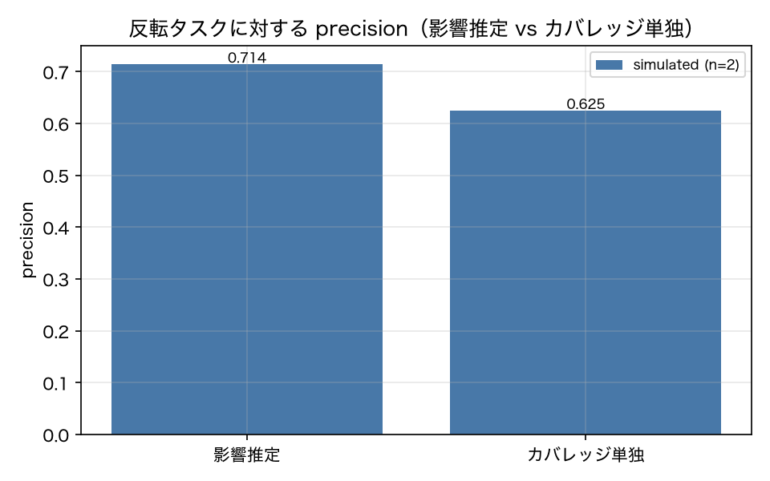

# E3-2 意味的影響推定による選択

## 5項目
- 仮説: プロンプト差分から列挙した影響タグで日付関連タスクが選ばれ、反転テストを高再現率で捉える
- 植込み条件: v02_dateformat（日付書式の指示変更）
- 対照: 文体だけを変えた差分 v02b_tone（run は不要。diff だけ使う）
- 合格基準: recall_of_flipped >= 0.8、control_selected_ratio <= 0.2、precision_gain_vs_coverage > 0.0
- 来歴: simulated

## 方法
v01 → v02_dateformat のプロンプト差分（section: date_format）から影響タグを列挙し、
タスクの tags・category・kind を文字 2〜3-gram の TF-IDF でベクトル化して、コサイン類似が閾値 0.15 以上の
タスクを選んだ（原典 3.3）。反転は ADR-009 の定義（対応する反復での不一致率 > フレーク帯）。
対照は v01 → v02b_tone（文体だけの差分、run は作らない）で、同じ手順の selected_ratio を見る。
カバレッジ単独（section: date_format を参照するタスク）の precision と比較した。
live が使えないため、タグ列挙は LLM ではなく差分本文からの決定的抽出（impact.tags_offline）を使い、
来歴を simulated とした。live で Haiku に列挙させる経路（impact.tags_live）は実装済みで未実行。

## 結果
| 指標 | 値（来歴） | 基準 | 判定 |
|---|---|---|---|
| control_selected_ratio | 0 [simulated] | <= 0.2 | ○ |
| coverage_precision | 0.625 [simulated] | — | — |
| impact_precision | 0.7143 [simulated] | — | — |
| n_flipped | 10 [simulated] | — | — |
| n_flipped_legacy_band | 10 [simulated] | — | — |
| n_selected | 14 [simulated] | — | — |
| precision_gain_vs_coverage | 0.0893 [simulated] | > 0.0 | ○ |
| recall_of_flipped | 1 [simulated] | >= 0.8 | ○ |
| selected_ratio | 0.3043 [simulated] | — | — |

## 判定
PASS

全基準を満たした。

## 気づき・限界
- 列挙された影響タグ: ['calendar_create', 'date', 'scheduling']
- 対照（v02b_tone）のタグ: []、選択率 0.0
- 反転タスク: ['T-001', 'T-006', 'T-007', 'T-008', 'T-009', 'T-010', 'T-012', 'T-013', 'T-014', 'T-401']
- 影響推定が選んだタスク: ['T-001', 'T-006', 'T-007', 'T-008', 'T-009', 'T-010', 'T-011', 'T-012', 'T-013', 'T-014', 'T-101', 'T-102', 'T-103', 'T-401']
- タグ列挙は決定的抽出（KEYWORD_TAGS）なので、LLM の意味理解の寄与は検証できていない。この実験が確かめたのは「タグ → TF-IDF 照合 → 選択」の経路が機能することまで。

---
生成: `uv run agenteval exp e3_2` / 実行時刻 2026-09-19T01:57:49+00:00 / コスト 0.0 USD
