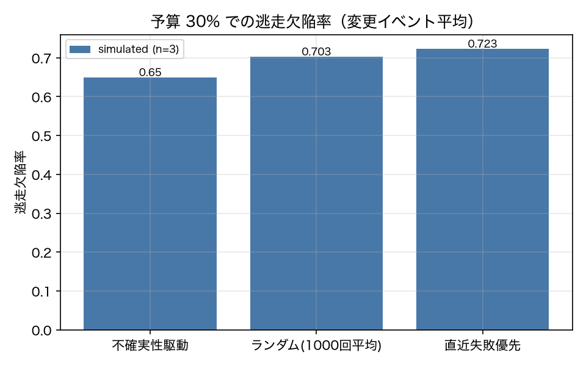
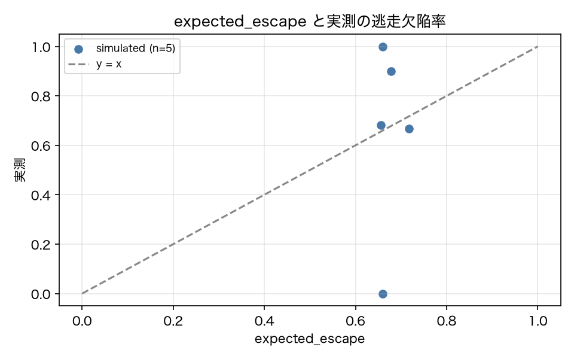

# E3-3 不確実性駆動のテスト選択

## 5項目
- 仮説: 予算 30% で H(p̂)/c による選択はランダムと直近失敗優先より逃走欠陥率が低く、expected_escape は実測と校正されている
- 植込み条件: v02〜v09 の各変更を leave-one-change-out で評価
- 対照: 同予算のランダム選択（1,000 回抽選の平均）と直近失敗優先
- 合格基準: escape_ratio_vs_random <= 0.5、calibration_error <= 0.15
- 来歴: simulated

## 方法
変更イベント = v01 → v02〜v09 の 8 件。各イベントについて、そのイベントを除いた履歴
（leave-one-change-out）から `p̂_t` を推定し、`H(p̂)/c` の降順に予算 30% まで貪欲選択した
（冗長性: ツール名列の正規化編集距離の類似 > 0.8 は飛ばす）。逃走欠陥率は
「選ばなかったテストのうち実際に反転していたものの割合」（原典 3.8）。
対照はランダム選択（1,000 回抽選の平均）と直近失敗優先。
`expected_escape` は選ばなかったテストの `Σ(1 − p̂_t) / |T|` で、実測の逃走欠陥率と並べて校正誤差を見た。

## 結果
| 指標 | 値（来歴） | 基準 | 判定 |
|---|---|---|---|
| calibration_error | 0.26 [simulated] | <= 0.15 | × |
| escape_no_redundancy_variant | 0.4442 [simulated] | — | — |
| escape_random | 0.7028 [simulated] | — | — |
| escape_ratio_vs_random | 0.9244 [simulated] | <= 0.5 | × |
| escape_recent_failures | 0.723 [simulated] | — | — |
| escape_uncertainty | 0.6497 [simulated] | — | — |
| mean_redundant_skips | 24.6 [simulated] | — | — |
| n_measurable_events | 5 [simulated] | — | — |

## 判定
FAIL

未達の基準: escape_ratio_vs_random, calibration_error。

## 気づき・限界
- 変更イベントごとの結果: [{'change': 'v02_dateformat', 'n_flipped': 10, 'uncertainty': 0.9, 'random': 0.7193999999999999, 'recent': 0.6, 'expected': 0.6778, 'selected': 16, 'no_redundancy': 0.6, 'n_skipped_redundant': 30}, {'change': 'v03_noverify', 'n_flipped': 0, 'uncertainty': 0.0, 'random': 0.0, 'recent': 0.0, 'expected': 0.6554, 'selected': 17, 'no_redundancy': 0.0, 'n_skipped_redundant': 29}, {'change': 'v04_loopy', 'n_flipped': 0, 'uncertainty': 0.0, 'random': 0.0, 'recent': 0.0, 'expected': 0.6566, 'selected': 17, 'no_redundancy': 0.0, 'n_skipped_redundant': 29}, {'change': 'v05_unsafe_delete', 'n_flipped': 2, 'uncertainty': 0.0, 'random': 0.688, 'recent': 1.0, 'expected': 0.6602, 'selected': 17, 'no_redundancy': 0.0, 'n_skipped_redundant': 24}, {'change': 'v06_toolschema_v2', 'n_flipped': 6, 'uncertainty': 0.6667, 'random': 0.7123318000000001, 'recent': 0.8333, 'expected': 0.7179, 'selected': 14, 'no_redundancy': 0.1667, 'n_skipped_redundant': 22}, {'change': 'v07_step_minimizer', 'n_flipped': 22, 'uncertainty': 0.6818, 'random': 0.6930054999999999, 'recent': 0.6818, 'expected': 0.6559, 'selected': 17, 'no_redundancy': 0.4545, 'n_skipped_redundant': 23}, {'change': 'v08_summarize_ctx', 'n_flipped': 0, 'uncertainty': 0.0, 'random': 0.0, 'recent': 0.0, 'expected': 0.6582, 'selected': 17, 'no_redundancy': 0.0, 'n_skipped_redundant': 24}, {'change': 'v09_model_swap', 'n_flipped': 4, 'uncertainty': 1.0, 'random': 0.7015, 'recent': 0.5, 'expected': 0.6593, 'selected': 17, 'no_redundancy': 1.0, 'n_skipped_redundant': 24}]
- 原因の切り分け: 冗長性ペナルティ（`.claude/rules/pts.md` の「ツール名列の正規化編集距離の補数が 0.8 を超える候補は飛ばす」）が、候補の大半を落としている（平均 24.6 件／回）。この例示環境ではタスクのツール名列が `calendar_search → calendar_create → checks_run → finish` のようにほぼ同一なので、ツール名だけの類似度では別タスクを区別できない。
- 冗長性ペナルティを切った変種では逃走欠陥率が 0.444（ランダムは 0.703）まで下がる。つまり「カバレッジで絞る → 不確実性で並べる」経路自体は効いており、落としているのは類似度の定義である。
- 判定は FAIL（実験設計の不備）とする。手法が主張どおり働かなかったのではなく、類似度をツール名列だけで測る実装と、ツール名列が同質なタスク集合の組合せが原因。修正案: 類似度に正規化引数を含める（規則の変更なので ADR が要る）か、タスクのツール列を多様にする。
- 反転が 0 件の変更イベントは逃走欠陥率が定義できないので平均から除いた（件数を n_measurable_events に記載）。
- ロジスティック回帰は変更イベント単位の leave-one-out で学習した。学習データが 8 イベントと少ないため、Beta 事後との平均が支配的である。

---
生成: `uv run agenteval exp e3_3` / 実行時刻 2026-09-13T01:51:35+00:00 / コスト 0.0 USD
