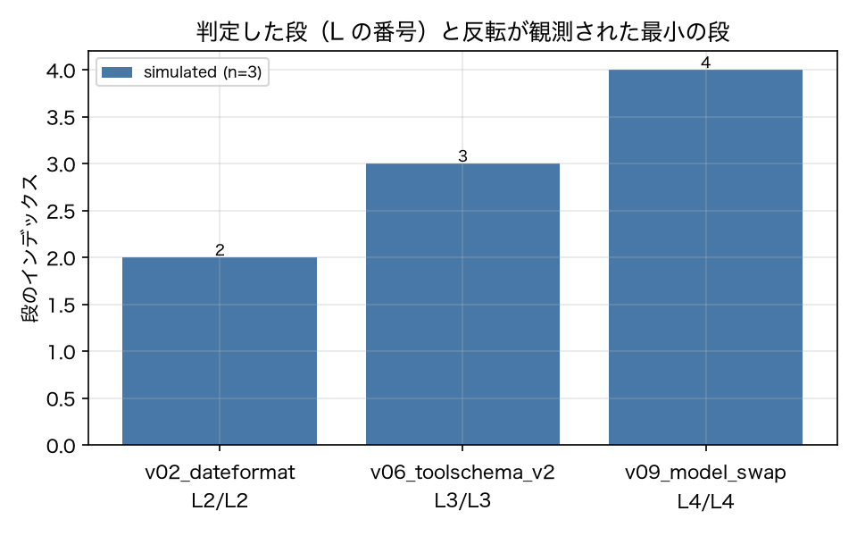

# E3-4 テストピラミッドの段判定

## 5項目
- 仮説: 変更分類から決めた段は、反転が観測される最小の段以上である。LLM に見えない変更は L1 で止まる
- 植込み条件: v02（prompt → L2 以上）、v06（tool → L3 以上）、v09（model → L4）
- 対照: Change(kind=code)（ツールラッパーのリファクタ。版ハッシュ不変）
- 合格基準: level_ok_rate == 1.0、control_nonflake_flips == 0
- 来歴: simulated

## 方法
各植込み版について `Change` を計算し、`decide_level` が返す段と、実際に反転が観測された
最小の段（`observed_min_level`）を比較した（原典 3.5）。反転の定義は ADR-009。
対照は `Change(kind=code)`（ツールラッパーのリファクタ。版ハッシュは変わらない）で、
L0〜L1 で停止し、非フレーク反転が 0 であることを確認した。
この例示環境では L2〜L4 を「軌跡の実行」で代表しているため、段の粒度はレポートより粗い。

## 結果
| 指標 | 値（来歴） | 基準 | 判定 |
|---|---|---|---|
| control_level | L1 [simulated] | — | — |
| control_nonflake_flips | 0 [simulated] | == 0 | ○ |
| level_ok_rate | 1 [simulated] | == 1.0 | ○ |
| n_planted | 3 [simulated] | — | — |

## 判定
PASS

全基準を満たした。

## 気づき・限界
- 段の判定結果: [{'version': 'v02_dateformat', 'change_kind': 'prompt', 'decided': 'L2', 'observed_min': 'L2', 'n_flipped': 10, 'ok': True}, {'version': 'v06_toolschema_v2', 'change_kind': 'tool', 'decided': 'L3', 'observed_min': 'L3', 'n_flipped': 6, 'ok': True}, {'version': 'v09_model_swap', 'change_kind': 'model', 'decided': 'L4', 'observed_min': 'L4', 'n_flipped': 4, 'ok': True}]
- 対照（kind=code）の段: L1（L1 で停止）。版ハッシュが変わらないため反転は定義上 0。
- 反転が 0 件の版では observed_min が L1 に落ちるため、decided ≥ observed が自動的に成り立つ。つまりこの基準は「過小な段を選ばないこと」しか確かめておらず、「過大な段を選ばないこと」は確かめていない。

---
生成: `uv run agenteval exp e3_4` / 実行時刻 2026-09-13T03:52:42+00:00 / コスト 0.0 USD
