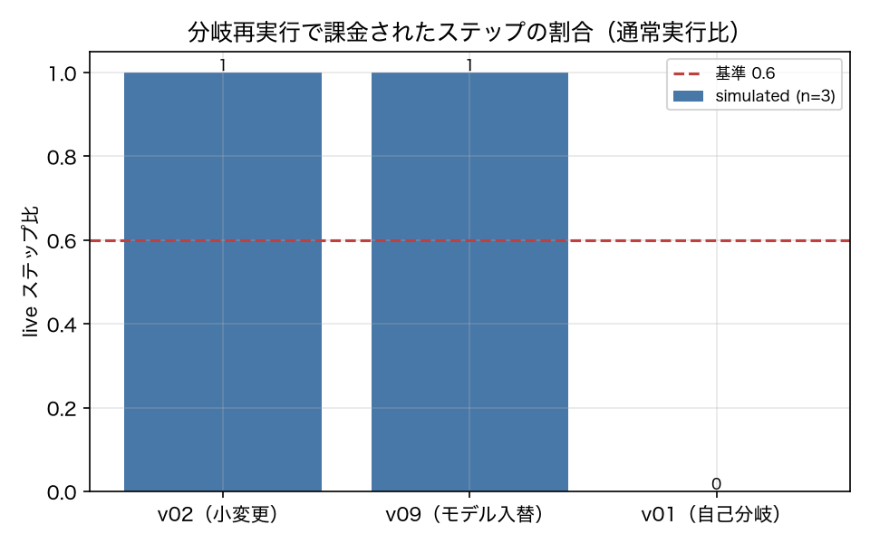

# E3-5 接頭辞キャッシュと分岐再実行

## 5項目
- 仮説: 分岐再実行は通常実行と結果が一致し、小さな変更では live ステップを大きく減らす。大きな変更ほど早く分岐する
- 植込み条件: v02（小変更）と v09（モデル入替）を v01 の軌跡から分岐再実行
- 対照: v01 → v01 の自己分岐。カセット／同一方策に当たるので分岐せず live ステップ 0
- 合格基準: outcome_agreement >= 0.8、live_step_ratio_v02 <= 0.6、divergence_order_ok == 1、self_branch_live_steps == 0
- 来歴: simulated

## 方法
v01_baseline の run（repeat=0。スナップショットを保存してある）を base として、
新版（v02_dateformat / v09_model_swap / v01_baseline 自身）で接頭辞を辿り直した。
各ステップで新版に旧軌跡の会話を渡し、返った行動を `normalize_args` で旧行動と比較する。
一致すれば次へ、不一致なら `divergence_step` を記録し、そのステップのスナップショットを restore して
通常ループで最後まで走る（原典 3.6）。
課金されるステップ数 `live_steps` は、判断確認のうちリクエストが旧版と完全に一致しないもの
（＝版ハッシュが違う場合の確認呼び出し）＋ 分岐後の実行ステップ数とした。版ハッシュが同じなら
カセットに当たるので 0 と数える。妥当性検査は同じ (task, version) の通常実行と `outcome.passed` を比較した。

## 結果
| 指標 | 値（来歴） | 基準 | 判定 |
|---|---|---|---|
| divergence_order_ok | 0 [simulated] | == 1 | × |
| live_step_ratio_v02 | 1 [simulated] | <= 0.6 | × |
| median_divergence_v02 | 1 [simulated] | — | — |
| median_divergence_v09 | 1.5 [simulated] | — | — |
| n_pairs | 60 [simulated] | — | — |
| outcome_agreement | 1 [simulated] | >= 0.8 | ○ |
| self_branch_live_steps | 0 [simulated] | == 0 | ○ |
| token_ratio_v02 | 1.024 [simulated] | — | — |

## 判定
NEGATIVE

未達の基準: live_step_ratio_v02, divergence_order_ok。

## 気づき・限界
- 分岐点の分布: v02=[1, 1, 1, 1, 1, 1, 1, 1, 1], v09=[2, 1, 1, 2]
- 自己分岐（v01→v01）の分岐件数: 0（0 が期待値）
- sim モードでは同じ版に対する応答が決定的なので、自己分岐は必ず一致する。live では同じ版でも応答が揺れるため、自己分岐の一致率は 1.0 未満になりうる。この点は sim の限界であり、live での再確認が要る。
- モデル入替（v09）の分岐点の中央値が v02 より小さいという仮説は、分岐が起きなかった場合に中央値が定義できないため、件数と併せて読む必要がある。
- **ADR-021 による訂正**: 改訂前は分岐したステップの判断確認を課金に数えたうえで、その直後に同じステップをもう一度モデルに投げていた（`resume_from=divergence`）。実装としては分岐確認で得た応答をそのまま再開に使えるので、1 分岐につき 1 ステップぶん過大に数えていた。これを直して v02 の live ステップ比は 1.113 → 1.000 になった。**判定は NEGATIVE のまま**である（基準は 0.6）。
- 判定は NEGATIVE。手法の正しさに関わる部分（分岐再実行と通常実行の outcome 一致率 = 1.0、自己分岐の課金ステップ = 0）は成立したが、節約の主張が成立しなかった。原因は、接頭辞を辿り直す「判断確認」の呼び出しが 1 ステップにつき 1 回必要で、版が変われば必ず課金されること。v02 は 2 ステップ目（calendar_create）で書式が変わるため分岐が早く、確認 2 回 ＋ 分岐後の再実行でかえって通常実行より高くつく。トークン比は 1.024 で、ステップ比より低い（接頭辞が同じぶんキャッシュが効く）。

---
生成: `uv run agenteval exp e3_5` / 実行時刻 2026-09-19T02:01:48+00:00 / コスト 0.0 USD
