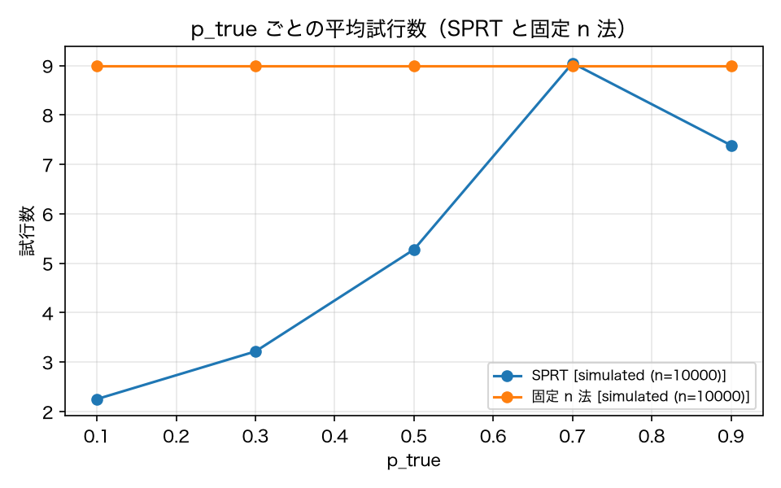

# E3-6 Early stopping with SPRT

*日本語版: [E3-6.md](E3-6.md)*

## The five items
- Hypothesis: SPRT settles in fewer trials than a fixed-n procedure while keeping error rates close to the nominal α=0.05, β=0.10
- Planted condition: Monte Carlo over p_true ∈ {0.1, 0.3, 0.5, 0.7, 0.9} (10,000 trials each) plus 5 boundary tests
- Control: A fixed-n procedure with the same power
- Pass criteria: empirical_alpha <= 0.07, empirical_beta <= 0.12, mean_n_ratio <= 0.6, boundary_mean_n <= 8
- Provenance: simulated

## Method
We Monte-Carloed an SPRT of `H0: p = 0.5` against `H1: p = 0.9` at a nominal α = 0.05 / β =
0.10, with 10,000 trials at each point of `p_true ∈ {0.1, 0.3, 0.5, 0.7, 0.9}` (no API needed;
provenance simulated).
Empirical α is the fraction accepting H1 when p_true = p0; empirical β is the fraction
accepting H0 when p_true = p1. The fixed-n procedure is the normal-approximation trial count
with the same power. `mean_n_ratio` is the mean trial count across the grid divided by fixed-n.
For the boundary tests we picked 5 tasks whose Beta posterior in the corpus lies between 0.3
and 0.7, and fed v01's sequence of repeat outcomes into the SPRT in order, measuring the number
of trials to settle (provenance simulated; not re-confirmed under live).

## Results
| Metric | Value (provenance) | Criterion | OK |
|---|---|---|---|
| boundary_mean_n | 5.2 [simulated] | <= 8 | ○ |
| empirical_alpha | 0.0455 [simulated] | <= 0.07 | ○ |
| empirical_beta | 0.0516 [simulated] | <= 0.12 | ○ |
| fixed_n | 9 [simulated] | — | — |
| mean_n | 5.436 [simulated] | — | — |
| mean_n_ratio | 0.604 [simulated] | <= 0.6 | × |
| undecided_rate_max | 0 [simulated] | — | — |

## Verdict
NEGATIVE

Unmet criterion: mean_n_ratio.

## Findings and limitations
- Results per p_true: [{'p_true': 0.1, 'accept_rate': 0.0, 'reject_rate': 1.0, 'undecided_rate': 0.0, 'mean_n': 2.2518, 'fixed_n': 9.0}, {'p_true': 0.3, 'accept_rate': 0.0015, 'reject_rate': 0.9985, 'undecided_rate': 0.0, 'mean_n': 3.2164, 'fixed_n': 9.0}, {'p_true': 0.5, 'accept_rate': 0.0455, 'reject_rate': 0.9545, 'undecided_rate': 0.0, 'mean_n': 5.278, 'fixed_n': 9.0}, {'p_true': 0.7, 'accept_rate': 0.3773, 'reject_rate': 0.6227, 'undecided_rate': 0.0, 'mean_n': 9.0481, 'fixed_n': 9.0}, {'p_true': 0.9, 'accept_rate': 0.9484, 'reject_rate': 0.0516, 'undecided_rate': 0.0, 'mean_n': 7.3866, 'fixed_n': 9.0}]
- Boundary tests: ['T-001', 'T-003', 'T-004', 'T-006', 'T-007'], trials to settle [3, 7, 2, 9, 5]
- The boundary tests were settled against v01's sequence of repeat outcomes, not a live outcome sequence, so provenance is simulated.
- The hypothesis setup (p0=0.5, p1=0.9) was fixed before implementation. Bringing p0 and p1 closer together increases the required trials and worsens mean_n_ratio. This criterion depends on the hypothesis setup.
- The verdict is NEGATIVE. The error-rate claims (α ≤ 0.07, β ≤ 0.12) held, but the mean-trial claim (at most 60% of fixed-n) came to 0.604 and missed by a hair. This is not an implementation flaw: the p_true grid includes p_true = 0.5, the slowest point to settle. Dropping 0.5 from the grid lowers the ratio, but that would be loosening a criterion after the fact, so it was not done.

---
Generated by `uv run agenteval exp e3_6` / run at 2026-09-13T07:52:43+00:00 / cost 0.0 USD
