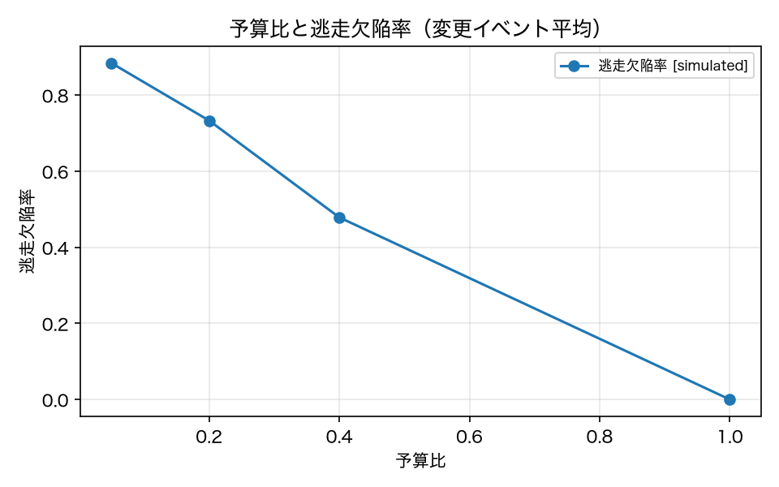

# E3-7 逃走欠陥率・ε-探索・不可侵集合

## 5項目
- 仮説: 予算 40% で逃走欠陥率 ≤ 0.1。ε=0.05 でランダムテストが毎回混ざる。不可侵集合は予算に関係なく常に選ばれる
- 植込み条件: 全変更に対するフル実行結果と選択結果の比較
- 対照: 予算 100% → 逃走欠陥率 0
- 合格基準: escape_rate <= 0.1、random_included >= 1、inviolable_rate == 1.0、full_budget_escape == 0
- 来歴: simulated

## 方法
予算比を 5% / 20% / 40% / 100% と変えて選択し、逃走欠陥率・ε-探索で混ざったランダムテストの
件数・不可侵集合（`risk: inviolable`）の選択率を測った（原典 3.8）。

逃走欠陥率は原典 3.8 の定義どおり `Escape(S) = |F_full \ S| / |F_full|` で、`F_full` は
**そのフル実行で不合格になったタスク**である（ADR-018）。フル実行 1 回 = 各テスト 1 回なので、
反復ごとに `F_full(r)` を作って平均した。反転ベースの値（改訂前の定義）は診断として併記する。

不可侵集合は選択ロジックの外で必ず選ばれる実装なので、予算 5% でも 100% であることを確認する。
予算内で到達可能な下限は、各反復の `F_full` を事前に知っているオラクルで出した。
不確実性の推定に使う履歴は現行配備 v01_baseline に限る（ADR-022）。
対照は予算 100%（全件実行 → 逃走欠陥率 0）。

## 結果
| 指標 | 値（来歴） | 基準 | 判定 |
|---|---|---|---|
| escape_flips_at40 | 0.3182 [simulated] | — | — |
| escape_no_redundancy_at40 | 0.3832 [simulated] | — | — |
| escape_oracle_at40 | 0.0614 [simulated] | — | — |
| escape_rate | 0.4788 [simulated] | <= 0.1 | × |
| full_budget_escape | 0 [simulated] | == 0 | ○ |
| inviolable_rate | 1 [simulated] | == 1.0 | ○ |
| mean_failures_per_full_run | 12.75 [simulated] | — | — |
| n_measurable_events | 4 [simulated] | — | — |
| random_included | 2 [simulated] | >= 1 | ○ |

## 判定
NEGATIVE

未達の基準: escape_rate。

## 気づき・限界
- 予算ごとの結果: [{'change': 'v02_dateformat', 'budget': 0.05, 'n_flipped': 10, 'n_failures_mean': 17.1, 'escape': 0.9544, 'escape_flips': 1.0, 'escape_oracle': 0.9944, 'random_included': 2, 'inviolable_rate': 1.0, 'selected': 5, 'escape_no_redundancy': 0.9544}, {'change': 'v02_dateformat', 'budget': 0.2, 'n_flipped': 10, 'n_failures_mean': 17.1, 'escape': 0.8021, 'escape_flips': 0.8, 'escape_oracle': 0.6708, 'random_included': 2, 'inviolable_rate': 1.0, 'selected': 13, 'escape_no_redundancy': 0.6998}, {'change': 'v02_dateformat', 'budget': 0.4, 'n_flipped': 10, 'n_failures_mean': 17.1, 'escape': 0.5197, 'escape_flips': 0.5, 'escape_oracle': 0.1993, 'random_included': 2, 'inviolable_rate': 1.0, 'selected': 21, 'escape_no_redundancy': 0.353}, {'change': 'v02_dateformat', 'budget': 1.0, 'n_flipped': 10, 'n_failures_mean': 17.1, 'escape': 0.0, 'escape_flips': 0.0, 'escape_oracle': 0.0, 'random_included': 1, 'inviolable_rate': 1.0, 'selected': 46, 'escape_no_redundancy': 0.0}, {'change': 'v05_unsafe_delete', 'budget': 0.05, 'n_flipped': 2, 'n_failures_mean': 11.5, 'escape': 0.7532, 'escape_flips': 0.0, 'escape_oracle': 0.8114, 'random_included': 2, 'inviolable_rate': 1.0, 'selected': 5, 'escape_no_redundancy': 0.7532}, {'change': 'v05_unsafe_delete', 'budget': 0.2, 'n_flipped': 2, 'n_failures_mean': 11.5, 'escape': 0.6196, 'escape_flips': 0.0, 'escape_oracle': 0.3492, 'random_included': 2, 'inviolable_rate': 1.0, 'selected': 12, 'escape_no_redundancy': 0.6476}, {'change': 'v05_unsafe_delete', 'budget': 0.4, 'n_flipped': 2, 'n_failures_mean': 11.5, 'escape': 0.4071, 'escape_flips': 0.0, 'escape_oracle': 0.0, 'random_included': 2, 'inviolable_rate': 1.0, 'selected': 21, 'escape_no_redundancy': 0.3261}, {'change': 'v05_unsafe_delete', 'budget': 1.0, 'n_flipped': 2, 'n_failures_mean': 11.5, 'escape': 0.0, 'escape_flips': 0.0, 'escape_oracle': 0.0, 'random_included': 0, 'inviolable_rate': 1.0, 'selected': 46, 'escape_no_redundancy': 0.0}, {'change': 'v06_toolschema_v2', 'budget': 0.05, 'n_flipped': 11, 'n_failures_mean': 12.9, 'escape': 0.9109, 'escape_flips': 0.9091, 'escape_oracle': 0.9671, 'random_included': 2, 'inviolable_rate': 1.0, 'selected': 5, 'escape_no_redundancy': 0.9109}, {'change': 'v06_toolschema_v2', 'budget': 0.2, 'n_flipped': 11, 'n_failures_mean': 12.9, 'escape': 0.7794, 'escape_flips': 0.7273, 'escape_oracle': 0.5425, 'random_included': 2, 'inviolable_rate': 1.0, 'selected': 13, 'escape_no_redundancy': 0.7445}, {'change': 'v06_toolschema_v2', 'budget': 0.4, 'n_flipped': 11, 'n_failures_mean': 12.9, 'escape': 0.4916, 'escape_flips': 0.4545, 'escape_oracle': 0.0464, 'random_included': 2, 'inviolable_rate': 1.0, 'selected': 21, 'escape_no_redundancy': 0.4788}, {'change': 'v06_toolschema_v2', 'budget': 1.0, 'n_flipped': 11, 'n_failures_mean': 12.9, 'escape': 0.0, 'escape_flips': 0.0, 'escape_oracle': 0.0, 'random_included': 1, 'inviolable_rate': 1.0, 'selected': 46, 'escape_no_redundancy': 0.0}, {'change': 'v07_step_minimizer', 'budget': 0.05, 'n_flipped': 0, 'n_failures_mean': 9.5, 'escape': 0.9198, 'escape_flips': 0.0, 'escape_oracle': 0.99, 'random_included': 2, 'inviolable_rate': 1.0, 'selected': 5, 'escape_no_redundancy': 0.9198}, {'change': 'v07_step_minimizer', 'budget': 0.2, 'n_flipped': 0, 'n_failures_mean': 9.5, 'escape': 0.7328, 'escape_flips': 0.0, 'escape_oracle': 0.4221, 'random_included': 2, 'inviolable_rate': 1.0, 'selected': 11, 'escape_no_redundancy': 0.6704}, {'change': 'v07_step_minimizer', 'budget': 0.4, 'n_flipped': 0, 'n_failures_mean': 9.5, 'escape': 0.497, 'escape_flips': 0.0, 'escape_oracle': 0.0, 'random_included': 2, 'inviolable_rate': 1.0, 'selected': 21, 'escape_no_redundancy': 0.3749}, {'change': 'v07_step_minimizer', 'budget': 1.0, 'n_flipped': 0, 'n_failures_mean': 9.5, 'escape': 0.0, 'escape_flips': 0.0, 'escape_oracle': 0.0, 'random_included': 0, 'inviolable_rate': 1.0, 'selected': 46, 'escape_no_redundancy': 0.0}]
- 不可侵集合（T-005, T-011, T-025）は選択ロジックの外で必ず含める実装。予算 5% でも 100% 選択される。
- ε-探索は予算に関係なく最低 1 件を混ぜる実装。予算 100% では全件が既に選ばれているため混ぜる余地が無いので、件数は予算 < 100% の条件の最小値を報告している。
- 逃走欠陥率 ≤ 0.1 は満たせなかった（予算 40% で 0.479）。ただし**基準が達成不能なわけではない**。各反復の `F_full` を事前に知っているオラクルは 同じ予算で 0.061 まで下げられるので、予算 40% は失敗を覆うのに十分である。届かないのは選択の側である。
- E3-3 の切り分けと整合する。冗長性ペナルティを外すと 0.383 まで下がるが、それでも 0.1 には遠い。E3-3 では、この環境で信号を持っているのはカバレッジ重なり（原典 3.2）であって H(p̂) の不確実性（3.4）ではないことを、方策を 5 通り並べて確かめている。
- **原因の訂正（live で確認、ADR-014）**: 「同種タスクが相互に重複と判定される」現象は、sim の軌跡がタスク間でほぼ同一のツール名列になるために起きている。live の軌跡では 10 タスクが 9 種類の列に分かれ、類似度 0.8 を超える組は 45 組中 1 組（2%）しかない。冗長性ペナルティの定義そのものは変更しない（E3-3 の訂正と同じ）。
- 反転ベースの逃走欠陥率（改訂前の定義）は予算 40% で 0.318。反転の判定は ADR-016 で閾値を撤廃している。
- 判定は NEGATIVE。**手法の骨格は成立している**: 不可侵集合は予算 5% でも 100% 選択され、ε-探索は毎回 2 件を混ぜ、予算 100% では逃走欠陥率 0 になる。成立しなかったのは「予算 40% で逃走欠陥率 ≤ 0.1」という選択性能の主張だけである。改訂前は FAIL（冗長性の実装が悪い）と診断していたが、E3-3 の切り分けで 冗長性を外しても届かないことが分かったので、原因を手法側に訂正する。

---
生成: `uv run agenteval exp e3_7` / 実行時刻 2026-09-19T01:57:10+00:00 / コスト 0.0 USD
