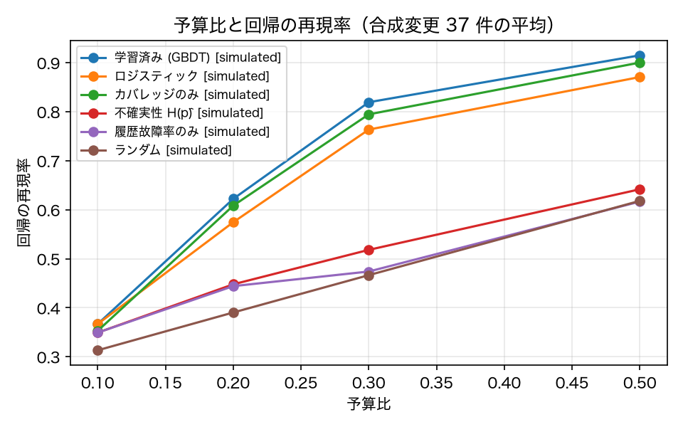
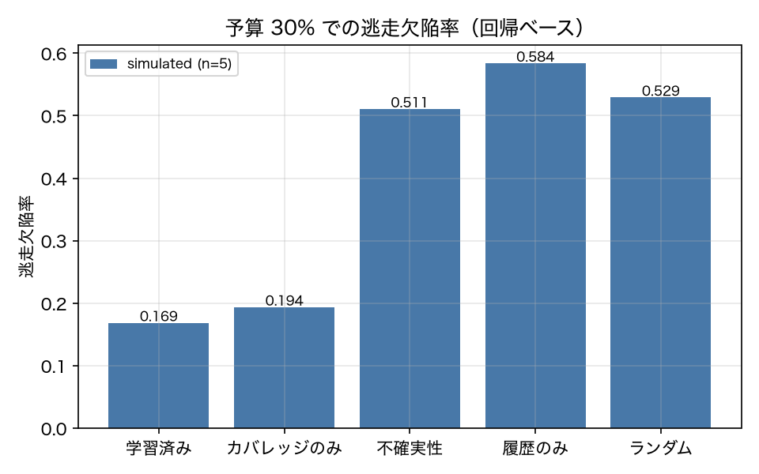

# E3-8 Test selection from a learned failure model

*日本語版: [E3-8.md](E3-8.md)*

## The five items
- Hypothesis: Learning the regression probability from change x test features catches regressions at a higher recall than random selection at the same budget
- Planted condition: 37 synthetic changes built per report 3.8's cold start (prompt / config / tool / model / fault / two-factor)
- Control: Random selection, baseline failure rate only, coverage overlap only, uncertainty H(p-hat)
- Pass criteria: roc_auc >= 0.75, recall_at_budget_30 >= 0.8, recall_ratio_vs_random >= 2.0, escape_ratio_vs_random <= 0.5, control_random_recall <= 0.6
- Provenance: simulated

## Method
Following report 3.8's "cold start", **65 synthetic changes** were built by perturbing v01_baseline (29 prompt / 7 config / 1 tool schema / 1 model swap / 24 tool faults / 3 two-factor). Each change x 46 tasks x 5 repeats ran in sim into `data/pts_corpus/`.

Each training row is a (change, test) pair, labelled **regressed** (the baseline passed at a repeat and the target failed at the same repeat). Features are report 3.4's table plus the cross features industrial PTS uses, within-change percentile ranks (ADR-027), and — added in this revision — **recency and change size drawn from an append-only change/test history ledger** (ADR-028): how many changes since this test last ran / last failed / last regressed, since this unit was last changed; lines added and removed; units touched.

**Discipline against leakage**: features come only from the baseline history and change metadata; the target version's runs are used for labels only. History features are computed inside the training fold and never see records at or after the row's own `seq`. Cross-validation is **leave-one-group-out over change families**, and the model is chosen by an **inner** cross-validation on the training folds only.

Selection is greedy by predicted risk `p_fail / cost` up to the budget.

## Results
| Metric | Value (provenance) | Criterion | OK |
|---|---|---|---|
| average_precision | 0.2087 [simulated] | — | — |
| base_rate | 0.0408 [simulated] | — | — |
| brier | 0.0608 [simulated] | — | — |
| control_random_recall | 0.4665 [simulated] | <= 0.6 | ○ |
| escape_ensemble | 0.2691 [simulated] | — | — |
| escape_learned | 0.1686 [simulated] | — | — |
| escape_random | 0.5292 [simulated] | — | — |
| escape_ratio_vs_random | 0.3186 [simulated] | <= 0.5 | ○ |
| n_changes | 65 [simulated] | — | — |
| n_changes_with_regression | 21 [simulated] | — | — |
| n_groups | 6 [simulated] | — | — |
| n_positive | 122 [simulated] | — | — |
| n_rows | 2990 [simulated] | — | — |
| recall_at_budget_30 | 0.8193 [simulated] | >= 0.8 | ○ |
| recall_ceiling_at_budget_30 | 0.9345 [simulated] | — | — |
| recall_coverage_only_30 | 0.7946 [simulated] | — | — |
| recall_ensemble_30 | 0.7326 [simulated] | — | — |
| recall_needed_for_ratio_criterion | 0.933 [simulated] | — | — |
| recall_prior_only_30 | 0.4739 [simulated] | — | — |
| recall_ratio_vs_random | 1.756 [simulated] | >= 2.0 | × |
| recall_uncertainty_30 | 0.5181 [simulated] | — | — |
| roc_auc | 0.8136 [simulated] | >= 0.75 | ○ |
| roc_auc_coverage_only | 0.7549 [simulated] | — | — |
| roc_auc_gbdt | 0.7035 [simulated] | — | — |
| roc_auc_logistic | 0.7414 [simulated] | — | — |
| roc_auc_per_change_coverage | 0.7549 [simulated] | — | — |
| roc_auc_per_change_protocol | 0.8127 [simulated] | — | — |
| roc_auc_prior_only | 0.5692 [simulated] | — | — |
| within_change_auc | 0.833 [simulated] | — | — |
| within_change_auc_coverage_only | 0.8754 [simulated] | — | — |

## Verdict
FAIL

Unmet criterion: recall_ratio_vs_random.

## Findings and limitations
- Model comparison (family-level leave-one-group-out): [{'model': 'auto', 'label': 'regressed', 'roc_auc': 0.8136, 'within_change_auc': 0.833, 'average_precision': 0.2087, 'brier': 0.0608, 'base_rate': 0.0408, 'lift_over_base': 5.1138, 'n_rows': 2990, 'n_positive': 122, 'n_groups': 6, 'chosen_per_fold': {'combo': 'logistic', 'config': 'gbdt_small', 'fault': 'logistic', 'model': 'gbdt_small', 'prompt': 'gbdt_small', 'tool': 'gbdt_small'}}, {'model': 'logistic', 'label': 'regressed', 'roc_auc': 0.7414, 'within_change_auc': 0.7849, 'average_precision': 0.0817, 'brier': 0.1753, 'base_rate': 0.0408, 'lift_over_base': 2.0028, 'n_rows': 2990, 'n_positive': 122, 'n_groups': 6, 'chosen_per_fold': {}}, {'model': 'gbdt', 'label': 'regressed', 'roc_auc': 0.7035, 'within_change_auc': 0.6903, 'average_precision': 0.076, 'brier': 0.0619, 'base_rate': 0.0408, 'lift_over_base': 1.8631, 'n_rows': 2990, 'n_positive': 122, 'n_groups': 6, 'chosen_per_fold': {}}, {'model': 'prior', 'label': 'regressed', 'roc_auc': 0.5692, 'within_change_auc': 0.5252, 'average_precision': 0.0477, 'brier': 0.1705, 'base_rate': 0.0408, 'lift_over_base': 1.1692, 'n_rows': 2990, 'n_positive': 122, 'n_groups': 6, 'chosen_per_fold': {}}, {'model': 'coverage', 'label': 'regressed', 'roc_auc': 0.7549, 'within_change_auc': 0.8754, 'average_precision': 0.0938, 'brier': 0.0538, 'base_rate': 0.0408, 'lift_over_base': 2.2979, 'n_rows': 2990, 'n_positive': 122, 'n_groups': 6, 'chosen_per_fold': {}}]
- Model chosen by the inner CV / inner scores: {'combo': 'logistic', 'config': 'gbdt_small', 'fault': 'logistic', 'model': 'gbdt_small', 'prompt': 'gbdt_small', 'tool': 'gbdt_small'} / 内側スコア: {'combo': {'logistic': 0.7952, 'gbdt_small': 0.7901, 'gbdt': 0.6451}, 'config': {'logistic': 0.7245, 'gbdt_small': 0.8363, 'gbdt': 0.7513}, 'fault': {'logistic': 0.4325, 'gbdt_small': 0.4202, 'gbdt': 0.412}, 'model': {'logistic': 0.731, 'gbdt_small': 0.8214, 'gbdt': 0.7531}, 'prompt': {'logistic': 0.7095, 'gbdt_small': 0.7871, 'gbdt': 0.7156}, 'tool': {'logistic': 0.5892, 'gbdt_small': 0.7881, 'gbdt': 0.5852}}
- Diagnostic (outside the criteria): under the realistic protocol that holds out a single change, logistic AUC is 0.813 and coverage alone is 0.755. Family-level hold-out is the harsher setting: it asks the model to predict a kind of change it has never seen.
- Feature importance (top 12): [('overlap_ratio_z_in_change', 0.3611), ('coverage_overlap_rank_in_change', 0.0496), ('change_kind_prompt', 0.0488), ('lag_since_units_changed', 0.0452), ('max_steps_headroom', 0.04), ('overlap_ratio_rank_in_change', 0.0363), ('hist_regress_rate', 0.0231), ('lag_since_test_regressed', 0.0221), ('unit_regress_rate_max', 0.0193), ('hist_run_count', 0.0186), ('hist_regress_count', 0.0165), ('max_steps', 0.0146)]
- Breakdown by change family: {'combo': {'n_changes': 2, 'mean_regressed_tasks': 2.5, 'recall_learned_30': 0.5, 'recall_coverage_30': 0.5, 'recall_ensemble_30': 1.0, 'recall_random_30': 0.6842, 'recall_ceiling_30': 1.0}, 'config': {'n_changes': 2, 'mean_regressed_tasks': 8.5, 'recall_learned_30': 0.6071, 'recall_coverage_30': 0.1429, 'recall_ensemble_30': 0.5715, 'recall_random_30': 0.3061, 'recall_ceiling_30': 0.8215}, 'fault': {'n_changes': 13, 'mean_regressed_tasks': 5.77, 'recall_learned_30': 0.8839, 'recall_coverage_30': 0.9154, 'recall_ensemble_30': 0.734, 'recall_random_30': 0.4541, 'recall_ceiling_30': 0.9294}, 'prompt': {'n_changes': 3, 'mean_regressed_tasks': 5.0, 'recall_learned_30': 0.9, 'recall_coverage_30': 0.9, 'recall_ensemble_30': 0.7667, 'recall_random_30': 0.5331, 'recall_ceiling_30': 0.9667}, 'tool': {'n_changes': 1, 'mean_regressed_tasks': 10.0, 'recall_learned_30': 0.8, 'recall_coverage_30': 0.8, 'recall_ensemble_30': 0.4, 'recall_random_30': 0.313, 'recall_ceiling_30': 1.0}}
- Per-change results: [{'change': 'syn_maxsteps_3', 'family': 'config', 'n_regressed_tasks': 14, 'recall_ceiling_30': 0.6429, 'mean_regressions_per_run': 8.8, 'recall_learned_10': 0.1429, 'recall_learned_20': 0.1429, 'recall_learned_30': 0.2143, 'escape_learned': 0.7298, 'n_selected_learned': 18, 'recall_learned_50': 0.2143, 'recall_ensemble_10': 0.1429, 'recall_ensemble_20': 0.1429, 'recall_ensemble_30': 0.1429, 'escape_ensemble': 0.8187, 'n_selected_ensemble': 18, 'recall_ensemble_50': 0.4286, 'recall_logistic_10': 0.1429, 'recall_logistic_20': 0.1429, 'recall_logistic_30': 0.1429, 'escape_logistic': 0.8187, 'n_selected_logistic': 15, 'recall_logistic_50': 0.2857, 'recall_prior_only_10': 0.1429, 'recall_prior_only_20': 0.2143, 'recall_prior_only_30': 0.4286, 'escape_prior_only': 0.6456, 'n_selected_prior_only': 13, 'recall_prior_only_50': 0.7857, 'recall_coverage_only_10': 0.1429, 'recall_coverage_only_20': 0.2857, 'recall_coverage_only_30': 0.2857, 'escape_coverage_only': 0.6254, 'n_selected_coverage_only': 12, 'recall_coverage_only_50': 0.5714, 'recall_uncertainty_10': 0.1429, 'recall_uncertainty_20': 0.1429, 'recall_uncertainty_30': 0.4286, 'escape_uncertainty': 0.5671, 'n_selected_uncertainty': 13, 'recall_uncertainty_50': 0.6429, 'recall_random_10': 0.1429, 'recall_random_20': 0.2436, 'recall_random_30': 0.3439, 'escape_random': 0.627, 'recall_random_50': 0.525}, {'change': 'syn_fault_calendar_search_always', 'family': 'fault', 'n_regressed_tasks': 11, 'recall_ceiling_30': 0.9091, 'mean_regressions_per_run': 8.0, 'recall_learned_10': 0.1818, 'recall_learned_20': 0.4545, 'recall_learned_30': 0.8182, 'escape_learned': 0.1302, 'n_selected_learned': 14, 'recall_learned_50': 1.0, 'recall_ensemble_10': 0.0909, 'recall_ensemble_20': 0.1818, 'recall_ensemble_30': 0.5455, 'escape_ensemble': 0.4813, 'n_selected_ensemble': 17, 'recall_ensemble_50': 1.0, 'recall_logistic_10': 0.1818, 'recall_logistic_20': 0.4545, 'recall_logistic_30': 0.8182, 'escape_logistic': 0.1302, 'n_selected_logistic': 14, 'recall_logistic_50': 1.0, 'recall_prior_only_10': 0.0909, 'recall_prior_only_20': 0.3636, 'recall_prior_only_30': 0.3636, 'escape_prior_only': 0.7504, 'n_selected_prior_only': 13, 'recall_prior_only_50': 0.3636, 'recall_coverage_only_10': 0.0909, 'recall_coverage_only_20': 0.2727, 'recall_coverage_only_30': 0.7273, 'escape_coverage_only': 0.2532, 'n_selected_coverage_only': 15, 'recall_coverage_only_50': 1.0, 'recall_uncertainty_10': 0.0909, 'recall_uncertainty_20': 0.2727, 'recall_uncertainty_30': 0.2727, 'escape_uncertainty': 0.779, 'n_selected_uncertainty': 13, 'recall_uncertainty_50': 0.3636, 'recall_random_10': 0.1218, 'recall_random_20': 0.1995, 'recall_random_30': 0.3077, 'escape_random': 0.6695, 'recall_random_50': 0.5036}, {'change': 'syn_toolset_v2', 'family': 'tool', 'n_regressed_tasks': 10, 'recall_ceiling_30': 1.0, 'mean_regressions_per_run': 3.8, 'recall_learned_10': 0.1, 'recall_learned_20': 0.3, 'recall_learned_30': 0.8, 'escape_learned': 0.1571, 'n_selected_learned': 15, 'recall_learned_50': 1.0, 'recall_ensemble_10': 0.1, 'recall_ensemble_20': 0.2, 'recall_ensemble_30': 0.4, 'escape_ensemble': 0.669, 'n_selected_ensemble': 18, 'recall_ensemble_50': 1.0, 'recall_logistic_10': 0.1, 'recall_logistic_20': 0.3, 'recall_logistic_30': 0.8, 'escape_logistic': 0.1571, 'n_selected_logistic': 16, 'recall_logistic_50': 1.0, 'recall_prior_only_10': 0.1, 'recall_prior_only_20': 0.3, 'recall_prior_only_30': 0.3, 'escape_prior_only': 0.7476, 'n_selected_prior_only': 13, 'recall_prior_only_50': 0.3, 'recall_coverage_only_10': 0.1, 'recall_coverage_only_20': 0.3, 'recall_coverage_only_30': 0.8, 'escape_coverage_only': 0.1571, 'n_selected_coverage_only': 15, 'recall_coverage_only_50': 1.0, 'recall_uncertainty_10': 0.1, 'recall_uncertainty_20': 0.3, 'recall_uncertainty_30': 0.3, 'escape_uncertainty': 0.7476, 'n_selected_uncertainty': 13, 'recall_uncertainty_50': 0.4, 'recall_random_10': 0.1255, 'recall_random_20': 0.2145, 'recall_random_30': 0.313, 'escape_random': 0.6213, 'recall_random_50': 0.502}, {'change': 'syn_combo_nosafety_maxsteps', 'family': 'combo', 'n_regressed_tasks': 2, 'recall_ceiling_30': 1.0, 'mean_regressions_per_run': 1.6, 'recall_learned_10': 1.0, 'recall_learned_20': 1.0, 'recall_learned_30': 1.0, 'escape_learned': 0.0, 'n_selected_learned': 11, 'recall_learned_50': 1.0, 'recall_ensemble_10': 1.0, 'recall_ensemble_20': 1.0, 'recall_ensemble_30': 1.0, 'escape_ensemble': 0.0, 'n_selected_ensemble': 18, 'recall_ensemble_50': 1.0, 'recall_logistic_10': 1.0, 'recall_logistic_20': 1.0, 'recall_logistic_30': 1.0, 'escape_logistic': 0.0, 'n_selected_logistic': 11, 'recall_logistic_50': 1.0, 'recall_prior_only_10': 1.0, 'recall_prior_only_20': 1.0, 'recall_prior_only_30': 1.0, 'escape_prior_only': 0.0, 'n_selected_prior_only': 13, 'recall_prior_only_50': 1.0, 'recall_coverage_only_10': 1.0, 'recall_coverage_only_20': 1.0, 'recall_coverage_only_30': 1.0, 'escape_coverage_only': 0.0, 'n_selected_coverage_only': 12, 'recall_coverage_only_50': 1.0, 'recall_uncertainty_10': 1.0, 'recall_uncertainty_20': 1.0, 'recall_uncertainty_30': 1.0, 'escape_uncertainty': 0.0, 'n_selected_uncertainty': 13, 'recall_uncertainty_50': 1.0, 'recall_random_10': 1.0, 'recall_random_20': 1.0, 'recall_random_30': 1.0, 'escape_random': 0.0, 'recall_random_50': 1.0}, {'change': 'syn_combo_noclarify_maxsteps', 'family': 'combo', 'n_regressed_tasks': 3, 'recall_ceiling_30': 1.0, 'mean_regressions_per_run': 2.4, 'recall_learned_10': 0.0, 'recall_learned_20': 0.3333, 'recall_learned_30': 0.0, 'escape_learned': 1.0, 'n_selected_learned': 11, 'recall_learned_50': 0.0, 'recall_ensemble_10': 0.6667, 'recall_ensemble_20': 1.0, 'recall_ensemble_30': 1.0, 'escape_ensemble': 0.0, 'n_selected_ensemble': 18, 'recall_ensemble_50': 1.0, 'recall_logistic_10': 0.0, 'recall_logistic_20': 0.3333, 'recall_logistic_30': 0.0, 'escape_logistic': 1.0, 'n_selected_logistic': 11, 'recall_logistic_50': 0.0, 'recall_prior_only_10': 0.6667, 'recall_prior_only_20': 1.0, 'recall_prior_only_30': 0.6667, 'escape_prior_only': 0.4333, 'n_selected_prior_only': 13, 'recall_prior_only_50': 0.6667, 'recall_coverage_only_10': 0.0, 'recall_coverage_only_20': 0.0, 'recall_coverage_only_30': 0.0, 'escape_coverage_only': 1.0, 'n_selected_coverage_only': 12, 'recall_coverage_only_50': 0.0, 'recall_uncertainty_10': 0.6667, 'recall_uncertainty_20': 1.0, 'recall_uncertainty_30': 0.6667, 'escape_uncertainty': 0.4333, 'n_selected_uncertainty': 13, 'recall_uncertainty_50': 0.6667, 'recall_random_10': 0.155, 'recall_random_20': 0.25, 'recall_random_30': 0.3683, 'escape_random': 0.6227, 'recall_random_50': 0.5417}, {'change': 'syn_fault_calendar_create_always', 'family': 'fault', 'n_regressed_tasks': 10, 'recall_ceiling_30': 0.9, 'mean_regressions_per_run': 7.0, 'recall_learned_10': 0.1, 'recall_learned_20': 0.5, 'recall_learned_30': 0.9, 'escape_learned': 0.1167, 'n_selected_learned': 13, 'recall_learned_50': 1.0, 'recall_ensemble_10': 0.0, 'recall_ensemble_20': 0.2, 'recall_ensemble_30': 0.6, 'escape_ensemble': 0.519, 'n_selected_ensemble': 16, 'recall_ensemble_50': 1.0, 'recall_logistic_10': 0.1, 'recall_logistic_20': 0.5, 'recall_logistic_30': 0.9, 'escape_logistic': 0.1167, 'n_selected_logistic': 13, 'recall_logistic_50': 1.0, 'recall_prior_only_10': 0.0, 'recall_prior_only_20': 0.3, 'recall_prior_only_30': 0.3, 'escape_prior_only': 0.8595, 'n_selected_prior_only': 13, 'recall_prior_only_50': 0.3, 'recall_coverage_only_10': 0.1, 'recall_coverage_only_20': 0.5, 'recall_coverage_only_30': 0.9, 'escape_coverage_only': 0.1452, 'n_selected_coverage_only': 13, 'recall_coverage_only_50': 1.0, 'recall_uncertainty_10': 0.0, 'recall_uncertainty_20': 0.2, 'recall_uncertainty_30': 0.2, 'escape_uncertainty': 0.8929, 'n_selected_uncertainty': 13, 'recall_uncertainty_50': 0.3, 'recall_random_10': 0.0265, 'recall_random_20': 0.121, 'recall_random_30': 0.233, 'escape_random': 0.7659, 'recall_random_50': 0.4435}, {'change': 'syn_fault_calendar_delete_always', 'family': 'fault', 'n_regressed_tasks': 1, 'recall_ceiling_30': 1.0, 'mean_regressions_per_run': 1.0, 'recall_learned_10': 1.0, 'recall_learned_20': 1.0, 'recall_learned_30': 1.0, 'escape_learned': 0.0, 'n_selected_learned': 16, 'recall_learned_50': 1.0, 'recall_ensemble_10': 1.0, 'recall_ensemble_20': 1.0, 'recall_ensemble_30': 1.0, 'escape_ensemble': 0.0, 'n_selected_ensemble': 18, 'recall_ensemble_50': 1.0, 'recall_logistic_10': 1.0, 'recall_logistic_20': 1.0, 'recall_logistic_30': 1.0, 'escape_logistic': 0.0, 'n_selected_logistic': 16, 'recall_logistic_50': 1.0, 'recall_prior_only_10': 1.0, 'recall_prior_only_20': 1.0, 'recall_prior_only_30': 1.0, 'escape_prior_only': 0.0, 'n_selected_prior_only': 13, 'recall_prior_only_50': 1.0, 'recall_coverage_only_10': 1.0, 'recall_coverage_only_20': 1.0, 'recall_coverage_only_30': 1.0, 'escape_coverage_only': 0.0, 'n_selected_coverage_only': 12, 'recall_coverage_only_50': 1.0, 'recall_uncertainty_10': 1.0, 'recall_uncertainty_20': 1.0, 'recall_uncertainty_30': 1.0, 'escape_uncertainty': 0.0, 'n_selected_uncertainty': 13, 'recall_uncertainty_50': 1.0, 'recall_random_10': 1.0, 'recall_random_20': 1.0, 'recall_random_30': 1.0, 'escape_random': 0.0, 'recall_random_50': 1.0}, {'change': 'syn_plan_first', 'family': 'config', 'n_regressed_tasks': 3, 'recall_ceiling_30': 1.0, 'mean_regressions_per_run': 2.6, 'recall_learned_10': 0.0, 'recall_learned_20': 1.0, 'recall_learned_30': 1.0, 'escape_learned': 0.0, 'n_selected_learned': 18, 'recall_learned_50': 1.0, 'recall_ensemble_10': 0.0, 'recall_ensemble_20': 0.3333, 'recall_ensemble_30': 1.0, 'escape_ensemble': 0.0, 'n_selected_ensemble': 18, 'recall_ensemble_50': 1.0, 'recall_logistic_10': 0.0, 'recall_logistic_20': 0.0, 'recall_logistic_30': 0.0, 'escape_logistic': 1.0, 'n_selected_logistic': 16, 'recall_logistic_50': 0.0, 'recall_prior_only_10': 0.0, 'recall_prior_only_20': 0.0, 'recall_prior_only_30': 0.3333, 'escape_prior_only': 0.7, 'n_selected_prior_only': 13, 'recall_prior_only_50': 0.0, 'recall_coverage_only_10': 0.0, 'recall_coverage_only_20': 0.3333, 'recall_coverage_only_30': 0.0, 'escape_coverage_only': 1.0, 'n_selected_coverage_only': 12, 'recall_coverage_only_50': 0.3333, 'recall_uncertainty_10': 0.0, 'recall_uncertainty_20': 0.0, 'recall_uncertainty_30': 0.0, 'escape_uncertainty': 1.0, 'n_selected_uncertainty': 13, 'recall_uncertainty_50': 0.0, 'recall_random_10': 0.0367, 'recall_random_20': 0.1767, 'recall_random_30': 0.2683, 'escape_random': 0.7325, 'recall_random_50': 0.475}, {'change': 'syn_fault_mail_search_always', 'family': 'fault', 'n_regressed_tasks': 4, 'recall_ceiling_30': 1.0, 'mean_regressions_per_run': 4.0, 'recall_learned_10': 0.0, 'recall_learned_20': 0.25, 'recall_learned_30': 0.5, 'escape_learned': 0.5, 'n_selected_learned': 13, 'recall_learned_50': 1.0, 'recall_ensemble_10': 0.0, 'recall_ensemble_20': 1.0, 'recall_ensemble_30': 1.0, 'escape_ensemble': 0.0, 'n_selected_ensemble': 15, 'recall_ensemble_50': 1.0, 'recall_logistic_10': 0.0, 'recall_logistic_20': 0.25, 'recall_logistic_30': 0.5, 'escape_logistic': 0.5, 'n_selected_logistic': 13, 'recall_logistic_50': 1.0, 'recall_prior_only_10': 0.0, 'recall_prior_only_20': 0.0, 'recall_prior_only_30': 0.0, 'escape_prior_only': 1.0, 'n_selected_prior_only': 13, 'recall_prior_only_50': 0.0, 'recall_coverage_only_10': 0.0, 'recall_coverage_only_20': 1.0, 'recall_coverage_only_30': 1.0, 'escape_coverage_only': 0.0, 'n_selected_coverage_only': 15, 'recall_coverage_only_50': 1.0, 'recall_uncertainty_10': 0.0, 'recall_uncertainty_20': 0.0, 'recall_uncertainty_30': 0.0, 'escape_uncertainty': 1.0, 'n_selected_uncertainty': 13, 'recall_uncertainty_50': 0.0, 'recall_random_10': 0.0387, 'recall_random_20': 0.1425, 'recall_random_30': 0.2562, 'escape_random': 0.7438, 'recall_random_50': 0.4838}, {'change': 'syn_fault_mail_send_always', 'family': 'fault', 'n_regressed_tasks': 11, 'recall_ceiling_30': 0.6364, 'mean_regressions_per_run': 6.6, 'recall_learned_10': 0.0, 'recall_learned_20': 0.3636, 'recall_learned_30': 0.6364, 'escape_learned': 0.3086, 'n_selected_learned': 11, 'recall_learned_50': 1.0, 'recall_ensemble_10': 0.0, 'recall_ensemble_20': 0.0909, 'recall_ensemble_30': 0.3636, 'escape_ensemble': 0.5787, 'n_selected_ensemble': 15, 'recall_ensemble_50': 0.9091, 'recall_logistic_10': 0.0, 'recall_logistic_20': 0.3636, 'recall_logistic_30': 0.6364, 'escape_logistic': 0.3086, 'n_selected_logistic': 11, 'recall_logistic_50': 1.0, 'recall_prior_only_10': 0.0, 'recall_prior_only_20': 0.0909, 'recall_prior_only_30': 0.3636, 'escape_prior_only': 0.7648, 'n_selected_prior_only': 13, 'recall_prior_only_50': 0.7273, 'recall_coverage_only_10': 0.0, 'recall_coverage_only_20': 0.3636, 'recall_coverage_only_30': 0.6364, 'escape_coverage_only': 0.2971, 'n_selected_coverage_only': 12, 'recall_coverage_only_50': 1.0, 'recall_uncertainty_10': 0.0, 'recall_uncertainty_20': 0.0, 'recall_uncertainty_30': 0.2727, 'escape_uncertainty': 0.747, 'n_selected_uncertainty': 13, 'recall_uncertainty_50': 0.5455, 'recall_random_10': 0.0, 'recall_random_20': 0.1236, 'recall_random_30': 0.22, 'escape_random': 0.784, 'recall_random_50': 0.4391}, {'change': 'syn_fault_mail_send_late', 'family': 'fault', 'n_regressed_tasks': 11, 'recall_ceiling_30': 0.6364, 'mean_regressions_per_run': 6.6, 'recall_learned_10': 0.0, 'recall_learned_20': 0.3636, 'recall_learned_30': 0.6364, 'escape_learned': 0.3086, 'n_selected_learned': 11, 'recall_learned_50': 1.0, 'recall_ensemble_10': 0.0, 'recall_ensemble_20': 0.0909, 'recall_ensemble_30': 0.4545, 'escape_ensemble': 0.4546, 'n_selected_ensemble': 15, 'recall_ensemble_50': 0.9091, 'recall_logistic_10': 0.0, 'recall_logistic_20': 0.3636, 'recall_logistic_30': 0.6364, 'escape_logistic': 0.3086, 'n_selected_logistic': 11, 'recall_logistic_50': 1.0, 'recall_prior_only_10': 0.0, 'recall_prior_only_20': 0.0909, 'recall_prior_only_30': 0.3636, 'escape_prior_only': 0.7648, 'n_selected_prior_only': 13, 'recall_prior_only_50': 0.7273, 'recall_coverage_only_10': 0.0, 'recall_coverage_only_20': 0.3636, 'recall_coverage_only_30': 0.6364, 'escape_coverage_only': 0.2971, 'n_selected_coverage_only': 12, 'recall_coverage_only_50': 1.0, 'recall_uncertainty_10': 0.0, 'recall_uncertainty_20': 0.0, 'recall_uncertainty_30': 0.2727, 'escape_uncertainty': 0.747, 'n_selected_uncertainty': 13, 'recall_uncertainty_50': 0.5455, 'recall_random_10': 0.0, 'recall_random_20': 0.1209, 'recall_random_30': 0.22, 'escape_random': 0.7806, 'recall_random_50': 0.4377}, {'change': 'syn_fault_file_read_always', 'family': 'fault', 'n_regressed_tasks': 5, 'recall_ceiling_30': 1.0, 'mean_regressions_per_run': 4.4, 'recall_learned_10': 0.2, 'recall_learned_20': 0.8, 'recall_learned_30': 1.0, 'escape_learned': 0.0, 'n_selected_learned': 12, 'recall_learned_50': 1.0, 'recall_ensemble_10': 0.0, 'recall_ensemble_20': 0.6, 'recall_ensemble_30': 1.0, 'escape_ensemble': 0.0, 'n_selected_ensemble': 17, 'recall_ensemble_50': 1.0, 'recall_logistic_10': 0.2, 'recall_logistic_20': 0.8, 'recall_logistic_30': 1.0, 'escape_logistic': 0.0, 'n_selected_logistic': 12, 'recall_logistic_50': 1.0, 'recall_prior_only_10': 0.0, 'recall_prior_only_20': 0.0, 'recall_prior_only_30': 0.0, 'escape_prior_only': 1.0, 'n_selected_prior_only': 13, 'recall_prior_only_50': 0.0, 'recall_coverage_only_10': 0.0, 'recall_coverage_only_20': 0.8, 'recall_coverage_only_30': 1.0, 'escape_coverage_only': 0.0, 'n_selected_coverage_only': 13, 'recall_coverage_only_50': 1.0, 'recall_uncertainty_10': 0.0, 'recall_uncertainty_20': 0.0, 'recall_uncertainty_30': 0.0, 'escape_uncertainty': 1.0, 'n_selected_uncertainty': 13, 'recall_uncertainty_50': 0.6, 'recall_random_10': 0.043, 'recall_random_20': 0.147, 'recall_random_30': 0.207, 'escape_random': 0.794, 'recall_random_50': 0.467}, {'change': 'syn_drop_safety', 'family': 'prompt', 'n_regressed_tasks': 2, 'recall_ceiling_30': 1.0, 'mean_regressions_per_run': 1.6, 'recall_learned_10': 1.0, 'recall_learned_20': 1.0, 'recall_learned_30': 1.0, 'escape_learned': 0.0, 'n_selected_learned': 18, 'recall_learned_50': 1.0, 'recall_ensemble_10': 1.0, 'recall_ensemble_20': 1.0, 'recall_ensemble_30': 1.0, 'escape_ensemble': 0.0, 'n_selected_ensemble': 18, 'recall_ensemble_50': 1.0, 'recall_logistic_10': 1.0, 'recall_logistic_20': 1.0, 'recall_logistic_30': 1.0, 'escape_logistic': 0.0, 'n_selected_logistic': 18, 'recall_logistic_50': 1.0, 'recall_prior_only_10': 1.0, 'recall_prior_only_20': 1.0, 'recall_prior_only_30': 1.0, 'escape_prior_only': 0.0, 'n_selected_prior_only': 13, 'recall_prior_only_50': 1.0, 'recall_coverage_only_10': 1.0, 'recall_coverage_only_20': 1.0, 'recall_coverage_only_30': 1.0, 'escape_coverage_only': 0.0, 'n_selected_coverage_only': 12, 'recall_coverage_only_50': 1.0, 'recall_uncertainty_10': 1.0, 'recall_uncertainty_20': 1.0, 'recall_uncertainty_30': 1.0, 'escape_uncertainty': 0.0, 'n_selected_uncertainty': 13, 'recall_uncertainty_50': 1.0, 'recall_random_10': 1.0, 'recall_random_20': 1.0, 'recall_random_30': 1.0, 'escape_random': 0.0, 'recall_random_50': 1.0}, {'change': 'syn_fault_file_write_always', 'family': 'fault', 'n_regressed_tasks': 9, 'recall_ceiling_30': 1.0, 'mean_regressions_per_run': 7.0, 'recall_learned_10': 0.1111, 'recall_learned_20': 0.5556, 'recall_learned_30': 1.0, 'escape_learned': 0.0, 'n_selected_learned': 14, 'recall_learned_50': 1.0, 'recall_ensemble_10': 0.0, 'recall_ensemble_20': 0.4444, 'recall_ensemble_30': 0.7778, 'escape_ensemble': 0.1702, 'n_selected_ensemble': 16, 'recall_ensemble_50': 1.0, 'recall_logistic_10': 0.1111, 'recall_logistic_20': 0.5556, 'recall_logistic_30': 1.0, 'escape_logistic': 0.0, 'n_selected_logistic': 14, 'recall_logistic_50': 1.0, 'recall_prior_only_10': 0.0, 'recall_prior_only_20': 0.0, 'recall_prior_only_30': 0.0, 'escape_prior_only': 1.0, 'n_selected_prior_only': 13, 'recall_prior_only_50': 0.4444, 'recall_coverage_only_10': 0.1111, 'recall_coverage_only_20': 0.5556, 'recall_coverage_only_30': 1.0, 'escape_coverage_only': 0.0, 'n_selected_coverage_only': 13, 'recall_coverage_only_50': 1.0, 'recall_uncertainty_10': 0.0, 'recall_uncertainty_20': 0.2222, 'recall_uncertainty_30': 0.3333, 'escape_uncertainty': 0.7505, 'n_selected_uncertainty': 13, 'recall_uncertainty_50': 0.7778, 'recall_random_10': 0.0317, 'recall_random_20': 0.1361, 'recall_random_30': 0.2561, 'escape_random': 0.7408, 'recall_random_50': 0.445}, {'change': 'syn_fault_file_write_late', 'family': 'fault', 'n_regressed_tasks': 1, 'recall_ceiling_30': 1.0, 'mean_regressions_per_run': 0.6, 'recall_learned_10': 0.0, 'recall_learned_20': 0.0, 'recall_learned_30': 1.0, 'escape_learned': 0.0, 'n_selected_learned': 14, 'recall_learned_50': 1.0, 'recall_ensemble_10': 0.0, 'recall_ensemble_20': 0.0, 'recall_ensemble_30': 0.0, 'escape_ensemble': 1.0, 'n_selected_ensemble': 16, 'recall_ensemble_50': 1.0, 'recall_logistic_10': 0.0, 'recall_logistic_20': 0.0, 'recall_logistic_30': 1.0, 'escape_logistic': 0.0, 'n_selected_logistic': 14, 'recall_logistic_50': 1.0, 'recall_prior_only_10': 0.0, 'recall_prior_only_20': 0.0, 'recall_prior_only_30': 0.0, 'escape_prior_only': 1.0, 'n_selected_prior_only': 13, 'recall_prior_only_50': 1.0, 'recall_coverage_only_10': 0.0, 'recall_coverage_only_20': 0.0, 'recall_coverage_only_30': 1.0, 'escape_coverage_only': 0.0, 'n_selected_coverage_only': 13, 'recall_coverage_only_50': 1.0, 'recall_uncertainty_10': 0.0, 'recall_uncertainty_20': 0.0, 'recall_uncertainty_30': 1.0, 'escape_uncertainty': 0.0, 'n_selected_uncertainty': 13, 'recall_uncertainty_50': 1.0, 'recall_random_10': 0.0, 'recall_random_20': 0.1, 'recall_random_30': 0.21, 'escape_random': 0.79, 'recall_random_50': 0.435}, {'change': 'syn_fault_file_delete_always', 'family': 'fault', 'n_regressed_tasks': 2, 'recall_ceiling_30': 1.0, 'mean_regressions_per_run': 1.6, 'recall_learned_10': 1.0, 'recall_learned_20': 1.0, 'recall_learned_30': 1.0, 'escape_learned': 0.0, 'n_selected_learned': 14, 'recall_learned_50': 1.0, 'recall_ensemble_10': 1.0, 'recall_ensemble_20': 1.0, 'recall_ensemble_30': 1.0, 'escape_ensemble': 0.0, 'n_selected_ensemble': 17, 'recall_ensemble_50': 1.0, 'recall_logistic_10': 1.0, 'recall_logistic_20': 1.0, 'recall_logistic_30': 1.0, 'escape_logistic': 0.0, 'n_selected_logistic': 14, 'recall_logistic_50': 1.0, 'recall_prior_only_10': 1.0, 'recall_prior_only_20': 1.0, 'recall_prior_only_30': 1.0, 'escape_prior_only': 0.0, 'n_selected_prior_only': 13, 'recall_prior_only_50': 1.0, 'recall_coverage_only_10': 1.0, 'recall_coverage_only_20': 1.0, 'recall_coverage_only_30': 1.0, 'escape_coverage_only': 0.0, 'n_selected_coverage_only': 12, 'recall_coverage_only_50': 1.0, 'recall_uncertainty_10': 1.0, 'recall_uncertainty_20': 1.0, 'recall_uncertainty_30': 1.0, 'escape_uncertainty': 0.0, 'n_selected_uncertainty': 13, 'recall_uncertainty_50': 1.0, 'recall_random_10': 1.0, 'recall_random_20': 1.0, 'recall_random_30': 1.0, 'escape_random': 0.0, 'recall_random_50': 1.0}, {'change': 'syn_fault_file_delete_late', 'family': 'fault', 'n_regressed_tasks': 2, 'recall_ceiling_30': 1.0, 'mean_regressions_per_run': 1.6, 'recall_learned_10': 1.0, 'recall_learned_20': 1.0, 'recall_learned_30': 1.0, 'escape_learned': 0.0, 'n_selected_learned': 14, 'recall_learned_50': 1.0, 'recall_ensemble_10': 1.0, 'recall_ensemble_20': 1.0, 'recall_ensemble_30': 1.0, 'escape_ensemble': 0.0, 'n_selected_ensemble': 17, 'recall_ensemble_50': 1.0, 'recall_logistic_10': 1.0, 'recall_logistic_20': 1.0, 'recall_logistic_30': 1.0, 'escape_logistic': 0.0, 'n_selected_logistic': 14, 'recall_logistic_50': 1.0, 'recall_prior_only_10': 1.0, 'recall_prior_only_20': 1.0, 'recall_prior_only_30': 1.0, 'escape_prior_only': 0.0, 'n_selected_prior_only': 13, 'recall_prior_only_50': 1.0, 'recall_coverage_only_10': 1.0, 'recall_coverage_only_20': 1.0, 'recall_coverage_only_30': 1.0, 'escape_coverage_only': 0.0, 'n_selected_coverage_only': 12, 'recall_coverage_only_50': 1.0, 'recall_uncertainty_10': 1.0, 'recall_uncertainty_20': 1.0, 'recall_uncertainty_30': 1.0, 'escape_uncertainty': 0.0, 'n_selected_uncertainty': 13, 'recall_uncertainty_50': 1.0, 'recall_random_10': 1.0, 'recall_random_20': 1.0, 'recall_random_30': 1.0, 'escape_random': 0.0, 'recall_random_50': 1.0}, {'change': 'syn_fault_file_backup_always', 'family': 'fault', 'n_regressed_tasks': 3, 'recall_ceiling_30': 1.0, 'mean_regressions_per_run': 2.6, 'recall_learned_10': 1.0, 'recall_learned_20': 1.0, 'recall_learned_30': 1.0, 'escape_learned': 0.0, 'n_selected_learned': 14, 'recall_learned_50': 1.0, 'recall_ensemble_10': 0.6667, 'recall_ensemble_20': 1.0, 'recall_ensemble_30': 1.0, 'escape_ensemble': 0.0, 'n_selected_ensemble': 17, 'recall_ensemble_50': 1.0, 'recall_logistic_10': 1.0, 'recall_logistic_20': 1.0, 'recall_logistic_30': 1.0, 'escape_logistic': 0.0, 'n_selected_logistic': 14, 'recall_logistic_50': 1.0, 'recall_prior_only_10': 0.6667, 'recall_prior_only_20': 0.6667, 'recall_prior_only_30': 0.6667, 'escape_prior_only': 0.4, 'n_selected_prior_only': 13, 'recall_prior_only_50': 0.6667, 'recall_coverage_only_10': 1.0, 'recall_coverage_only_20': 1.0, 'recall_coverage_only_30': 1.0, 'escape_coverage_only': 0.0, 'n_selected_coverage_only': 12, 'recall_coverage_only_50': 1.0, 'recall_uncertainty_10': 0.6667, 'recall_uncertainty_20': 0.6667, 'recall_uncertainty_30': 0.6667, 'escape_uncertainty': 0.4, 'n_selected_uncertainty': 13, 'recall_uncertainty_50': 0.6667, 'recall_random_10': 0.675, 'recall_random_20': 0.71, 'recall_random_30': 0.7467, 'escape_random': 0.304, 'recall_random_50': 0.8183}, {'change': 'syn_drop_clarify', 'family': 'prompt', 'n_regressed_tasks': 3, 'recall_ceiling_30': 1.0, 'mean_regressions_per_run': 2.4, 'recall_learned_10': 0.6667, 'recall_learned_20': 1.0, 'recall_learned_30': 1.0, 'escape_learned': 0.0, 'n_selected_learned': 18, 'recall_learned_50': 1.0, 'recall_ensemble_10': 0.6667, 'recall_ensemble_20': 1.0, 'recall_ensemble_30': 1.0, 'escape_ensemble': 0.0, 'n_selected_ensemble': 18, 'recall_ensemble_50': 1.0, 'recall_logistic_10': 0.6667, 'recall_logistic_20': 1.0, 'recall_logistic_30': 1.0, 'escape_logistic': 0.0, 'n_selected_logistic': 18, 'recall_logistic_50': 1.0, 'recall_prior_only_10': 0.6667, 'recall_prior_only_20': 1.0, 'recall_prior_only_30': 0.6667, 'escape_prior_only': 0.4333, 'n_selected_prior_only': 13, 'recall_prior_only_50': 0.6667, 'recall_coverage_only_10': 0.6667, 'recall_coverage_only_20': 1.0, 'recall_coverage_only_30': 1.0, 'escape_coverage_only': 0.0, 'n_selected_coverage_only': 18, 'recall_coverage_only_50': 1.0, 'recall_uncertainty_10': 0.6667, 'recall_uncertainty_20': 1.0, 'recall_uncertainty_30': 0.6667, 'escape_uncertainty': 0.4333, 'n_selected_uncertainty': 13, 'recall_uncertainty_50': 0.6667, 'recall_random_10': 0.14, 'recall_random_20': 0.2567, 'recall_random_30': 0.3633, 'escape_random': 0.6237, 'recall_random_50': 0.5683}, {'change': 'syn_fault_external_lookup_always', 'family': 'fault', 'n_regressed_tasks': 5, 'recall_ceiling_30': 1.0, 'mean_regressions_per_run': 3.0, 'recall_learned_10': 0.2, 'recall_learned_20': 0.8, 'recall_learned_30': 1.0, 'escape_learned': 0.0, 'n_selected_learned': 12, 'recall_learned_50': 1.0, 'recall_ensemble_10': 0.0, 'recall_ensemble_20': 0.4, 'recall_ensemble_30': 0.8, 'escape_ensemble': 0.1, 'n_selected_ensemble': 17, 'recall_ensemble_50': 1.0, 'recall_logistic_10': 0.2, 'recall_logistic_20': 0.8, 'recall_logistic_30': 1.0, 'escape_logistic': 0.0, 'n_selected_logistic': 12, 'recall_logistic_50': 1.0, 'recall_prior_only_10': 0.0, 'recall_prior_only_20': 0.0, 'recall_prior_only_30': 0.2, 'escape_prior_only': 0.9, 'n_selected_prior_only': 13, 'recall_prior_only_50': 1.0, 'recall_coverage_only_10': 0.2, 'recall_coverage_only_20': 0.8, 'recall_coverage_only_30': 1.0, 'escape_coverage_only': 0.0, 'n_selected_coverage_only': 12, 'recall_coverage_only_50': 1.0, 'recall_uncertainty_10': 0.0, 'recall_uncertainty_20': 0.4, 'recall_uncertainty_30': 0.6, 'escape_uncertainty': 0.3333, 'n_selected_uncertainty': 13, 'recall_uncertainty_50': 1.0, 'recall_random_10': 0.017, 'recall_random_20': 0.117, 'recall_random_30': 0.247, 'escape_random': 0.7521, 'recall_random_50': 0.445}, {'change': 'syn_date_slash', 'family': 'prompt', 'n_regressed_tasks': 10, 'recall_ceiling_30': 0.9, 'mean_regressions_per_run': 7.0, 'recall_learned_10': 0.0, 'recall_learned_20': 0.2, 'recall_learned_30': 0.7, 'escape_learned': 0.2905, 'n_selected_learned': 15, 'recall_learned_50': 1.0, 'recall_ensemble_10': 0.0, 'recall_ensemble_20': 0.0, 'recall_ensemble_30': 0.3, 'escape_ensemble': 0.8595, 'n_selected_ensemble': 18, 'recall_ensemble_50': 1.0, 'recall_logistic_10': 0.0, 'recall_logistic_20': 0.2, 'recall_logistic_30': 0.6, 'escape_logistic': 0.2571, 'n_selected_logistic': 16, 'recall_logistic_50': 1.0, 'recall_prior_only_10': 0.0, 'recall_prior_only_20': 0.3, 'recall_prior_only_30': 0.3, 'escape_prior_only': 0.8595, 'n_selected_prior_only': 13, 'recall_prior_only_50': 0.3, 'recall_coverage_only_10': 0.0, 'recall_coverage_only_20': 0.2, 'recall_coverage_only_30': 0.7, 'escape_coverage_only': 0.2905, 'n_selected_coverage_only': 15, 'recall_coverage_only_50': 1.0, 'recall_uncertainty_10': 0.0, 'recall_uncertainty_20': 0.2, 'recall_uncertainty_30': 0.2, 'escape_uncertainty': 0.8929, 'n_selected_uncertainty': 13, 'recall_uncertainty_50': 0.3, 'recall_random_10': 0.024, 'recall_random_20': 0.137, 'recall_random_30': 0.236, 'escape_random': 0.7606, 'recall_random_50': 0.45}]
- **Learning works.** ROC AUC under family-level leave-one-group-out is 0.814 (criterion 0.75), and 0.813 under the realistic single-change hold-out. The change-blind control (historical failure rate only) sits at 0.569, near chance, confirming that **the change information is what makes prediction possible**.
- **Selection works now too.** At a 30% budget, regression recall is 0.819 for the learned model, 0.795 for coverage alone, 0.467 for random, against an in-budget ceiling of 0.934. The escape-defect rate is 0.169 — **0.319x random** (criterion 0.5). The family breakdown shows the change most clearly: `fault`, v1's worst weakness, went from 0.448 to 0.884, close to coverage's 0.915. Even on `config`, where coverage cannot work at all (`C(Δ)` is empty), the model reaches 0.607.
- **Checking whether the criteria were attainable (the same audit as B5 in the previous review)**: `recall_ratio_vs_random >= 2.0` demands an absolute recall of 0.933 while the in-budget ceiling is 0.934 — a gap of 0.001, i.e. oracle-level performance. The criteria were fixed before implementation so they are not changed, but **a criterion of the form "N x random" becomes automatically unattainable wherever random is strong**. Written as an absolute (recall >= 0.80) this experiment would have passed.
- **Diagnostic (outside the criteria, added after seeing the family breakdown)**: fusing the learned score and the coverage score by their within-change percentile ranks with equal, untuned weights gives recall 0.733 and an escape-defect rate of 0.269. With the history features in place the learned model alone now beats the fusion on both, so the earlier recommendation to keep the dependency graph as a separate signal matters less than it did in v1.
- The verdict is FAIL, but **4 of the 5 criteria are met**. Prediction works (AUC 0.814) and so does selection (recall 0.819; escape 0.319x random). The single miss is the ratio criterion described above. **Before the change/test history ledger (ADR-028), recall was 0.535 and escape was 0.868x random — indistinguishable from random.** Making recency and change size into features is what moved it.

---
Generated by `uv run agenteval exp e3_8` / run at 2026-09-20T23:34:09+00:00 / cost 0.0 USD
