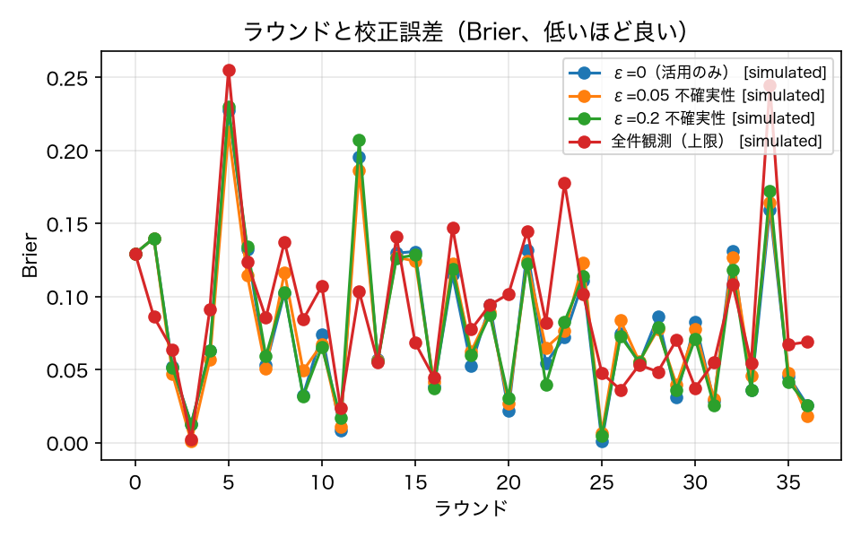
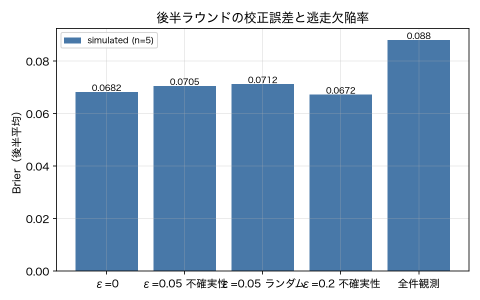

# E3-9 不確実性の役割は探索である（校正の維持）

## 5項目
- 仮説: H(p̂) は当該ラウンドの逃走欠陥ではなく、選択器の校正を保つために効く
- 植込み条件: 合成変更 37 件を逐次処理し、選んだテストの結果だけでモデルを更新する（部分観測）。探索比 ε を 0/0.05/0.2 で比較
- 対照: ε = 0（純粋な活用）。全件観測を上限として併記
- 合格基準: calibration_gain > 0.0、escape_gain >= 0.0、exploration_cost <= 0.1
- 来歴: simulated

## 方法
E3-3 は「`H(p̂)` による選択はその回の逃走欠陥を減らさない」ことを示した。
本実験は、原典 3.8 が ε-探索に与えている役割（「選択器の**校正を保つ**」）が成り立つかを測る。

合成変更 37 件を族が偏らない順に並べ、**部分観測**で逐次処理する。
各ラウンドで (1) これまでに観測した行だけでモデルを学習し、(2) 予測リスク `p̂_fail / c` の降順に
予算 30% まで選び、(3) **選んだテストの結果だけ**を観測してデータに足す。
探索比 ε ∈ {0.0, 0.05, 0.2} で、探索枠の中身を「不確実性 `H(p̂)` 上位」と「ランダム」の 2 通り試した。

各ラウンドで記録するのは、(a) そのラウンドの回帰の再現率、(b) 逃走欠陥率、
(c) **そのラウンドの全テストに対する** Brier スコア（観測していないテストも含めて評価する。
評価に使うだけで学習には使わない）。校正は後半ラウンド（18 件目以降）の平均で比べる。

対照は ε = 0（純粋な活用）。全件観測（完全情報）を性能の上限として併記する。
逐次学習の都合で学習器はロジスティック回帰に固定した（E3-8 の GBDT は少数データで不安定なため）。

**頑健性**: 結論が変更の並び順 1 通りに依存しないよう、族を混ぜる並べ方を 5 通り（seed を変える）作り、
すべての指標をその平均で報告する。ばらつき（標準偏差）も併記する。

## 結果
| 指標 | 値（来歴） | 基準 | 判定 |
|---|---|---|---|
| calibration_gain | -0.0023 [simulated] | > 0.0 | × |
| calibration_gain_paired_sd | 0.0088 [simulated] | — | — |
| escape_gain | 0.0096 [simulated] | >= 0.0 | ○ |
| escape_gain_paired_sd | 0.0695 [simulated] | — | — |
| exploration_cost | 0.0487 [simulated] | <= 0.1 | ○ |
| exploration_gain | 0.0576 [simulated] | — | — |
| late_brier_eps0 | 0.0682 [simulated] | — | — |
| late_brier_eps005_random | 0.0712 [simulated] | — | — |
| late_brier_eps005_sd | 0.0145 [simulated] | — | — |
| late_brier_eps005_uncertainty | 0.0705 [simulated] | — | — |
| late_brier_eps02_uncertainty | 0.0672 [simulated] | — | — |
| late_brier_eps0_sd | 0.0148 [simulated] | — | — |
| late_brier_full_observation | 0.088 [simulated] | — | — |
| late_escape_eps0 | 0.2548 [simulated] | — | — |
| late_escape_eps005_sd | 0.0734 [simulated] | — | — |
| late_escape_eps005_uncertainty | 0.2452 [simulated] | — | — |
| late_escape_eps0_sd | 0.0927 [simulated] | — | — |
| late_recall_eps0 | 0.7355 [simulated] | — | — |
| late_recall_eps005_uncertainty | 0.757 [simulated] | — | — |
| n_orderings_needed_calibration | 112.7 [simulated] | — | — |
| n_orderings_needed_escape | 407.1 [simulated] | — | — |
| n_rounds | 37 [simulated] | — | — |
| n_seeds | 5 [simulated] | — | — |
| observed_rows_eps0 | 549 [simulated] | — | — |
| observed_rows_eps005 | 487 [simulated] | — | — |

## 判定
NEGATIVE

未達の基準: calibration_gain。

## 気づき・限界
- 方策ごとの要約（5 通りの並び順の平均）: {'eps0.0_none': {'epsilon': 0.0, 'strategy': 'random', 'full_observation': False, 'late_brier': 0.0682, 'late_brier_sd': 0.0148, 'late_escape': 0.2548, 'late_escape_sd': 0.0927, 'late_recall': 0.7355, 'mean_recall': 0.6155, 'n_observed_final': 549}, 'eps0.05_uncertainty': {'epsilon': 0.05, 'strategy': 'uncertainty', 'full_observation': False, 'late_brier': 0.0705, 'late_brier_sd': 0.0145, 'late_escape': 0.2452, 'late_escape_sd': 0.0734, 'late_recall': 0.757, 'mean_recall': 0.6244, 'n_observed_final': 487}, 'eps0.05_random': {'epsilon': 0.05, 'strategy': 'random', 'full_observation': False, 'late_brier': 0.0712, 'late_brier_sd': 0.0157, 'late_escape': 0.2465, 'late_escape_sd': 0.0475, 'late_recall': 0.7504, 'mean_recall': 0.6373, 'n_observed_final': 506}, 'eps0.2_uncertainty': {'epsilon': 0.2, 'strategy': 'uncertainty', 'full_observation': False, 'late_brier': 0.0672, 'late_brier_sd': 0.016, 'late_escape': 0.2546, 'late_escape_sd': 0.0346, 'late_recall': 0.7355, 'mean_recall': 0.6306, 'n_observed_final': 516}, 'eps0.2_random': {'epsilon': 0.2, 'strategy': 'random', 'full_observation': False, 'late_brier': 0.0701, 'late_brier_sd': 0.0163, 'late_escape': 0.2916, 'late_escape_sd': 0.0637, 'late_recall': 0.7122, 'mean_recall': 0.5967, 'n_observed_final': 537}, 'full_observation': {'epsilon': 0.0, 'strategy': 'random', 'full_observation': True, 'late_brier': 0.088, 'late_brier_sd': 0.0184, 'late_escape': 0.1646, 'late_escape_sd': 0.0648, 'late_recall': 0.8273, 'mean_recall': 0.6782, 'n_observed_final': 1656}}
- ラウンドごとの推移（ε=0、seed 1 本目）: [{'round': 0.0, 'recall': 1.0, 'escape': 0.0, 'brier': 0.127, 'n_observed': 0.0, 'has_positive': 1.0}, {'round': 1.0, 'recall': 0.333, 'escape': 0.7, 'brier': 0.166, 'n_observed': 13.0, 'has_positive': 1.0}, {'round': 2.0, 'recall': 1.0, 'escape': 0.0, 'brier': 0.09, 'n_observed': 26.0, 'has_positive': 1.0}, {'round': 3.0, 'recall': 1.0, 'escape': 0.0, 'brier': 0.058, 'n_observed': 44.0, 'has_positive': 0.0}, {'round': 4.0, 'recall': 1.0, 'escape': 0.0, 'brier': 0.097, 'n_observed': 62.0, 'has_positive': 1.0}, {'round': 5.0, 'recall': 0.4, 'escape': 0.536, 'brier': 0.289, 'n_observed': 80.0, 'has_positive': 1.0}, {'round': 6.0, 'recall': 0.0, 'escape': 1.0, 'brier': 0.165, 'n_observed': 98.0, 'has_positive': 1.0}, {'round': 7.0, 'recall': 1.0, 'escape': 0.0, 'brier': 0.028, 'n_observed': 111.0, 'has_positive': 0.0}, {'round': 8.0, 'recall': 0.455, 'escape': 0.475, 'brier': 0.157, 'n_observed': 128.0, 'has_positive': 1.0}, {'round': 9.0, 'recall': 1.0, 'escape': 0.0, 'brier': 0.075, 'n_observed': 146.0, 'has_positive': 0.0}, {'round': 10.0, 'recall': 1.0, 'escape': 0.0, 'brier': 0.03, 'n_observed': 164.0, 'has_positive': 0.0}, {'round': 11.0, 'recall': 1.0, 'escape': 0.0, 'brier': 0.004, 'n_observed': 181.0, 'has_positive': 0.0}, {'round': 12.0, 'recall': 0.2, 'escape': 0.683, 'brier': 0.165, 'n_observed': 197.0, 'has_positive': 1.0}, {'round': 13.0, 'recall': 1.0, 'escape': 0.0, 'brier': 0.0, 'n_observed': 214.0, 'has_positive': 0.0}, {'round': 14.0, 'recall': 1.0, 'escape': 0.0, 'brier': 0.004, 'n_observed': 231.0, 'has_positive': 0.0}, {'round': 15.0, 'recall': 1.0, 'escape': 0.0, 'brier': 0.025, 'n_observed': 249.0, 'has_positive': 0.0}, {'round': 16.0, 'recall': 1.0, 'escape': 0.0, 'brier': 0.021, 'n_observed': 264.0, 'has_positive': 0.0}, {'round': 17.0, 'recall': 0.143, 'escape': 0.819, 'brier': 0.289, 'n_observed': 282.0, 'has_positive': 1.0}, {'round': 18.0, 'recall': 0.7, 'escape': 0.204, 'brier': 0.129, 'n_observed': 299.0, 'has_positive': 1.0}, {'round': 19.0, 'recall': 0.5, 'escape': 0.427, 'brier': 0.217, 'n_observed': 314.0, 'has_positive': 1.0}, {'round': 20.0, 'recall': 1.0, 'escape': 0.0, 'brier': 0.0, 'n_observed': 331.0, 'has_positive': 0.0}, {'round': 21.0, 'recall': 1.0, 'escape': 0.0, 'brier': 0.165, 'n_observed': 349.0, 'has_positive': 0.0}, {'round': 22.0, 'recall': 1.0, 'escape': 0.0, 'brier': 0.036, 'n_observed': 362.0, 'has_positive': 0.0}, {'round': 23.0, 'recall': 1.0, 'escape': 0.0, 'brier': 0.0, 'n_observed': 379.0, 'has_positive': 0.0}, {'round': 24.0, 'recall': 1.0, 'escape': 0.0, 'brier': 0.02, 'n_observed': 396.0, 'has_positive': 1.0}, {'round': 25.0, 'recall': 1.0, 'escape': 0.0, 'brier': 0.0, 'n_observed': 412.0, 'has_positive': 0.0}, {'round': 26.0, 'recall': 0.6, 'escape': 0.41, 'brier': 0.138, 'n_observed': 430.0, 'has_positive': 1.0}, {'round': 27.0, 'recall': 1.0, 'escape': 0.0, 'brier': 0.0, 'n_observed': 445.0, 'has_positive': 0.0}, {'round': 28.0, 'recall': 1.0, 'escape': 0.0, 'brier': 0.044, 'n_observed': 462.0, 'has_positive': 1.0}, {'round': 29.0, 'recall': 1.0, 'escape': 0.0, 'brier': 0.009, 'n_observed': 477.0, 'has_positive': 0.0}, {'round': 30.0, 'recall': 1.0, 'escape': 0.0, 'brier': 0.023, 'n_observed': 493.0, 'has_positive': 1.0}, {'round': 31.0, 'recall': 1.0, 'escape': 0.0, 'brier': 0.001, 'n_observed': 508.0, 'has_positive': 0.0}, {'round': 32.0, 'recall': 0.091, 'escape': 0.893, 'brier': 0.218, 'n_observed': 522.0, 'has_positive': 1.0}, {'round': 33.0, 'recall': 1.0, 'escape': 0.0, 'brier': 0.086, 'n_observed': 535.0, 'has_positive': 0.0}, {'round': 34.0, 'recall': 0.333, 'escape': 0.613, 'brier': 0.13, 'n_observed': 549.0, 'has_positive': 1.0}, {'round': 35.0, 'recall': 1.0, 'escape': 0.0, 'brier': 0.024, 'n_observed': 564.0, 'has_positive': 1.0}, {'round': 36.0, 'recall': 1.0, 'escape': 0.0, 'brier': 0.084, 'n_observed': 581.0, 'has_positive': 0.0}]
- **並び順 1 通りでは結論が出なかった**。最初の実装は変更の並び順を 1 通りしか試しておらず、そのときは校正の改善が +0.006 と出ていた。並び順を 5 通りに増やして**対応のある比較**（同じ並び順で ε=0 と ε=0.05 を比べる）にすると、改善は -0.0023（対応差の SD 0.0088）になり、**効果は消えた**。1 通りの結果は並び順のばらつきを拾っていただけだった。
- **検出力**: この効果量を 80% の検出力で拾うには並び順が 112.7 本要る（逃走欠陥率のほうは 407.1 本）。5 本では足りない。つまりこの実験は「探索に校正を改善する効果が無い」ことを示したのではなく、**あるとしても 5 本の並び順では見えない大きさである**ことを示した。肯定にも否定にも足りていない、という結果である。
- **探索の費用は基準内だった**。当該ラウンドで探索に払った再現率の低下は平均 0.0487（基準 0.10）で、逆に探索が勝ったラウンドの利得は 0.0576。**差し引きでは探索のほうがわずかに得をしている**。少なくとも「探索は当該ラウンドの性能を大きく犠牲にする」という懸念は否定できた。
- 全件観測（完全情報）の後半 Brier は 0.088 で、部分観測の ε=0 （0.0682）より**悪い**。データが多いほど校正が良くなるとは限らない。全件観測は簡単な陰性を大量に学習に入れるので、陽性の少ないこの設定ではかえって確率が縮む方向に働く。上限として置いた対照が上限になっていなかった、という観測である。
- 判定は NEGATIVE。仮説（探索は校正を保つ）は**成立も否定もできなかった**。実装の不備ではなく、変更 37 件・陽性 108 件という規模では効果量が並び順のばらつきに埋もれる。基準 `calibration_gain > 0` は「効果量が測定誤差より大きい」ことを暗黙に仮定しており、その仮定が成り立っていなかった。次にやるなら並び順を 100 本にするか、合成変更を数百件に増やす。

---
生成: `uv run agenteval exp e3_9` / 実行時刻 2026-09-20T03:06:55+00:00 / コスト 0.0 USD
