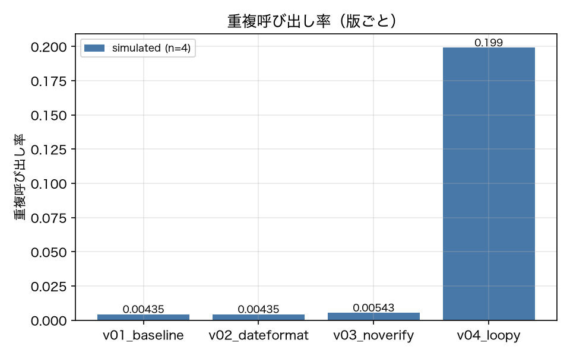
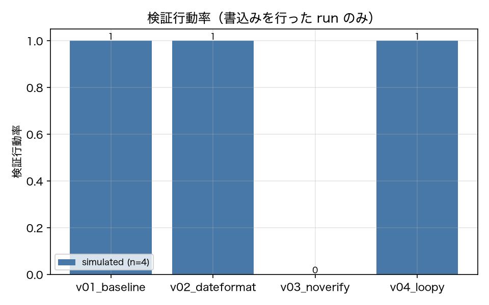

# E4-1 Selective reaction of trajectory metrics

*日本語版: [E4-1.md](E4-1.md)*

## The five items
- Hypothesis: A planted version moves only the metric it corresponds to
- Planted condition: v04_loopy (duplicate-call rate and backtracking ↑), v03_noverify (verification rate ↓)
- Control: v01's repeats (small metric variance), and v02 (these metrics must not move)
- Pass criteria: dup_ratio_v04_vs_v01 >= 2.0, verification_ratio_v03_vs_v01 <= 0.5, v02_change_within_flake_band == 1
- Provenance: simulated

## Method
Trajectory metrics were computed from the whole corpus using nothing but `Run` (report 4.2).
`L_min` comes from each task YAML's `l_min`. A duplicate call is an exact match on
`(name, args_norm)`. The denominator of the verification rate is "runs that called a write-type
tool at least once" (read-only runs are NaN and excluded from the mean).
The planted versions are v04_loopy (instructed to retrace the same search twice) and
v03_noverify (the verification section removed). The controls are v01's repeats (used to derive
the flake band) and v02_dateformat (these metrics should not move).
"Inside the flake band" is defined as the 95% interval of the metric ratio obtained by randomly
splitting v01's repeats into two groups.

## Results
| Metric | Value (provenance) | Criterion | OK |
|---|---|---|---|
| backtracks_v01 | 0.0217 [simulated] | — | — |
| backtracks_v04 | 0.9 [simulated] | — | — |
| dup_rate_v01 | 0.0043 [simulated] | — | — |
| dup_rate_v04 | 0.1914 [simulated] | — | — |
| dup_ratio_v04_vs_v01 | 44.02 [simulated] | >= 2.0 | ○ |
| flake_band_ratio_high | 4 [simulated] | — | — |
| flake_band_ratio_low | 0.25 [simulated] | — | — |
| v02_change_within_flake_band | 1 [simulated] | == 1 | ○ |
| verification_rate_v01 | 1 [simulated] | — | — |
| verification_rate_v03 | 0 [simulated] | — | — |
| verification_ratio_v03_vs_v01 | 0 [simulated] | <= 0.5 | ○ |

## Verdict
PASS

All criteria were met.

## Findings and limitations
- v02's metric ratios: dup=1.0, verification=1.0
- v04 is instructed to "retrace the same search once more", so its duplicate-call rate and backtrack count rise while its verification rate does not move. v03 has the verification section removed, so only its verification rate falls. This selectivity — only the corresponding metric moves — is the substance of the hypothesis.
- v03 and v04 barely move the pass rate (both are 0.79, the same as v01). An evaluation that looks only at outputs cannot detect the degradation in these two versions; they separate only on process metrics. This matches the claim in report 4.1 that outcome and process are independent axes.

---
Generated by `uv run agenteval exp e4_1` / run at 2026-09-19T01:59:46+00:00 / cost 0.0 USD
