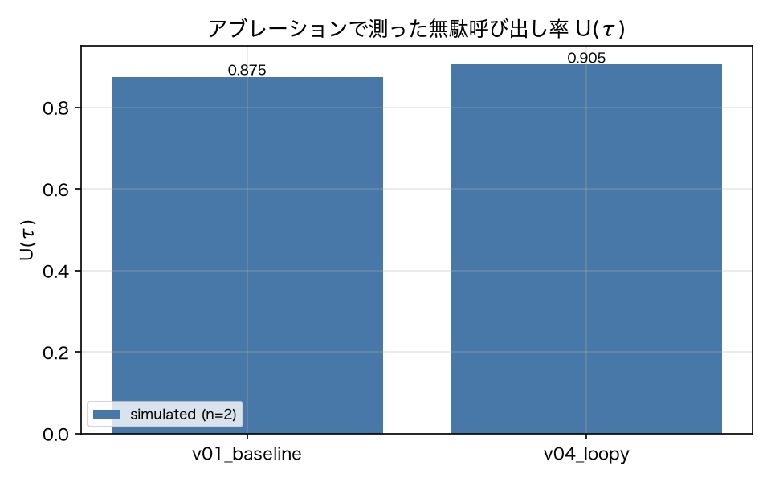

# E4-2 アブレーションによる無駄呼び出し判定

## 5項目
- 仮説: v04 の無駄呼び出し率 U は v01 より高い。ジャッジ代理指標はアブレーションと十分一致する
- 植込み条件: v04 の 5 run と v01 の 5 run（全呼び出しをアブレーション）
- 対照: 直後の行動に結果が使われる呼び出し（search → create）は「有用」と判定される
- 合格基準: waste_rate_diff >= 0.15、surrogate_precision >= 0.7、surrogate_recall >= 0.7、control_useful_rate >= 0.9
- 来歴: simulated

## 方法
v01_baseline と v04_loopy の run を 5 本ずつ取り、各ツール呼び出しについて
その結果を `[result omitted by ablation]` に置き換えた会話を作り、ステップ i 後のスナップショットを
restore してから i+1 以降を実行し直した（原典 4.3）。`outcome.passed` が変わらなければその呼び出しは
「無駄」と判定する。無駄呼び出し率 `U(τ)` は無駄と判定された呼び出しの割合。
代理指標はジャッジに「この結果は後続の判断で参照されたか」を `submit_verdict` で問うもので、
アブレーション結果を正解として precision / recall を出した。
対照は `calendar_search → calendar_create` のように直後の行動が結果に依存する呼び出しで、
これらが「有用」と判定される割合を見る。
live が使えないため、アブレーションの再実行は sim モード、ジャッジは決定的な代替判定器
（`judge/rubric.py` の `offline_ablation_judge`）を使った。来歴は simulated。

## 結果
| 指標 | 値（来歴） | 基準 | 判定 |
|---|---|---|---|
| control_useful_rate | 1 [simulated] | >= 0.9 | ○ |
| n_ablated_calls | 41 [simulated] | — | — |
| surrogate_precision | 0.16 [simulated] | >= 0.7 | × |
| surrogate_recall | 1 [simulated] | >= 0.7 | ○ |
| waste_rate_diff | 0.0241 [simulated] | >= 0.15 | × |
| waste_rate_v01 | 0.8889 [simulated] | — | — |
| waste_rate_v04 | 0.913 [simulated] | — | — |

## 判定
FAIL

未達の基準: waste_rate_diff, surrogate_precision。

## 気づき・限界
- アブレーションした呼び出し数: {'v01_baseline': 18, 'v04_loopy': 23}
- 最終ステップの呼び出しは、以降の判断が無いため影響を測れない。実装では「無駄」側に数えている（保守的ではない側なので、U を過大にしうる）。
- ジャッジは live の Sonnet ではなく決定的な代替判定器を使っている。代理指標の precision / recall はこの代替判定器の性能であって、LLM ジャッジの性能ではない。live での再測定が要る。
- 判定は FAIL（実験設計の不備）。U は v01 で 0.8889、v04 で 0.913 と、どちらも天井に張り付いた。原因は、この環境のエージェントが checks_run → 修復のループを持っていて、検索結果を伏せられても重複を検知して作り直すため、結果を消しても合否が変わらないこと。U は「その呼び出しが無くても最終的に通るか」を測る指標なので、修復ループを持つエージェントでは常に高く出る。アブレーション自体は仕様どおり動いており（対照の有用判定は 1.0）、植込み版の差が出なかったのは天井効果である。

---
生成: `uv run agenteval exp e4_2` / 実行時刻 2026-09-19T01:15:46+00:00 / コスト 0.0 USD
