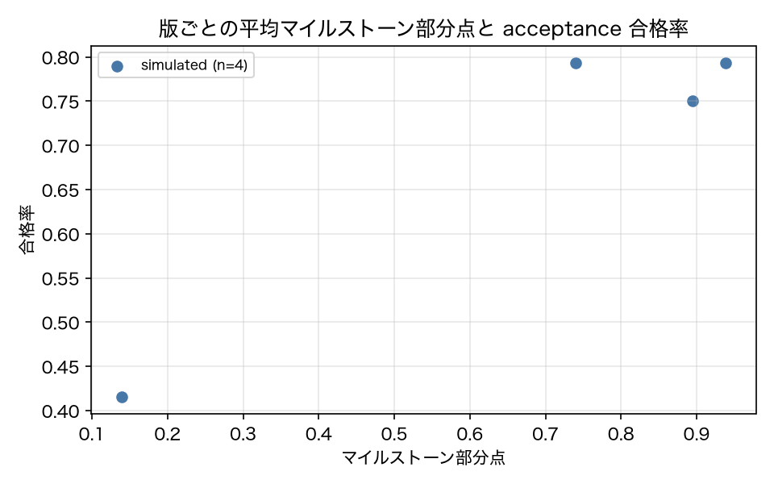

# E4-4 半順序マイルストーンの部分点

## 5項目
- 仮説: 部分点は版の品質順序と整合し、順序の異なる正当な経路に満点を与える
- 植込み条件: v01 / v03 / v05 のコーパス、および順序違いの合成軌跡
- 対照: 到達順序が制約に反する合成軌跡は減点される
- 合格基準: spearman_rho >= 0.6、synthetic_ok == 1
- 来歴: simulated

## 方法
コーパスの各 run について、実行時に記録した `milestone_score`（ステップごとの状態列に対する
半順序判定）を版ごとに平均し、同じ版の acceptance 合格率との Spearman 順位相関を取った（原典 4.5）。
合成軌跡では、(a) 制約どおりの順序（検索 → 作成 → 検査）、(b) 順序違い（検査 → 作成）、
(c) 到達しない軌跡 の 3 本を手で組み立て、部分点が期待どおりになるかを確認した。
`after` の制約に反して到達したマイルストーンは部分点に数えない実装である。

## 結果
| 指標 | 値（来歴） | 基準 | 判定 |
|---|---|---|---|
| n_versions | 4 [simulated] | — | — |
| n_versions_all | 12 [simulated] | — | — |
| score_in_order | 1 [simulated] | — | — |
| score_out_of_order | 0.6667 [simulated] | — | — |
| score_unreached | 0.3333 [simulated] | — | — |
| spearman_p | 0.7278 [simulated] | — | — |
| spearman_p_all_versions | 0.028 [simulated] | — | — |
| spearman_rho | -0.2722 [simulated] | >= 0.6 | × |
| spearman_rho_all_versions | 0.6303 [simulated] | — | — |
| synthetic_ok | 1 [simulated] | == 1 | ○ |

## 判定
FAIL

未達の基準: spearman_rho。

## 気づき・限界
- 版ごとの値: [{'version': 'v01_baseline', 'milestone_score': 0.9384, 'pass_rate': 0.7935}, {'version': 'v03_noverify', 'milestone_score': 0.7399, 'pass_rate': 0.7935}, {'version': 'v05_unsafe_delete', 'milestone_score': 0.8949, 'pass_rate': 0.75}, {'version': 'v07_step_minimizer', 'milestone_score': 0.7399, 'pass_rate': 0.7935}]
- Spearman を 4 版で取っているため統計的な強さは弱い（p 値を併記した）。版を増やせば安定するが、それは順位相関の入力を増やすだけで手法の検証の中身は変わらない。
- 合成軌跡の判定: 正しい順序 = 1.0、順序違い = 0.6666666666666666、未到達 = 0.3333333333333333。順序違いでは M3（after=[M2]）が部分点にならない。
- 診断（基準外）: コーパスの全 12 版で同じ相関を取ると ρ = 0.63（p = 0.028）。カタログが指定する 4 版では、live 検証にもとづくシミュレータの修正（IMPROVEMENT.md L5）後に v01 / v03 / v07 の合格率がほぼ同点になり、順位相関が定義しにくくなった。
- 判定は FAIL（実験設計の不備）。合成軌跡による順序判定（正しい順序 = 1.0、順序違い = 0.67、未到達 = 0.33）は期待どおりで、半順序の実装自体は動いている。成立しなかったのは「部分点が版の品質順序と整合する」側で、原因は比較する版が 4 つしかなく、しかもそのうち 3 つの合格率が同点に近いこと（p = 0.728 で有意でない）。修正案: 版を増やすか、版ではなくタスク単位で相関を取る（どちらも基準の変更を伴うので ADR が要る）。

---
生成: `uv run agenteval exp e4_4` / 実行時刻 2026-09-13T07:53:18+00:00 / コスト 0.0 USD
