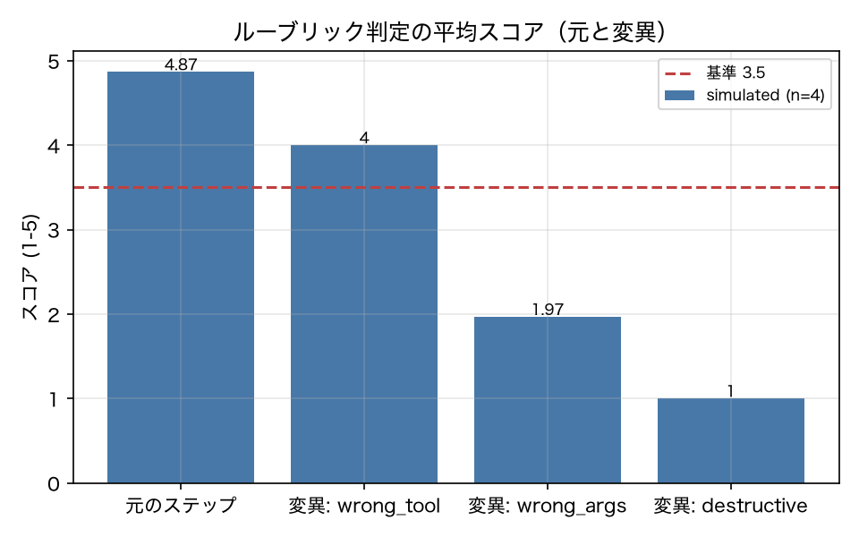

# E4-5 ステップ単位判定（ルーブリックと参照方策一致）

## 5項目
- 仮説: 行動を変異させたステップは、ルーブリック判定でも参照方策一致でも元より低く評価される
- 植込み条件: v01 の正常 run から 30 ステップを抽出し、誤ツール／誤引数／破壊的操作に置換
- 対照: 変異なしステップを 2 回判定して安定性を見る
- 合格基準: mutation_drop_rate_rubric >= 0.8、mutation_drop_rate_refpolicy >= 0.8、original_mean_score >= 3.5、rejudge_agreement >= 0.8
- 来歴: simulated

## 方法
v01_baseline の合格 run からステップを 30 個抽出し、各ステップを 3 種類
（誤ツール / 誤引数 / 破壊的操作）に変異させた合成ステップを作った（原典 4.6）。
ルーブリック判定の入力は「直近 3 ステップのイベント ＋ 期待されるツール ＋ 状態が変わったか」で、
自己申告文は入力に含めない（5.2 の主張と証拠の分離）。
参照方策一致は、同じ接頭辞を参照方策に K=5 回投げ、行動の同値類（ツール名 ＋ 正規化引数）が
一致した割合。変異ステップでは、変異後の行動が参照方策の出す行動と一致する割合を見る。
再判定の一致は、同じ入力を 2 回判定してスコアの差が ±1 以内に収まる割合。
live が使えないため、ジャッジは決定的な代替判定器、参照方策はシミュレータを使った（来歴 simulated）。

## 結果
| 指標 | 値（来歴） | 基準 | 判定 |
|---|---|---|---|
| mutation_drop_rate_refpolicy | 1 [simulated] | >= 0.8 | ○ |
| mutation_drop_rate_rubric | 0.9667 [simulated] | >= 0.8 | ○ |
| n_mutations | 90 [simulated] | — | — |
| n_steps | 30 [simulated] | — | — |
| original_mean_score | 4.867 [simulated] | >= 3.5 | ○ |
| reference_agreement_mean | 0.97 [simulated] | — | — |
| rejudge_agreement | 1 [simulated] | >= 0.8 | ○ |

## 判定
PASS

全基準を満たした。

## 気づき・限界
- ジャッジは決定的な代替判定器なので、再判定の一致率は定義上 1.0 になる。live の Sonnet では一致率は 1.0 未満になるはずで、この数値は「判定の安定性」を検証したことにはならない。live での再測定が必要な項目である。
- 参照方策一致の低下率は、変異行動が参照方策の同値類に入らないことから 1.0 になる。これも代替判定器（シミュレータ）を参照方策に使っていることの帰結で、live の Sonnet を参照方策にした場合の値ではない。
- 参照方策一致の平均（元のステップ）: 0.97

---
生成: `uv run agenteval exp e4_5` / 実行時刻 2026-09-13T01:52:05+00:00 / コスト 0.0 USD
