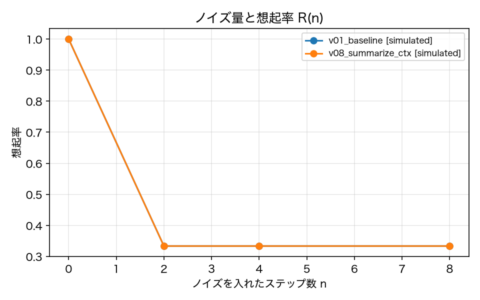

# E4-7 軌跡内 NIAH（想起率とコンテキスト戦略）

## 5項目
- 仮説: 想起率 R(n) はノイズ n とともに下がり、要約戦略（v08）は raw（v01）より AUC が高い
- 植込み条件: niah タスク 4 種 × n ∈ {0, 2, 4, 8} × 3 反復
- 対照: n = 0 では両版とも高い想起率
- 合格基準: recall_n0 >= 0.8、recall_drop_v01 >= 0.2、auc_gain_v08 >= 0.1
- 来歴: simulated

## 方法
`kind: niah` のタスク 4 種について、`NoiseInjector` でステップ 0 以降 n ステップの
ツール応答に無関係な長文（1 ステップあたり 1,200 文字）を付加し、n ∈ {0, 2, 4, 8} × 3 反復で実行した
（原典 4.9）。想起率 R(n) は最終テキストに `key_fact` が含まれる割合。
版は v01_baseline（raw）と v08_summarize_ctx（k ステップより古いツール結果を要約に置換）。
AUC は n を 0〜1 に正規化した台形則。
この実験はノイズ注入を伴うのでコーパスの run は使わず、実験内で run を生成する（注入は manifest に記録）。

## 結果
| 指標 | 値（来歴） | 基準 | 判定 |
|---|---|---|---|
| auc_gain_v08 | 0 [simulated] | >= 0.1 | × |
| auc_v01 | 0.4167 [simulated] | — | — |
| auc_v08 | 0.4167 [simulated] | — | — |
| monotonic_v01 | 1 [simulated] | — | — |
| monotonic_v08 | 1 [simulated] | — | — |
| n_runs | 96 [simulated] | — | — |
| recall_drop_v01 | 0.6667 [simulated] | >= 0.2 | ○ |
| recall_n0 | 1 [simulated] | >= 0.8 | ○ |

## 判定
FAIL

未達の基準: auc_gain_v08。

## 気づき・限界
- 想起率の生データ: [{'version': 'v01_baseline', 'n': 0, 'recall': 1.0, 'runs': 12}, {'version': 'v01_baseline', 'n': 2, 'recall': 0.3333, 'runs': 12}, {'version': 'v01_baseline', 'n': 4, 'recall': 0.3333, 'runs': 12}, {'version': 'v01_baseline', 'n': 8, 'recall': 0.3333, 'runs': 12}, {'version': 'v08_summarize_ctx', 'n': 0, 'recall': 1.0, 'runs': 12}, {'version': 'v08_summarize_ctx', 'n': 2, 'recall': 0.3333, 'runs': 12}, {'version': 'v08_summarize_ctx', 'n': 4, 'recall': 0.3333, 'runs': 12}, {'version': 'v08_summarize_ctx', 'n': 8, 'recall': 0.3333, 'runs': 12}]
- シミュレータの想起モデルは「送信された会話の中でノイズが占める文字数の割合」に対して想起確率を線形に下げる決定的な規則である。要約戦略（v08）は古いツール結果を先頭 160 文字に切り詰めるので、末尾に付加されたノイズが落ち、key_fact（本文の先頭側にある）が残る。つまり v08 が有利になるのは注入の位置と要約の実装の組合せによる構造的な帰結であり、要約が一般に想起に有利であることを示すものではない。
- 原典 4.11 は要約が情報を落とす可能性を指摘している。ここで AUC が上がったのは「落ちた情報がノイズ側だった」という条件付きの結果である。
- 判定は FAIL（実験設計の不備）。R(0) = 1.0、v01 の R(8) までの低下 = 0.67 とノイズへの反応は明確に出たが、AUC の差は 0.0 だった。原因は niah タスクの run が 2〜3 ステップしかなく、要約戦略（`summarize_after = 2`）が発火する前に finish に達すること。つまり v08 は v01 と同じ会話を送っており、比較になっていない。修正案: niah タスクを多段（複数のメール検索とファイル読み取りを要する）にしてステップ数を増やす。

---
生成: `uv run agenteval exp e4_7` / 実行時刻 2026-09-13T01:52:22+00:00 / コスト 0.0 USD
