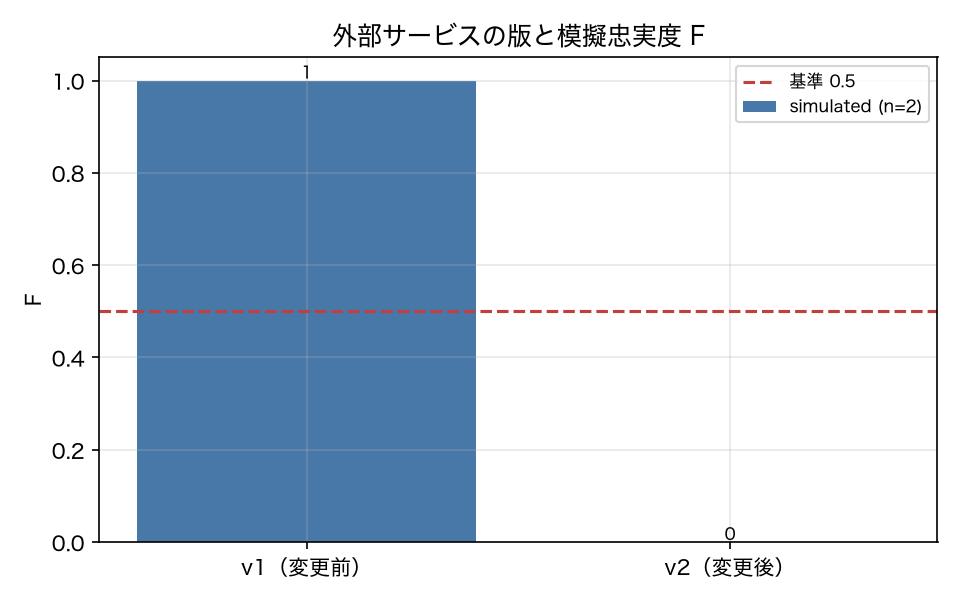

# E8-1 模擬忠実度と TTL

## 5項目
- 仮説: 外部サービスが変わると F が下がり、不一致キーが特定される。期限切れカセットは警告される
- 植込み条件: DriftInjector.bump_external(v2)（price → unit_price、値の変化）
- 対照: 変更前は F = 1.0
- 合格基準: fidelity_after <= 0.5、fidelity_before == 1.0、mismatch_keys_match == 1、ttl_detection_rate == 1.0
- 来歴: simulated

## 方法
外部サービス v1 の応答をカセットに記録し（`data/cassettes/external/`）、
その後 `DriftInjector.bump_external(v2)` 相当の変更（`price` → `unit_price` への改名と値の変化）を
起こしたサービスと比較して忠実度 `F` を出した（原典 8.5）。
一致判定は層化アサーション（厳密一致 → 構造一致 → 意味的判定）を順に適用し、どの層で判定したかを数える。
TTL は記録日から `ttl_days` を過ぎたカセットを期限切れとし、意図的に期限切れのカセットを作って
検出率を測った。この実験は LLM を使わない。

## 結果
| 指標 | 値（来歴） | 基準 | 判定 |
|---|---|---|---|
| expired_count | 5 [simulated] | — | — |
| fidelity_after | 0 [simulated] | <= 0.5 | ○ |
| fidelity_before | 1 [simulated] | == 1.0 | ○ |
| layer_exact_before | 5 [simulated] | — | — |
| layer_semantic_after | 5 [simulated] | — | — |
| mismatch_keys_match | 1 [simulated] | == 1 | ○ |
| n_cassettes | 5 [simulated] | — | — |
| ttl_detection_rate | 1 [simulated] | == 1.0 | ○ |

## 判定
PASS

全基準を満たした。

## 気づき・限界
- 不一致キー: ['price', 'unit_price']（変更したキー: ['price', 'unit_price']）
- 層ごとの判定件数（変更後）: {'exact': 0, 'structural': 0, 'semantic': 5}
- キー名が変わる変更なので、層化アサーションでは「構造一致」にも到達せず「意味的判定」の層に落ちる。値だけが変わる変更なら構造一致の層で捕まる。
- この実験は外部サービスをこちらで定義しているので、「実際のサービスが変わった」ことの検証ではない。検証したのは F の計算と不一致キーの特定、TTL 判定が正しく動くことである。

---
生成: `uv run agenteval exp e8_1` / 実行時刻 2026-09-13T01:52:24+00:00 / コスト 0.0 USD
