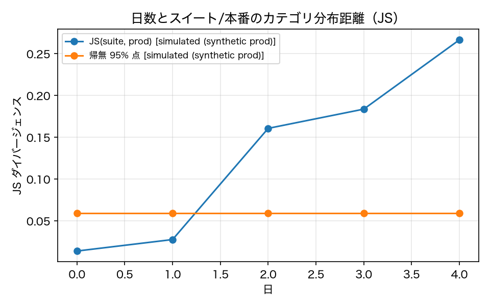

# E8-2 鮮度と分布距離

## 5項目
- 仮説: 本番分布のシフトを JS ダイバージェンスが捉え、共適応の言い換えを MMD が捉える
- 植込み条件: ProdStream の日別シフト（新カテゴリ比率 0% → 40%）と言い換え
- 対照: 同一分布からの再サンプル
- 合格基準: js_monotonic == 1、new_category_alarm == 1、mmd_p_value < 0.05、control_p_ge_005_rate >= 0.9
- 来歴: simulated

## 方法
`ProdStream`（ADR-006 の本番の代替）で 0〜4 日目のセッションを 60 件ずつ生成した。
日が進むと新カテゴリ（expense）の比率が上がり、プロンプトが「慣れた言い方」に寄る。
スイート側の分布はタスク YAML の `category` 分布。JS ダイバージェンスは原典 8.3 の式（底 2）。
警報の閾値は、スイート分布から同数を再サンプルしたときの JS の 95% 点（ブートストラップ、simulated）。
共適応の検出は、言い換え後のプロンプト群と元のプロンプト群の MMD（TF-IDF の文字 2〜3-gram ＋ RBF）で、
p 値は順列検定で出した。対照は同一分布からの再サンプル 2 群で、p ≥ 0.05 になる割合を見る。

## 結果
| 指標 | 値（来歴） | 基準 | 判定 |
|---|---|---|---|
| control_p_ge_005_rate | 0.95 [simulated] | >= 0.9 | ○ |
| js_day0 | 0.01383 [simulated] | — | — |
| js_day4 | 0.2664 [simulated] | — | — |
| js_monotonic | 1 [simulated] | == 1 | ○ |
| js_threshold | 0.05916 [simulated] | — | — |
| mmd | 4.2e-05 [simulated] | — | — |
| mmd_p_value | 0.0166 [simulated] | < 0.05 | ○ |
| new_category_alarm | 1 [simulated] | == 1 | ○ |
| new_category_ratio_day4 | 0.4167 [simulated] | — | — |

## 判定
PASS

全基準を満たした。

## 気づき・限界
- 日ごとの JS: [0.013826, 0.027569, 0.160572, 0.183587, 0.266444]、新カテゴリ比率: [0.0, 0.05, 0.267, 0.3, 0.417]
- 言い換えの MMD: 4.2e-05（p=0.0166）、対照の p 値: [0.6238, 0.4059, 0.4851, 0.2772, 0.604]...
- 本番は生成器で代替している（ADR-006）。分布シフトの大きさも言い換えの仕方もこちらで決めたものなので、この実験が示すのは「JS と MMD がシフトに反応すること」までで、実運用の分布シフトを捉えられることではない。
- 言い換えは決定的な置換規則（`PARAPHRASE_RULES`）で作っている。live では Haiku に生成させる経路を想定しているが未実行。

---
生成: `uv run agenteval exp e8_2` / 実行時刻 2026-09-13T03:54:20+00:00 / コスト 0.0 USD
