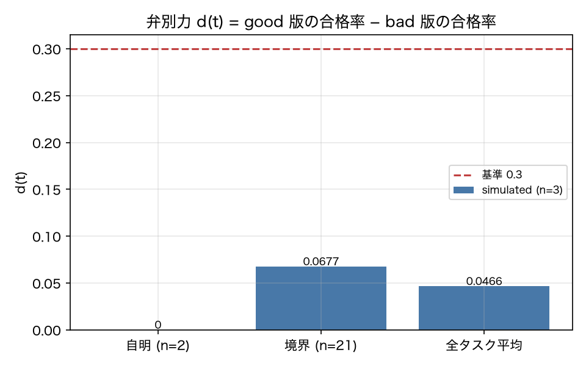

# E8-3 Discriminative power and saturation

*日本語版: [E8-3.md](E8-3.md)*

## The five items
- Hypothesis: Trivial tasks are judged saturated, and boundary tasks have high discriminative power
- Planted condition: Trivial tasks T-901, T-902 (pass under every version)
- Control: Boundary tasks (v01 pass rate 0.3–0.7)
- Pass criteria: trivial_abs_d < 0.1, trivial_saturated == 1, boundary_d >= 0.3, lifecycle_received == 1
- Provenance: simulated

## Method
We took `d(t)` as the difference in pass rate between the `quality_label` groups (good / bad)
in the version YAMLs (report 8.4; neutral is excluded), and judged a test saturated when its
pass rate exceeds 0.95 under every version and |d| < 0.1.
The planted condition is the trivial tasks T-901 / T-902 (they pass if you call finish). The
control is boundary tasks (v01_baseline pass rate between 0.3 and 0.7).
We also confirmed that a test judged saturated reaches the state machine in `lifecycle.py` and
transitions Active → Saturated.

## Results
| Metric | Value (provenance) | Criterion | OK |
|---|---|---|---|
| boundary_d | 0.0677 [simulated] | >= 0.3 | × |
| lifecycle_received | 1 [simulated] | == 1 | ○ |
| max_d | 0.175 [simulated] | — | — |
| mean_d_all | 0.0466 [simulated] | — | — |
| n_boundary | 21 [simulated] | — | — |
| n_saturated | 9 [simulated] | — | — |
| trivial_abs_d | 0 [simulated] | < 0.1 | ○ |
| trivial_saturated | 1 [simulated] | == 1 | ○ |

## Verdict
NEGATIVE

Unmet criterion: boundary_d.

## Findings and limitations
- Tasks judged saturated: ['T-023', 'T-024', 'T-030', 'T-201', 'T-302', 'T-303', 'T-304', 'T-901', 'T-902']
- Top d(t): [(0.175, 'T-008'), (0.143, 'T-025'), (0.143, 'T-013'), (0.143, 'T-005'), (0.136, 'T-401')]
- The good / bad labels describe the "quality" of a version, not its pass rate. v03_noverify and v04_loopy are labelled bad but their pass rates are no different from v01, so they push d(t) down. In other words, discriminative power measured on outputs alone cannot distinguish a version whose planted defect is in the process.
- The verdict is NEGATIVE. The saturation judgement on trivial tasks (|d| = 0, saturated = true) and the notification to the lifecycle held, but discriminative power on boundary tasks missed the criterion of 0.3. This is not an implementation flaw. The cause is that among the 7 bad-labelled versions, the "process-only degraded" ones — v03_noverify, v04_loopy and the v08 equivalent — do not lower the pass rate at all (the same observation as E4-1). Since `d(t)` tries to separate quality labels using outcomes alone, **a version whose output is the same and whose process has degraded cannot be discriminated in principle**. This is the mirror image of report 4.1's claim that outcome and process are independent axes, and shows that the discriminative power of 8.4 needs to be defined over process metrics as well (linter violation rate, verification rate).

---
Generated by `uv run agenteval exp e8_3` / run at 2026-09-19T01:16:38+00:00 / cost 0.0 USD
