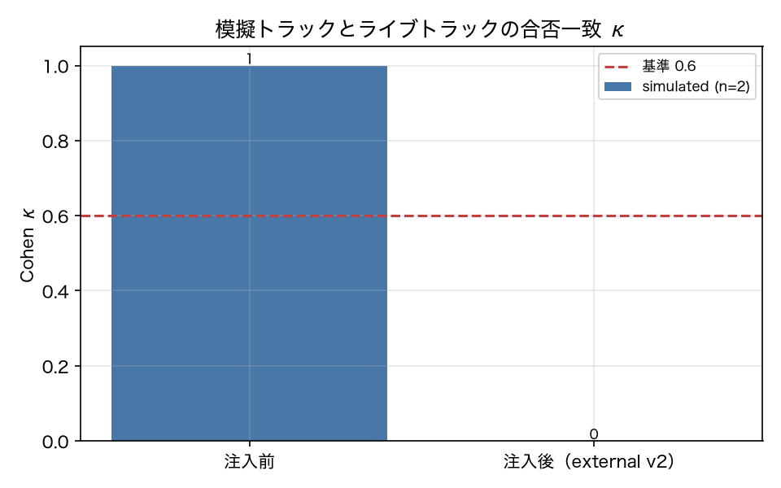

# E8-4 二重トラック κ

## 5項目
- 仮説: 模擬とライブの合否一致 κ はドリフト注入で下がる
- 植込み条件: bump_external(v2) 後に external_lookup を使うタスクを再実行
- 対照: 注入前の κ
- 合格基準: kappa_before >= 0.6、kappa_drop >= 0.3
- 来歴: simulated

## 方法
`external_lookup` を必ず使うタスク（mixed カテゴリ）に限定し、同じタスク集合を
「模擬トラック」（外部サービス v1）と「ライブトラック」（現在の外部サービス）で実行して、
`outcome.passed` の一致を Cohen κ で測った（原典 8.6）。
注入前は両トラックとも v1、注入後はライブトラックだけ `DriftInjector.bump_external(v2)` を適用する。
κ は `sklearn.metrics.cohen_kappa_score`。両群の合否に分散が無い場合は κ が未定義になるため、
完全一致なら 1.0、完全不一致なら 0.0 として扱う（実装の注記）。

## 結果
| 指標 | 値（来歴） | 基準 | 判定 |
|---|---|---|---|
| kappa_after | 0 [simulated] | — | — |
| kappa_before | 1 [simulated] | >= 0.6 | ○ |
| kappa_drop | 1 [simulated] | >= 0.3 | ○ |
| live_after_pass_rate | 0 [simulated] | — | — |
| mock_pass_rate | 0.72 [simulated] | — | — |
| n_runs | 75 [simulated] | — | — |
| n_tasks | 5 [simulated] | — | — |

## 判定
PASS

全基準を満たした。

## 気づき・限界
- 対象タスク（external_lookup を使うもの）: ['T-004', 'T-028', 'T-029', 'T-030', 'T-404']
- **注入前の κ = 1.0 は sim の構造から自明である**。sim モードでは同じ (task, seed, repeat) の実行が決定的なので、外部サービスの版が同じなら模擬とライブは必ず一致する。live では同じ条件でも応答が揺れるため κ < 1.0 になる。したがってこの実験が示したのは「ドリフト注入で κ が下がること」だけで、「注入前の κ が高いこと」は検証したことにならない。
- κ が下がる仕組みは、外部サービスの応答キーが `price` → `unit_price` に変わり、エージェントが価格を読み取れずに不合格になること。模擬側は v1 のままなので合格する。

---
生成: `uv run agenteval exp e8_4` / 実行時刻 2026-09-13T07:54:32+00:00 / コスト 0.0 USD
