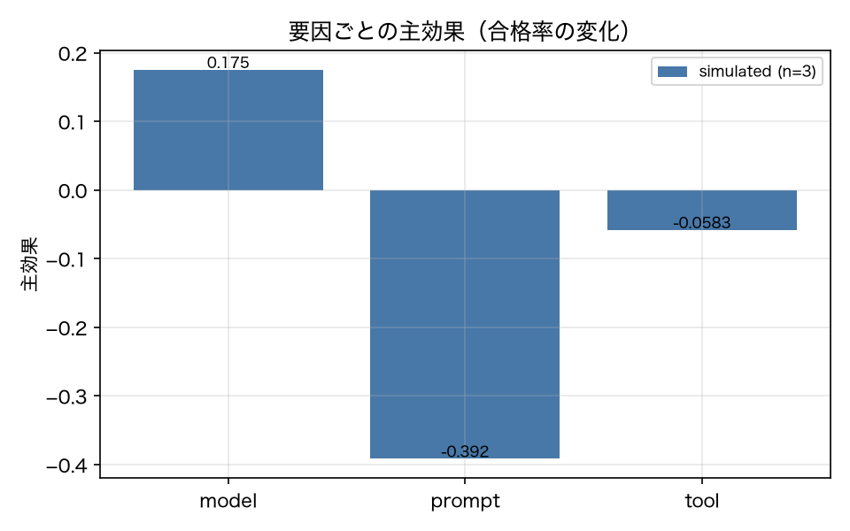

# E8-5 Drift attribution (factor-wise swapping)

*日本語版: [E8-5.md](E8-5.md)*

## The five items
- Hypothesis: Factor-wise swapping identifies the factor with the largest main effect, and it matches the planted cause
- Planted condition: 3 single-factor changes and 1 two-factor change
- Control: No change (all main effects inside the flake band)
- Pass criteria: single_factor_match_rate >= 0.66, two_factor_top2_match == 1, control_alarm == 0
- Provenance: simulated

## Method
For the 2^3 = 8 combinations of the factors {model, prompt, tool}, we built composite versions
taking each factor from a planted version (model from v09, prompt from v02, tool schema from
v06), ran the same 10 tasks × 3 repeats and measured the pass rate (report 8.8).
The main effect is the mean change in pass rate when that factor is swapped. The predicted
cause is the factor with the largest absolute main effect.
The control is no change (all factors off), where we confirm the main effects fall inside the
flake band.
The two-factor change is the prompt + tool pair, where we check whether the top 2 factors
match.

## Results
| Metric | Value (provenance) | Criterion | OK |
|---|---|---|---|
| control_alarm | 0 [simulated] | == 0 | ○ |
| control_delta | 0 [simulated] | — | — |
| effect_model | 0.175 [simulated] | — | — |
| effect_model_two_factor | 0 [simulated] | — | — |
| effect_prompt | -0.3917 [simulated] | — | — |
| effect_prompt_two_factor | -0.35 [simulated] | — | — |
| effect_tool | -0.0583 [simulated] | — | — |
| effect_tool_two_factor | -0.05 [simulated] | — | — |
| flake_band | 0.1812 [simulated] | — | — |
| n_cells | 8 [simulated] | — | — |
| predicted_cause | prompt [simulated] | — | — |
| single_factor_match_rate | 1 [simulated] | >= 0.66 | ○ |
| two_factor_top2 | prompt,tool [simulated] | — | — |
| two_factor_top2_match | 1 [simulated] | == 1 | ○ |

## Verdict
PASS

All criteria were met.

## Findings and limitations
- Per-cell pass rate with all three factors swapped: {'model=0,prompt=0,tool=0': 0.667, 'model=0,prompt=0,tool=1': 0.567, 'model=0,prompt=1,tool=0': 0.267, 'model=0,prompt=1,tool=1': 0.267, 'model=1,prompt=0,tool=0': 0.9, 'model=1,prompt=0,tool=1': 0.767, 'model=1,prompt=1,tool=0': 0.4, 'model=1,prompt=1,tool=1': 0.4}
- Main effects for the two-factor case (prompt + tool): {'model': 0.0, 'prompt': -0.35, 'tool': -0.05}
- Single-factor verdicts: [{'planted': 'model', 'predicted': 'model', 'effects': {'model': 0.2333, 'prompt': 0.0, 'tool': 0.0}}, {'planted': 'prompt', 'predicted': 'prompt', 'effects': {'model': 0.0, 'prompt': -0.4, 'tool': 0.0}}, {'planted': 'tool', 'predicted': 'tool', 'effects': {'model': 0.0, 'prompt': 0.0, 'tool': -0.1}}]
- Control (no change): running the same v01 twice with different seeds gives a pass-rate difference of 0.0, and with a flake band of 0.1812 that is judged as no alarm.
- In the two-factor case we do not swap the model factor (the model did not change in that deployment). The first implementation derived main effects from the table with all three factors swapped, which attributed a main effect to a model change that never happened and made the top 2 factors {prompt, model}. Factor-wise swapping must swap only the factors that actually differ between the old and new deployments.
- The composite versions are built by substituting v01's prompt, model and tools. The prompt factor therefore carries all of v02's prompt, so sections other than date_format are swapped along with it. The granularity of a factor is "a version attribute", not a section.

---
Generated by `uv run agenteval exp e8_5` / run at 2026-09-19T02:25:31+00:00 / cost 0.0 USD
