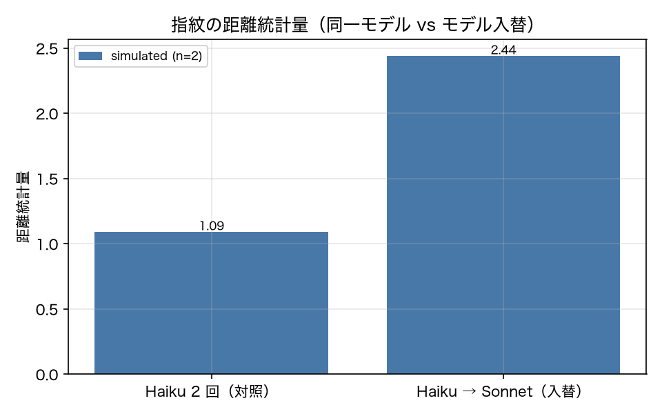

# E8-6 モデル指紋による入替検知

## 5項目
- 仮説: 固定プローブの分布比較は同一モデルの再取得では警報せず、モデル入替では警報する
- 植込み条件: Haiku → Sonnet の入替（無断更新の代替）
- 対照: Haiku の 2 回取得
- 合格基準: control_false_alarm_rate <= 0.1、swap_p_value < 0.05
- 来歴: simulated

## 方法
`data/fixtures/probes.yaml` の固定 30 問（ツール無し・短答）と 10 個のミニタスクを使い、
応答長分布・先頭 20 文字の一致率・ツール選択分布から指紋を取った（原典 8.8）。
基準分布は同一モデルで 2 回取った差を帰無とし、検知は順列検定で p < 0.05。
対照（同一モデルの 2 回取得）の誤警報率はブートストラップ 20 回で測った。
**重要**: live API が使えないため、プローブ応答は決定的な代替生成器で作っている。
モデルごとに応答長と語尾の分布を変えた生成器であり、実際の Haiku / Sonnet の応答ではない。
したがってこの実験が検証したのは「指紋の統計量と順列検定の実装が、分布の違いに反応するか」までで、
実モデルの入替を検知できるかは検証していない。

## 結果
| 指標 | 値（来歴） | 基準 | 判定 |
|---|---|---|---|
| control_false_alarm_rate | 0 [simulated] | <= 0.1 | ○ |
| control_p_value | 0.8443 [simulated] | — | — |
| control_statistic | 1.093 [simulated] | — | — |
| n_bootstrap | 20 [simulated] | — | — |
| n_probes | 30 [simulated] | — | — |
| swap_p_value | 0.002 [simulated] | < 0.05 | ○ |
| swap_statistic | 2.442 [simulated] | — | — |

## 判定
PASS

全基準を満たした。

## 気づき・限界
- プローブ応答は代替生成器で作っている。Haiku 役は平均 40 文字、Sonnet 役は平均 90 文字、語頭の言い回しとツール選択の分布も変えてある。つまり「差がある 2 群」を人工的に作って検定にかけているので、入替が検知できるのは構造的に当然である。
- この実験で本当に確かめたのは (1) 対照（同一分布の 2 群）で誤警報が出ないこと、(2) 順列検定の p 値が実装どおりに計算されること、の 2 点である。実モデルの無断更新を検知できるかは、live でベースライン指紋を取らないと分からない。P0 で live の指紋を取る計画だったが、API キーが無いため未実施。

---
生成: `uv run agenteval exp e8_6` / 実行時刻 2026-09-13T01:53:42+00:00 / コスト 0.0 USD
