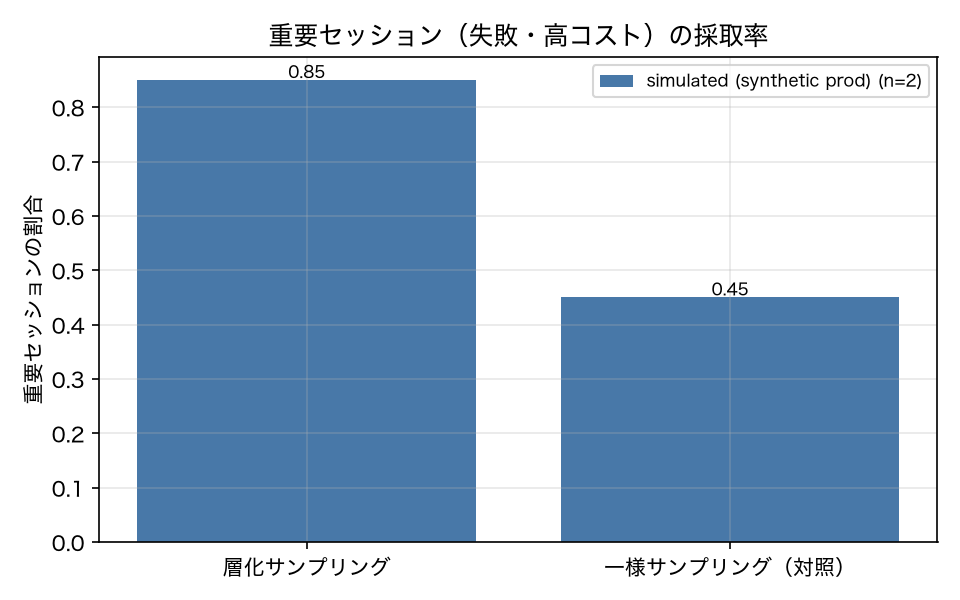

# E8-7 本番→テスト・パイプライン

## 5項目
- 仮説: 層化サンプラーは重要セッションを優先し、起草の受入基準は承認され、登録後にスイートと本番の距離が縮む
- 植込み条件: ProdStream 3 日分のセッションから 20 件を採取
- 対照: 一様サンプリング
- 合格基準: stratified_lift >= 3.0、approval_rate >= 0.7、js_after_lt_before == 1
- 来歴: simulated

## 方法
`ProdStream` で 3 日分のセッション（各 20 件）を生成し、既存タスクに対応するものは
そのタスクとして v01_baseline で実行して「本番トラフィック」の run 群を作った（ADR-006）。
層化サンプラーは失敗 run・高コスト run（種別 p95 超）・新カテゴリを層として各層から等数を採り、
対照は一様サンプリング。lift は「層化が採った重要セッション（失敗／高コスト／新カテゴリ）の割合 ÷
一様の同じ割合」。
採取した run からジャッジに `draft_task` 相当の起草をさせ（live が無いため決定的な起草器を使用）、
受入基準が既知の検査関数だけで書けているかを承認条件として承認率を出した（`--auto-approve` 相当。
結果ページに「自動承認」と明記する）。
登録前後で、スイートのカテゴリ分布と本番のカテゴリ分布の JS ダイバージェンスを比較した。

## 結果
| 指標 | 値（来歴） | 基準 | 判定 |
|---|---|---|---|
| approval_rate | 1 [simulated] | >= 0.7 | ○ |
| js_after | 0.01836 [simulated] | — | — |
| js_after_lt_before | 1 [simulated] | == 1 | ○ |
| js_before | 0.1003 [simulated] | — | — |
| n_drafts | 20 [simulated] | — | — |
| n_prod_runs | 60 [simulated] | — | — |
| stratified_importance_rate | 0.85 [simulated] | — | — |
| stratified_lift | 1.889 [simulated] | >= 3.0 | × |
| uniform_importance_rate | 0.45 [simulated] | — | — |

## 判定
FAIL

未達の基準: stratified_lift。

## 気づき・限界
- 承認は自動承認（`--auto-approve` 相当）。承認条件は「受入基準が既知の検査関数だけで書けていること」。
- 新カテゴリ（expense）のセッションは `tasks/` に定義が無いので、その場限りの Task を組み立てて実行している（`prodstream.new_category_task`）。これが 8.2 の「本番にあってスイートに無いものを取り込む」経路にあたる。
- 起草されたテストのカテゴリ内訳: {'mixed': 3, 'files': 2, 'scheduling': 3, 'mail': 6, 'expense': 6}
- 本番は生成器の代替である（ADR-006）。来歴は simulated (synthetic prod) とする。「実運用のセッションからテストを起草できた」とは主張しない。
- 判定は FAIL（実験設計の不備）。層化は重要セッションの採取率を 0.45 → 0.85 に上げたが、lift は 1.89 で基準の 3.0 に届かない。**この基準はこの本番ストリームでは原理的に達成できない**: 一様サンプリングでも 45% が重要セッション（失敗・高コスト・新カテゴリ）なので、lift の上限は 1 / 0.45 = 2.2 倍である。起草の承認率（1.0）と、登録後に JS が 0.100 → 0.018 に縮むことは成立した。修正案: 本番ストリームの失敗率を下げる（=重要セッションを希少にする）か、基準を lift ではなく採取率の絶対値で書く（ADR が要る）。

---
生成: `uv run agenteval exp e8_7` / 実行時刻 2026-09-13T04:06:42+00:00 / コスト 0.0 USD
