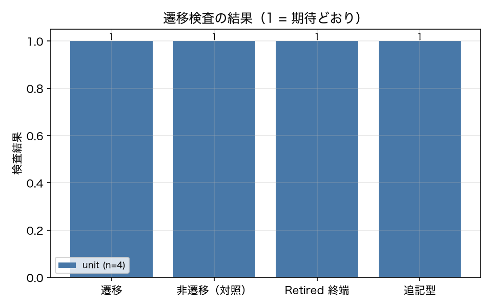

# E8-8 テストのライフサイクル状態機械

## 5項目
- 仮説: 遷移条件はメトリクスから決定的に動作し、Retired は終端である
- 植込み条件: 各遷移を起こすメトリクスを与える
- 対照: 条件を満たさないメトリクスでは遷移しない
- 合格基準: transitions_pass == 1、retired_terminal == 1、append_only == 1、no_trigger_stays == 1
- 来歴: simulated

## 方法
状態機械の各遷移について、その遷移を起こすメトリクスを与えて `next_state` の戻り値を確認した
（原典 8.10）。対照として、条件を満たさないメトリクスでは状態が変わらないことを確認した。
`Retired` からの遷移は例外（`TerminalState`）になることも確認した。
`data/lifecycle.jsonl` が追記型であること（書き込み後に行数が単調増加し、既存行が変わらないこと）も検査した。
この実験は LLM も run も使わない（来歴 unit）。

## 結果
| 指標 | 値（来歴） | 基準 | 判定 |
|---|---|---|---|
| append_only | 1 [unit] | == 1 | ○ |
| n_no_trigger | 5 [unit] | — | — |
| n_transitions | 9 [unit] | — | — |
| no_trigger_stays | 1 [unit] | == 1 | ○ |
| retired_terminal | 1 [unit] | == 1 | ○ |
| transitions_pass | 1 [unit] | == 1 | ○ |

## 判定
PASS

全基準を満たした。

## 気づき・限界
- 遷移の検査結果: [('Created', 'Validated', 'Validated'), ('Validated', 'Active', 'Active'), ('Active', 'Stale', 'Stale'), ('Active', 'Saturated', 'Saturated'), ('Active', 'Hardened', 'Hardened'), ('Saturated', 'Retired', 'Retired'), ('Stale', 'Rerecorded', 'Rerecorded'), ('Rerecorded', 'Active', 'Active'), ('Hardened', 'Active', 'Active')]
- 遷移条件の閾値（fidelity < 0.8 → Stale、|d| < 0.1 → Saturated、flake_rate > 0.3 → Hardened）は`drift/lifecycle.py` に書いてある。メトリクスの計算は `drift/state_source.py` に分けてあり、遷移判断と計算が同じ関数に混ざらないようにしている（規則どおり）。
- 原典 8.10 の図に対して、この実装は Active からの分岐の優先順位（fidelity → 弁別力 → フレーク）を決め打ちしている。複数の条件が同時に成立した場合の挙動は原典に明示が無いため、実装の判断である。

---
生成: `uv run agenteval exp e8_8` / 実行時刻 2026-09-13T01:53:53+00:00 / コスト 0.0 USD
