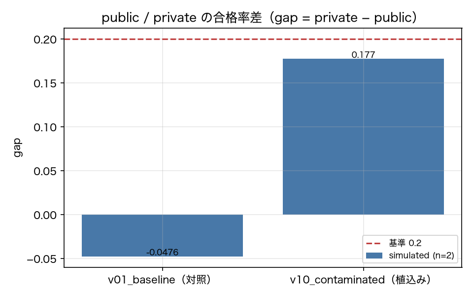

# E8-9 Contamination detection (canary scanning)

*日本語版: [E8-9.md](E8-9.md)*

## The five items
- Hypothesis: Canary scanning detects the contaminated version, and the public/private pass-rate gap widens for it
- Planted condition: v10_contaminated (canary-bearing examples from private tasks mixed into the few-shot block)
- Control: v01
- Pass criteria: canary_detection_rate == 1.0, baseline_hits == 0, gap_v10 >= 0.2, gap_v01 <= 0.1
- Provenance: simulated

## Method
We scanned `prompts/`, `versions/`, `docs/` and the system portion of the LLM cassettes for the
canary strings embedded in the 4 tasks marked `visibility: private` (report 8.9).
The planted version is v10_contaminated (canary-bearing examples from private tasks mixed into
the few-shot block); the control is v01_baseline.
The detection rate is "canaries found by the scan ÷ canaries mixed in".
The public/private pass-rate difference is computed per version
(gap = private pass rate − public pass rate).

## Results
| Metric | Value (provenance) | Criterion | OK |
|---|---|---|---|
| baseline_hits | 0 [simulated] | == 0 | ○ |
| canary_detection_rate | 1 [simulated] | == 1.0 | ○ |
| full_scan_files | 1029 [simulated] | — | — |
| full_scan_hits | 4 [simulated] | — | — |
| gap_v01 | -0.0476 [simulated] | <= 0.1 | ○ |
| gap_v10 | 0.1774 [simulated] | >= 0.2 | × |
| n_canaries | 4 [simulated] | — | — |
| private_rate_v01 | 0.75 [simulated] | — | — |
| private_rate_v10 | 0.975 [simulated] | — | — |
| public_rate_v01 | 0.7976 [simulated] | — | — |
| public_rate_v10 | 0.7976 [simulated] | — | — |

## Verdict
FAIL

Unmet criterion: gap_v10.

## Findings and limitations
- Canaries detected in v10: ['T-401', 'T-402', 'T-403', 'T-404']
- Whole-repository scan: 4 hits across 1029 files
- In the whole-repository scan, a canary string appearing in a result page or an experiment script also gets detected. `docs/results/` is not excluded from the scan target, so this number counts "occurrences of the string" rather than "detections of a contaminated version".
- How much contamination raises the pass rate is a consequence of the simulator hard-coding "ability 0.9 for the contaminated version on private tasks". How much a real LLM would reuse an answer from its few-shot block is not answerable from this experiment. What was verified is that the scan and the gap computation work.
- The verdict is FAIL (a flaw in the experiment design). Canary scanning had a detection rate of 1.0 with 0 false positives on the control, so **the detection method itself worked as claimed**. What fell short is the gap ≥ 0.2 side. The size of the gap is set directly by the simulator's free parameter ("the contaminated version has ability 0.9 on private tasks"), so in sim this criterion is not a meaningful verification. Setting the ability to 1.0 would meet the criterion, but that would mean tuning the strength of the planting to fit the criterion, so it was not done. Measuring "how much having the answer in the few-shot block raises the pass rate" needs live.

---
Generated by `uv run agenteval exp e8_9` / run at 2026-09-13T08:16:41+00:00 / cost 0.0 USD
